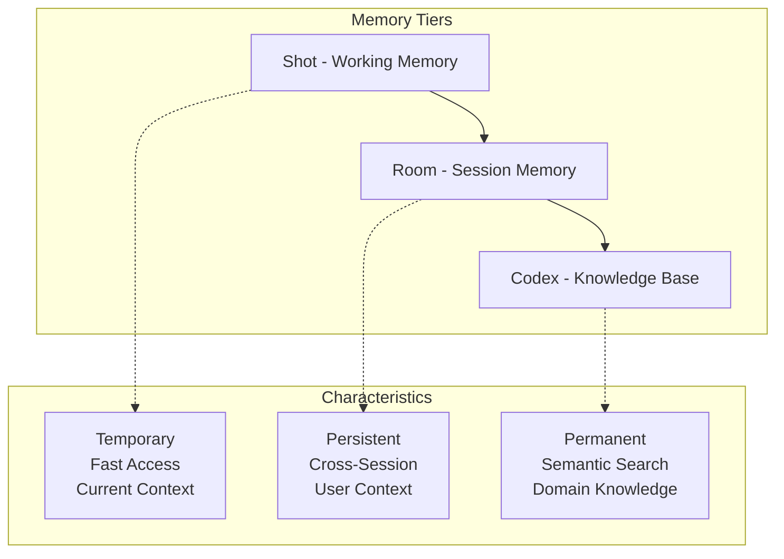

# Memory Management

This guide covers advanced memory management patterns in downcity, helping you build AI agents that efficiently handle memory, maintain context, and scale effectively. We'll explore strategies for different use cases, from personal assistants to enterprise applications.

## Memory Architecture Recap

downcity uses a three-tier memory system:



## Memory Strategies by Use Case

### Personal Assistant Memory

For personal assistants, focus on user preferences, habits, and long-term context:

```typescript
class PersonalAssistantMemory {
  private hero: Hero;
  private room: Room;
  private codex: Codex;
  private userProfile: Map<string, any> = new Map();

  constructor(userId: string) {
    // Create user-specific storage
    const persistor = new SQLitePersistor(`./users/${userId}/memory.db`);
    this.room = new Room(persistor, {
      maxShots: 100,        // Keep more conversations for personal use
      retentionDays: 365,   // Keep for a full year
      cleanupInterval: 86400 // Daily cleanup
    });

    // Personal knowledge base
    this.codex = Codex.create({ 
      tableName: `user_${userId}_knowledge` 
    });

    this.hero = Hero.create()
      .avatar(`You are a personal AI assistant. You know this user well and remember:
               - Their preferences and habits
               - Important dates and events
               - Ongoing projects and goals
               - Personal context and history
               
               Always personalize your responses based on what you know about them.`)
      .memory(this.room)
      .study(this.codex);

    this.loadUserProfile(userId);
  }

  private async loadUserProfile(userId: string) {
    // Load user preferences from previous conversations
    const recentShots = this.room.getShotsList().slice(-10);
    
    for (const shotInfo of recentShots) {
      const shot = this.room.getShot(shotInfo.id);
      if (shot) {
        await this.extractUserPreferences(shot);
      }
    }
  }

  private async extractUserPreferences(shot: Shot) {
    const messages = shot.getMessages();
    const userMessages = messages.filter(m => m.role === 'user');
    
    // Simple preference extraction (in practice, use NLP)
    for (const message of userMessages) {
      const content = message.content.toLowerCase();
      
      // Extract preferences
      if (content.includes('i prefer') || content.includes('i like')) {
        const preference = this.extractPreference(content);
        if (preference) {
          this.userProfile.set('preferences', [
            ...(this.userProfile.get('preferences') || []),
            preference
          ]);
        }
      }
      
      // Extract important dates
      if (content.includes('birthday') || content.includes('anniversary')) {
        const date = this.extractDate(content);
        if (date) {
          this.userProfile.set('important_dates', [
            ...(this.userProfile.get('important_dates') || []),
            date
          ]);
        }
      }
    }
  }

  private extractPreference(content: string): string | null {
    // Simple extraction - in practice, use more sophisticated NLP
    const patterns = [
      /i prefer (.+?)(?:\.|$)/,
      /i like (.+?)(?:\.|$)/,
      /my favorite (.+?) is (.+?)(?:\.|$)/
    ];

    for (const pattern of patterns) {
      const match = content.match(pattern);
      if (match) {
        return match[1] || match[2];
      }
    }
    return null;
  }

  private extractDate(content: string): any | null {
    // Extract date information - simplified
    if (content.includes('birthday')) {
      return { type: 'birthday', mentioned_at: new Date().toISOString() };
    }
    return null;
  }

  async chat(message: string): Promise<string> {
    // Add user context to the conversation
    const contextualMessage = this.addUserContext(message);
    return await this.hero.chat(contextualMessage);
  }

  private addUserContext(message: string): string {
    const preferences = this.userProfile.get('preferences') || [];
    const importantDates = this.userProfile.get('important_dates') || [];
    
    let context = '';
    if (preferences.length > 0) {
      context += `User preferences: ${preferences.slice(-3).join(', ')}. `;
    }
    if (importantDates.length > 0) {
      context += `Important dates mentioned: ${importantDates.length} events. `;
    }
    
    return context ? `Context: ${context}\n\nUser: ${message}` : message;
  }

  async addPersonalKnowledge(knowledge: string, category: string) {
    await this.codex.add(knowledge, {
      category: 'personal',
      subcategory: category,
      added_at: new Date().toISOString(),
      source: 'user_provided'
    });
  }

  getUserProfile(): Record<string, any> {
    return Object.fromEntries(this.userProfile);
  }

  cleanup() {
    this.codex.close();
  }
}

// Usage
const assistant = new PersonalAssistantMemory('user_123');

await assistant.chat("I prefer coffee over tea");
await assistant.chat("My birthday is in March");
await assistant.addPersonalKnowledge("User works at TechCorp as a software engineer", "work");

// Later conversations will reference these preferences
await assistant.chat("What should I drink this morning?");
// Response will likely suggest coffee based on preference
```

### Customer Support Memory

For customer support, focus on issue tracking, resolution history, and customer context:

```typescript
class CustomerSupportMemory {
  private hero: Hero;
  private room: Room;
  private codex: Codex;
  private ticketSystem: Map<string, any> = new Map();

  constructor() {
    const persistor = new SQLitePersistor('./support/customer-memory.db');
    this.room = new Room(persistor, {
      maxShots: 500,        // Keep many support conversations
      retentionDays: 90,    // Keep for 3 months (compliance)
      cleanupInterval: 3600 // Hourly cleanup
    });

    // Support knowledge base
    this.codex = Codex.create({ tableName: "support_knowledge" });
    this.loadSupportKnowledge();

    this.hero = Hero.create()
      .avatar(`You are a customer support agent with access to:
               - Complete customer interaction history
               - Product knowledge base
               - Previous ticket resolutions
               
               Always:
               - Reference previous interactions when relevant
               - Provide accurate, helpful solutions
               - Escalate complex issues appropriately
               - Maintain professional, empathetic tone`)
      .memory(this.room)
      .study(this.codex);
  }

  private async loadSupportKnowledge() {
    const supportKB = [
      {
        content: "To reset password: Go to login page, click 'Forgot Password', enter email, check inbox for reset link",
        metadata: { category: "authentication", issue_type: "password_reset", priority: "high" }
      },
      {
        content: "Login issues can be caused by: incorrect credentials, account lockout, browser cache, or server maintenance",
        metadata: { category: "authentication", issue_type: "login_problems", priority: "high" }
      },
      {
        content: "Billing questions should be escalated to billing team if they involve: refunds, payment disputes, or account changes",
        metadata: { category: "billing", issue_type: "escalation", priority: "medium" }
      },
      {
        content: "Feature requests should be logged in the product feedback system with customer details and use case",
        metadata: { category: "product", issue_type: "feature_request", priority: "low" }
      }
    ];

    for (const item of supportKB) {
      await this.codex.add(item.content, item.metadata);
    }
  }

  async startSupportSession(customerId: string, issueType: string, priority: 'low' | 'medium' | 'high' = 'medium') {
    // Create new support session
    this.hero.newShot();
    const shotId = this.hero.getCurrentShotId();
    
    // Set session metadata
    const currentShot = this.hero.getCurrentShot();
    currentShot.setMetadata({
      customerId,
      issueType,
      priority,
      status: 'open',
      createdAt: new Date().toISOString(),
      category: 'customer_support'
    });

    // Create ticket record
    const ticketId = `TICKET-${Date.now()}`;
    this.ticketSystem.set(ticketId, {
      customerId,
      shotId,
      issueType,
      priority,
      status: 'open',
      createdAt: new Date().toISOString()
    });

    // Get customer history
    const customerHistory = await this.getCustomerHistory(customerId);
    let contextMessage = `Starting support session for customer ${customerId}. Issue: ${issueType}. Priority: ${priority}.`;
    
    if (customerHistory.length > 0) {
      contextMessage += ` Customer has ${customerHistory.length} previous interactions.`;
    }

    await this.hero.chat(contextMessage);
    return { ticketId, shotId };
  }

  private async getCustomerHistory(customerId: string): Promise<Shot[]> {
    const allShots = this.room.getShotsList();
    const customerShots = [];

    for (const shotInfo of allShots) {
      const shot = this.room.getShot(shotInfo.id);
      if (shot && shot.getMetadata().customerId === customerId) {
        customerShots.push(shot);
      }
    }

    return customerShots.sort((a, b) => 
      new Date(b.getMetadata().createdAt).getTime() - 
      new Date(a.getMetadata().createdAt).getTime()
    );
  }

  async handleCustomerMessage(message: string, customerId: string): Promise<string> {
    // Add customer context
    const customerHistory = await this.getCustomerHistory(customerId);
    let contextualMessage = message;

    if (customerHistory.length > 0) {
      const recentIssues = customerHistory.slice(0, 3).map(shot => 
        shot.getMetadata().issueType
      ).filter(Boolean);

      if (recentIssues.length > 0) {
        contextualMessage = `Customer history: Previous issues include ${recentIssues.join(', ')}. Current message: ${message}`;
      }
    }

    return await this.hero.chat(contextualMessage);
  }

  async resolveTicket(ticketId: string, resolution: string) {
    const ticket = this.ticketSystem.get(ticketId);
    if (!ticket) throw new Error('Ticket not found');

    // Update ticket status
    ticket.status = 'resolved';
    ticket.resolvedAt = new Date().toISOString();
    ticket.resolution = resolution;

    // Update shot metadata
    const shot = this.room.getShot(ticket.shotId);
    if (shot) {
      shot.updateMetadata({
        status: 'resolved',
        resolvedAt: new Date().toISOString(),
        resolution
      });
      this.room.updateShot(shot);
    }

    // Add resolution to knowledge base for future reference
    await this.codex.add(
      `Issue: ${ticket.issueType}. Resolution: ${resolution}`,
      {
        category: 'resolutions',
        issue_type: ticket.issueType,
        priority: ticket.priority,
        resolved_at: new Date().toISOString()
      }
    );

    await this.hero.chat(`Ticket ${ticketId} has been resolved. Resolution: ${resolution}`);
  }

  async getTicketStats(): Promise<any> {
    const tickets = Array.from(this.ticketSystem.values());
    
    return {
      total: tickets.length,
      open: tickets.filter(t => t.status === 'open').length,
      resolved: tickets.filter(t => t.status === 'resolved').length,
      byPriority: {
        high: tickets.filter(t => t.priority === 'high').length,
        medium: tickets.filter(t => t.priority === 'medium').length,
        low: tickets.filter(t => t.priority === 'low').length
      },
      byIssueType: this.groupBy(tickets, 'issueType')
    };
  }

  private groupBy(array: any[], key: string): Record<string, number> {
    return array.reduce((groups, item) => {
      const group = item[key] || 'unknown';
      groups[group] = (groups[group] || 0) + 1;
      return groups;
    }, {});
  }

  cleanup() {
    this.codex.close();
  }
}

// Usage
const support = new CustomerSupportMemory();

// Start support session
const { ticketId } = await support.startSupportSession('cust_123', 'login_issue', 'high');

// Handle customer messages
const response1 = await support.handleCustomerMessage("I can't log into my account", 'cust_123');
const response2 = await support.handleCustomerMessage("I tried resetting my password but didn't get the email", 'cust_123');

// Resolve ticket
await support.resolveTicket(ticketId, "Password reset email was in spam folder. Customer successfully logged in after checking spam.");

// Get statistics
const stats = await support.getTicketStats();
console.log("Support Statistics:", stats);
```

### Educational Memory

For educational applications, track learning progress and adapt to student needs:

```typescript
class EducationalMemory {
  private hero: Hero;
  private room: Room;
  private codex: Codex;
  private studentProgress: Map<string, any> = new Map();

  constructor(studentId: string) {
    const persistor = new SQLitePersistor(`./education/${studentId}/progress.db`);
    this.room = new Room(persistor, {
      maxShots: 200,        // Keep learning sessions
      retentionDays: 180,   // Keep for semester
      cleanupInterval: 86400 // Daily cleanup
    });

    this.codex = Codex.create({ tableName: `curriculum_${studentId}` });
    this.loadCurriculum();

    this.hero = Hero.create()
      .avatar(`You are an adaptive AI tutor. You track student progress and adapt your teaching style based on:
               - Learning pace and preferences
               - Areas of strength and difficulty
               - Previous questions and mistakes
               - Current skill level
               
               Always:
               - Provide explanations at the appropriate level
               - Reference previous learning when building on concepts
               - Encourage and motivate the student
               - Identify knowledge gaps and address them`)
      .memory(this.room)
      .study(this.codex);

    this.initializeStudentProgress(studentId);
  }

  private async loadCurriculum() {
    const curriculum = [
      {
        content: "Variables in programming store data values. In JavaScript, use let, const, or var to declare variables.",
        metadata: { subject: "programming", topic: "variables", level: "beginner", prerequisite: "none" }
      },
      {
        content: "Functions are reusable blocks of code. They take inputs (parameters) and can return outputs.",
        metadata: { subject: "programming", topic: "functions", level: "beginner", prerequisite: "variables" }
      },
      {
        content: "Arrays store multiple values in a single variable. Access elements using index numbers starting from 0.",
        metadata: { subject: "programming", topic: "arrays", level: "intermediate", prerequisite: "variables" }
      },
      {
        content: "Loops repeat code multiple times. Common types include for loops, while loops, and forEach loops.",
        metadata: { subject: "programming", topic: "loops", level: "intermediate", prerequisite: "arrays" }
      }
    ];

    for (const item of curriculum) {
      await this.codex.add(item.content, item.metadata);
    }
  }

  private async initializeStudentProgress(studentId: string) {
    // Load existing progress from previous sessions
    const sessions = this.room.getShotsList();
    
    this.studentProgress.set('studentId', studentId);
    this.studentProgress.set('topicsLearned', new Set());
    this.studentProgress.set('currentLevel', 'beginner');
    this.studentProgress.set('strengths', []);
    this.studentProgress.set('difficulties', []);
    this.studentProgress.set('learningStyle', 'visual'); // Default
    
    // Analyze previous sessions
    for (const sessionInfo of sessions.slice(-10)) { // Last 10 sessions
      const session = this.room.getShot(sessionInfo.id);
      if (session) {
        await this.analyzeSession(session);
      }
    }
  }

  private async analyzeSession(session: Shot) {
    const messages = session.getMessages();
    const metadata = session.getMetadata();
    
    // Extract topics covered
    if (metadata.topic) {
      const topicsLearned = this.studentProgress.get('topicsLearned');
      topicsLearned.add(metadata.topic);
    }

    // Analyze student responses for understanding
    const studentMessages = messages.filter(m => m.role === 'user');
    for (const message of studentMessages) {
      await this.analyzeStudentResponse(message.content, metadata.topic);
    }
  }

  private async analyzeStudentResponse(response: string, topic: string) {
    const content = response.toLowerCase();
    
    // Simple analysis - in practice, use more sophisticated NLP
    if (content.includes("i understand") || content.includes("that makes sense")) {
      const strengths = this.studentProgress.get('strengths');
      if (!strengths.includes(topic)) {
        strengths.push(topic);
      }
    }
    
    if (content.includes("confused") || content.includes("don't understand")) {
      const difficulties = this.studentProgress.get('difficulties');
      if (!difficulties.includes(topic)) {
        difficulties.push(topic);
      }
    }
  }

  async startLearningSession(topic: string, level: 'beginner' | 'intermediate' | 'advanced' = 'beginner') {
    this.hero.newShot();
    const shotId = this.hero.getCurrentShotId();
    
    const currentShot = this.hero.getCurrentShot();
    currentShot.setMetadata({
      studentId: this.studentProgress.get('studentId'),
      topic,
      level,
      sessionType: 'learning',
      createdAt: new Date().toISOString()
    });

    // Personalize the session start
    const progress = this.getProgressSummary();
    const contextMessage = `Starting learning session on ${topic} at ${level} level. 
                           Student progress: ${progress.topicsCompleted} topics completed, 
                           current level: ${progress.currentLevel}.`;

    await this.hero.chat(contextMessage);
    return shotId;
  }

  async teachConcept(concept: string): Promise<string> {
    const progress = this.getProgressSummary();
    const difficulties = this.studentProgress.get('difficulties');
    
    let teachingMessage = `Teach the concept: ${concept}`;
    
    // Adapt teaching based on student's difficulties
    if (difficulties.length > 0) {
      teachingMessage += `. Student has had difficulty with: ${difficulties.join(', ')}. 
                          Adjust explanation accordingly and provide extra support.`;
    }
    
    // Reference previous learning
    const topicsLearned = Array.from(this.studentProgress.get('topicsLearned'));
    if (topicsLearned.length > 0) {
      teachingMessage += ` Student has already learned: ${topicsLearned.slice(-3).join(', ')}.`;
    }

    return await this.hero.chat(teachingMessage);
  }

  async askQuestion(question: string): Promise<string> {
    // Track that student is asking questions (good engagement)
    const currentShot = this.hero.getCurrentShot();
    const metadata = currentShot.getMetadata();
    
    currentShot.updateMetadata({
      ...metadata,
      questionsAsked: (metadata.questionsAsked || 0) + 1,
      lastActivity: new Date().toISOString()
    });

    return await this.hero.chat(question);
  }

  async assessUnderstanding(topic: string, studentResponse: string): Promise<{
    understood: boolean;
    confidence: number;
    nextSteps: string[];
  }> {
    // Analyze student's response to assess understanding
    await this.analyzeStudentResponse(studentResponse, topic);
    
    const assessment = await this.hero.chat(
      `Assess the student's understanding of ${topic} based on their response: "${studentResponse}". 
       Provide assessment of their comprehension level and suggest next steps.`
    );

    // Simple assessment logic (in practice, use more sophisticated analysis)
    const understood = !studentResponse.toLowerCase().includes('confused') && 
                      !studentResponse.toLowerCase().includes("don't understand");
    
    const confidence = understood ? 0.8 : 0.3;
    
    const nextSteps = understood 
      ? ['Move to next topic', 'Provide practice exercises']
      : ['Review concept again', 'Provide more examples', 'Try different explanation'];

    return { understood, confidence, nextSteps };
  }

  getProgressSummary() {
    const topicsLearned = this.studentProgress.get('topicsLearned');
    const strengths = this.studentProgress.get('strengths');
    const difficulties = this.studentProgress.get('difficulties');
    
    return {
      studentId: this.studentProgress.get('studentId'),
      topicsCompleted: topicsLearned.size,
      currentLevel: this.studentProgress.get('currentLevel'),
      strengths: strengths.slice(-5), // Last 5 strengths
      difficulties: difficulties.slice(-3), // Last 3 difficulties
      learningStyle: this.studentProgress.get('learningStyle')
    };
  }

  async generatePersonalizedCurriculum(): Promise<string[]> {
    const progress = this.getProgressSummary();
    const topicsLearned = Array.from(this.studentProgress.get('topicsLearned'));
    
    // Search for next appropriate topics
    const nextTopics = await this.codex.search('programming concepts', {
      limit: 10,
      metadata: { level: progress.currentLevel }
    });

    // Filter out already learned topics
    const availableTopics = nextTopics
      .filter(topic => !topicsLearned.includes(topic.metadata.topic))
      .map(topic => topic.metadata.topic);

    return availableTopics.slice(0, 5); // Next 5 topics
  }

  cleanup() {
    this.codex.close();
  }
}

// Usage
const tutor = new EducationalMemory('student_456');

// Start learning session
await tutor.startLearningSession('functions', 'beginner');

// Teach concept
const explanation = await tutor.teachConcept('JavaScript functions');
console.log("Tutor:", explanation);

// Student asks question
const answer = await tutor.askQuestion("How do I call a function?");
console.log("Tutor:", answer);

// Assess understanding
const assessment = await tutor.assessUnderstanding('functions', "I think functions are like recipes that take ingredients and make something");
console.log("Assessment:", assessment);

// Get progress
const progress = tutor.getProgressSummary();
console.log("Student Progress:", progress);

// Generate curriculum
const nextTopics = await tutor.generatePersonalizedCurriculum();
console.log("Next Topics:", nextTopics);
```

## Memory Optimization Strategies

### Conversation Summarization

Implement intelligent summarization to manage long conversations:

```typescript
class ConversationSummarizer {
  private hero: Hero;
  private summaryThreshold: number;

  constructor(hero: Hero, summaryThreshold = 50) {
    this.hero = hero;
    this.summaryThreshold = summaryThreshold;
  }

  async checkAndSummarize(): Promise<boolean> {
    const currentShot = this.hero.getCurrentShot();
    const messageCount = currentShot.getMessages().length;

    if (messageCount >= this.summaryThreshold) {
      await this.summarizeAndArchive();
      return true;
    }
    return false;
  }

  private async summarizeAndArchive() {
    const currentShot = this.hero.getCurrentShot();
    const messages = currentShot.getMessages();
    
    // Generate comprehensive summary
    const summary = await this.hero.chat(`
      Please create a detailed summary of our entire conversation that includes:
      1. Main topics discussed
      2. Key decisions or conclusions reached
      3. Important context that should be remembered
      4. Any unresolved questions or next steps
      
      This summary will be used to maintain context in future conversations.
    `);

    // Store summary in metadata
    currentShot.setMetadata({
      ...currentShot.getMetadata(),
      summary: summary,
      originalMessageCount: messages.length,
      summarizedAt: new Date().toISOString(),
      archived: true
    });

    // Create new shot with summary context
    this.hero.newShot();
    await this.hero.chat(`
      Previous conversation summary: ${summary}
      
      Let's continue our conversation with this context in mind.
    `);

    console.log(`Summarized conversation with ${messages.length} messages`);
  }

  async getSummaryHistory(): Promise<string[]> {
    const room = (this.hero as any)._room; // Access room if available
    if (!room) return [];

    const shots = room.getShotsList();
    const summaries = [];

    for (const shotInfo of shots) {
      const shot = room.getShot(shotInfo.id);
      if (shot && shot.getMetadata().summary) {
        summaries.push(shot.getMetadata().summary);
      }
    }

    return summaries;
  }
}

// Usage
const summarizer = new ConversationSummarizer(hero, 30);

// Check after each interaction
await hero.chat("User message");
await summarizer.checkAndSummarize();
```

### Memory Cleanup Strategies

Implement intelligent cleanup based on relevance and importance:

```typescript
class IntelligentMemoryCleanup {
  private room: Room;
  private importanceThreshold: number;
  private ageThreshold: number; // days

  constructor(room: Room, importanceThreshold = 0.3, ageThreshold = 30) {
    this.room = room;
    this.importanceThreshold = importanceThreshold;
    this.ageThreshold = ageThreshold;
  }

  async performCleanup(): Promise<{
    cleaned: number;
    kept: number;
    archived: number;
  }> {
    const shots = this.room.getShotsList();
    let cleaned = 0;
    let kept = 0;
    let archived = 0;

    for (const shotInfo of shots) {
      const shot = this.room.getShot(shotInfo.id);
      if (!shot) continue;

      const decision = await this.evaluateShot(shot);
      
      switch (decision.action) {
        case 'delete':
          this.room.deleteShot(shotInfo.id);
          cleaned++;
          break;
        case 'archive':
          await this.archiveShot(shot);
          archived++;
          break;
        case 'keep':
          kept++;
          break;
      }
    }

    return { cleaned, kept, archived };
  }

  private async evaluateShot(shot: Shot): Promise<{
    action: 'delete' | 'archive' | 'keep';
    reason: string;
    score: number;
  }> {
    const metadata = shot.getMetadata();
    const messages = shot.getMessages();
    const age = this.calculateAge(metadata.createdAt);
    
    let score = 0.5; // Base score
    let reasons = [];

    // Age factor
    if (age > this.ageThreshold) {
      score -= 0.2;
      reasons.push('old');
    }

    // Importance factor
    const importance = metadata.importance || 0.5;
    score += (importance - 0.5);
    if (importance > 0.7) reasons.push('important');

    // Activity factor
    if (messages.length > 20) {
      score += 0.1;
      reasons.push('active');
    }

    // Category factor
    if (metadata.category === 'support' || metadata.category === 'education') {
      score += 0.1;
      reasons.push('valuable_category');
    }

    // User engagement factor
    const userMessages = messages.filter(m => m.role === 'user');
    if (userMessages.length > 10) {
      score += 0.1;
      reasons.push('engaged');
    }

    // Decision logic
    if (score < this.importanceThreshold) {
      return { action: 'delete', reason: reasons.join(', '), score };
    } else if (score < 0.6 && age > 7) {
      return { action: 'archive', reason: reasons.join(', '), score };
    } else {
      return { action: 'keep', reason: reasons.join(', '), score };
    }
  }

  private calculateAge(createdAt: string): number {
    const created = new Date(createdAt);
    const now = new Date();
    return Math.floor((now.getTime() - created.getTime()) / (1000 * 60 * 60 * 24));
  }

  private async archiveShot(shot: Shot) {
    // Create summary for archived shot
    const messages = shot.getMessages();
    const summary = this.createQuickSummary(messages);
    
    shot.setMetadata({
      ...shot.getMetadata(),
      archived: true,
      archivedAt: new Date().toISOString(),
      quickSummary: summary
    });

    // Clear messages to save space, keep metadata
    shot.clearMessages();
    
    // Add summary message
    shot.addMessage({
      role: 'system',
      content: `Archived conversation summary: ${summary}`,
      timestamp: new Date().toISOString()
    });
  }

  private createQuickSummary(messages: Message[]): string {
    const userMessages = messages.filter(m => m.role === 'user');
    const topics = new Set<string>();
    
    // Extract key topics (simplified)
    userMessages.forEach(msg => {
      const words = msg.content.toLowerCase().split(/\W+/);
      words.forEach(word => {
        if (word.length > 4 && !this.isCommonWord(word)) {
          topics.add(word);
        }
      });
    });

    const topTopics = Array.from(topics).slice(0, 5);
    return `Discussed: ${topTopics.join(', ')}. ${messages.length} messages total.`;
  }

  private isCommonWord(word: string): boolean {
    const commonWords = ['that', 'this', 'with', 'have', 'will', 'from', 'they', 'know', 'want', 'been', 'good', 'much', 'some', 'time', 'very', 'when', 'come', 'here', 'just', 'like', 'long', 'make', 'many', 'over', 'such', 'take', 'than', 'them', 'well', 'were'];
    return commonWords.includes(word);
  }

  async getCleanupReport(): Promise<any> {
    const shots = this.room.getShotsList();
    const report = {
      total: shots.length,
      byAge: { recent: 0, old: 0, ancient: 0 },
      byImportance: { high: 0, medium: 0, low: 0 },
      archived: 0,
      recommendations: []
    };

    for (const shotInfo of shots) {
      const shot = this.room.getShot(shotInfo.id);
      if (!shot) continue;

      const metadata = shot.getMetadata();
      const age = this.calculateAge(metadata.createdAt);
      const importance = metadata.importance || 0.5;

      // Age categorization
      if (age < 7) report.byAge.recent++;
      else if (age < 30) report.byAge.old++;
      else report.byAge.ancient++;

      // Importance categorization
      if (importance > 0.7) report.byImportance.high++;
      else if (importance > 0.4) report.byImportance.medium++;
      else report.byImportance.low++;

      // Archived count
      if (metadata.archived) report.archived++;
    }

    // Generate recommendations
    if (report.byAge.ancient > 10) {
      report.recommendations.push('Consider cleaning up ancient conversations');
    }
    if (report.byImportance.low > 20) {
      report.recommendations.push('Many low-importance conversations could be archived');
    }
    if (report.archived / report.total < 0.1) {
      report.recommendations.push('Consider implementing regular archiving');
    }

    return report;
  }
}

// Usage
const cleanup = new IntelligentMemoryCleanup(room, 0.3, 30);

// Get cleanup report
const report = await cleanup.getCleanupReport();
console.log("Cleanup Report:", report);

// Perform cleanup
const results = await cleanup.performCleanup();
console.log("Cleanup Results:", results);
```

## Performance Monitoring

### Memory Usage Analytics

Track and optimize memory usage:

```typescript
class MemoryAnalytics {
  private room: Room;
  private codex: Codex;

  constructor(room: Room, codex: Codex) {
    this.room = room;
    this.codex = codex;
  }

  async getMemoryStats(): Promise<any> {
    const shots = this.room.getShotsList();
    let totalMessages = 0;
    let totalCharacters = 0;
    const categoryCounts = new Map<string, number>();
    const dailyActivity = new Map<string, number>();

    for (const shotInfo of shots) {
      const shot = this.room.getShot(shotInfo.id);
      if (!shot) continue;

      const messages = shot.getMessages();
      totalMessages += messages.length;
      
      messages.forEach(msg => {
        totalCharacters += msg.content.length;
      });

      // Category tracking
      const category = shot.getMetadata().category || 'uncategorized';
      categoryCounts.set(category, (categoryCounts.get(category) || 0) + 1);

      // Daily activity
      const date = new Date(shot.getMetadata().createdAt).toDateString();
      dailyActivity.set(date, (dailyActivity.get(date) || 0) + 1);
    }

    return {
      shots: {
        total: shots.length,
        averageMessagesPerShot: totalMessages / shots.length || 0,
        totalMessages,
        totalCharacters,
        averageCharactersPerMessage: totalCharacters / totalMessages || 0
      },
      categories: Object.fromEntries(categoryCounts),
      dailyActivity: Object.fromEntries(dailyActivity),
      memoryEfficiency: this.calculateMemoryEfficiency(shots.length, totalMessages, totalCharacters)
    };
  }

  private calculateMemoryEfficiency(shots: number, messages: number, characters: number): any {
    const avgMessagesPerShot = messages / shots || 0;
    const avgCharsPerMessage = characters / messages || 0;
    
    return {
      efficiency: avgMessagesPerShot > 10 ? 'good' : 'could_improve',
      avgMessagesPerShot,
      avgCharsPerMessage,
      recommendations: this.getEfficiencyRecommendations(avgMessagesPerShot, avgCharsPerMessage)
    };
  }

  private getEfficiencyRecommendations(avgMessages: number, avgChars: number): string[] {
    const recommendations = [];
    
    if (avgMessages < 5) {
      recommendations.push('Consider consolidating short conversations');
    }
    if (avgMessages > 50) {
      recommendations.push('Implement conversation summarization');
    }
    if (avgChars > 1000) {
      recommendations.push('Monitor for overly verbose responses');
    }
    if (avgChars < 50) {
      recommendations.push('Responses might be too brief');
    }
    
    return recommendations;
  }

  async identifyMemoryBottlenecks(): Promise<any> {
    const shots = this.room.getShotsList();
    const bottlenecks = {
      largestShots: [],
      oldestShots: [],
      mostActiveCategories: [],
      unusualPatterns: []
    };

    // Find largest shots
    const shotSizes = [];
    for (const shotInfo of shots) {
      const shot = this.room.getShot(shotInfo.id);
      if (shot) {
        const size = shot.getMessages().reduce((sum, msg) => sum + msg.content.length, 0);
        shotSizes.push({ id: shotInfo.id, size, messageCount: shot.getMessages().length });
      }
    }

    bottlenecks.largestShots = shotSizes
      .sort((a, b) => b.size - a.size)
      .slice(0, 5);

    // Find oldest shots
    bottlenecks.oldestShots = shots
      .sort((a, b) => new Date(a.meta.createdAt).getTime() - new Date(b.meta.createdAt).getTime())
      .slice(0, 5)
      .map(shot => ({
        id: shot.id,
        age: Math.floor((Date.now() - new Date(shot.meta.createdAt).getTime()) / (1000 * 60 * 60 * 24))
      }));

    return bottlenecks;
  }

  async generateOptimizationPlan(): Promise<string[]> {
    const stats = await this.getMemoryStats();
    const bottlenecks = await this.identifyMemoryBottlenecks();
    const plan = [];

    // Based on statistics
    if (stats.shots.total > 100) {
      plan.push('Implement regular cleanup schedule');
    }
    if (stats.shots.averageMessagesPerShot > 30) {
      plan.push('Enable conversation summarization');
    }
    if (stats.memoryEfficiency.efficiency === 'could_improve') {
      plan.push('Review conversation patterns and optimize');
    }

    // Based on bottlenecks
    if (bottlenecks.largestShots.length > 0) {
      plan.push(`Archive or summarize ${bottlenecks.largestShots.length} large conversations`);
    }
    if (bottlenecks.oldestShots.length > 0) {
      const oldestAge = bottlenecks.oldestShots[0].age;
      if (oldestAge > 90) {
        plan.push('Clean up conversations older than 90 days');
      }
    }

    return plan;
  }
}

// Usage
const analytics = new MemoryAnalytics(room, codex);

const stats = await analytics.getMemoryStats();
console.log("Memory Statistics:", stats);

const bottlenecks = await analytics.identifyMemoryBottlenecks();
console.log("Memory Bottlenecks:", bottlenecks);

const optimizationPlan = await analytics.generateOptimizationPlan();
console.log("Optimization Plan:", optimizationPlan);
```

## Best Practices Summary

### 1. Memory Strategy Design
- **Define Clear Objectives**: Understand what needs to be remembered and for how long
- **Choose Appropriate Tiers**: Use Shot for immediate context, Room for session memory, Codex for knowledge
- **Implement Retention Policies**: Set appropriate cleanup and archiving schedules

### 2. Performance Optimization
- **Monitor Memory Usage**: Track conversation sizes and patterns
- **Implement Summarization**: Use intelligent summarization for long conversations
- **Regular Cleanup**: Remove or archive irrelevant conversations
- **Efficient Indexing**: Use proper database indexes for fast retrieval

### 3. Context Management
- **Maintain Relevance**: Keep only relevant context in active memory
- **Personalization**: Adapt memory strategies to user types and use cases
- **Context Boundaries**: Use clear boundaries between different conversation contexts

### 4. Scalability
- **Distributed Storage**: Consider distributed storage for large-scale applications
- **Caching Strategies**: Implement caching for frequently accessed memories
- **Load Balancing**: Distribute memory operations across multiple instances

## Next Steps

- [Knowledge Integration Guide](/docs/guides/knowledge-integration) - Advanced knowledge base patterns
- [Advanced Patterns Guide](/docs/guides/advanced-patterns) - Complex implementation strategies
- [API Reference](/docs/api-reference) - Complete API documentation
- [Examples](/docs/examples) - Practical implementation examples