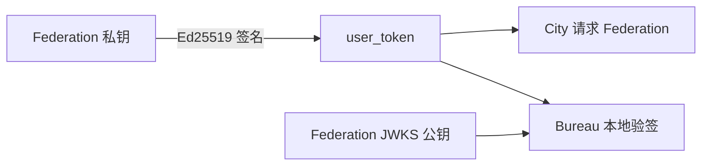

# City 用户身份

Federation 统一签发用户身份和账户数据，City 客户端直接访问 Federation。产品需要自己的后端能力时，再部署可选的 Bureau。一个 Federation 可以服务多个产品，每个产品由 `city_id` 隔离。

## 身份边界

- **Federation** — 保存 Ed25519 私钥并签发 `user_token`
- **City** — 保存 `federation_url + user_token` 并发起用户请求
- **Bureau** — Federation 的可信服务端节点，使用 `bureau_token` 管理 Federation，
  并使用 Federation 公钥本地验证独立服务收到的用户

## 认证流程

1. 用户登录时选择产品 `city_id`
2. Federation 使用私钥签发绑定该 `city_id` 的 `user_token`
3. 用户通过 `new City({ federation_url, user_token })` 调用 Federation
4. 用户携带同一个 Bearer Token 调用产品后端
5. City 直接携带 `user_token` 调用 Federation 的 Profile、余额和标准 Service
6. 如果产品有自己的后端，City 使用 `city.get()` / `city.post()` 请求 Bureau 独立服务
7. Bureau 使用 Federation 公钥本地验证 `user_token`，需要当前数据时再携带同一个 Token 请求 Federation

```ts
const city = new City({
  federation_url: "https://fed.example.com",
  user_token,
});

const profile = await city.user().profile();
```

可选的产品后端：

先在 Federation 管理侧登记 Bureau：

```bash
fed bureau token
```

CLI 只显示一次明文 `DOWNCITY_BUREAU_TOKEN`。Federation 数据库只保存 hash，
因此 Federation 和 Bureau 可以部署在不同服务器。

```ts
const bureau = new Bureau({
  federation_url: "https://fed.example.com",
  bureau_token: process.env.DOWNCITY_BUREAU_TOKEN!,
});

const identity = await bureau.identify(request);
const profile = await (await bureau.user(request)).profile();
```

`Bureau` 是可选后端，也是 Federation 管理 API 的可信服务端入口。它不绑定 `city_id`：
`identify()` 返回 `user_token` 中的 `city_id`，由 Bureau 的独立服务自行执行产品授权策略。
`identify()` 只读取 Federation discovery 和 JWKS，不调用在线 introspection；只有需要当前
Profile、余额等数据时，Bureau 才请求 Federation。

City 请求 Bureau 独立服务时不需要理解 Bureau 的 Service 目录，只需发送普通 HTTP 请求：

```ts
const result = await city.post(
  "https://bureau.example.com/reports/summary",
  { range: "today" },
);
```

## User Token 与 Bureau Token

两种 Token 都放在 Bearer Header 中，但底层实现和信任对象不同：

| 项目 | `user_token` | `bureau_token` |
| --- | --- | --- |
| 服务对象 | Federation 用户 | Federation 管理端与 Bureau 服务端 |
| 格式 | `ub_<JWT>` | `fb_<token_id>.<secret>` |
| 实现 | Ed25519 非对称签名 | 随机不透明凭证与 SHA-256 hash |
| 验证 | 使用 Federation JWKS 公钥验签 | Federation 计算 hash 并查询注册表 |
| 携带身份 | `user_id`、`city_id`、`iss`、`aud`、`exp`、`jti` | 不携带用户身份，只映射到 Federation 注册表记录 |
| 本地验证 | Bureau 使用 Federation JWKS 验证 | 管理请求由 Federation 查询注册表 |
| 撤销 | 主要依赖有效期和 Federation 当前状态 | Federation 将注册记录设为 `revoked` |

### User Token

Federation 使用私钥签发用户 JWT，只通过 JWKS 发布公钥。Bureau 可以验证签名、
issuer、audience、过期时间以及 `city_id`，但公钥不能用于签发或篡改用户 Token。



`user_token` 泄露后，持有者可以在 Token 有效期内冒充该用户，因此用户 Token
必须设置有限有效期，并只通过 HTTPS 传输。

### Bureau Token

`bureau_token` 不是 JWT，也没有公钥私钥关系。`fed bureau token` 在 CLI 本地
生成明文和 hash，只将 `token_id + token_hash` 登记到 Federation。


运行时 Bureau 会通过 HTTPS 把明文 Token 发给 Federation 管理 API。Federation 从中提取
`token_id`、计算 SHA-256，并与数据库记录比较。数据库不保存明文。

泄露 `bureau_token` 会让攻击者冒充该 Bureau 调用 Federation 管理 API，但不能生成
或伪造 `user_token`。发生泄露时使用 `fed bureau revoke <token_id>` 立即撤销注册记录。
撤销不会回溯已经签发的 `user_token`；用户 Token 仍由有效期和 Federation 密钥策略控制。

Federation 仍会发布 Ed25519 公钥，供 Federation 自身和其他协议验证用户 Token：

```text
/.well-known/downcity.json
/.well-known/jwks.json
```

`Bureau` 集合了 Federation 管理控制面能力。`bureau.cities`、`bureau.env`、
`bureau.bureaus` 等入口使用 `bureau_token` 调用 Federation；`fed bureau token` 仍由
CLI 生成明文并写入 Federation 注册表。

## 渠道账号

聊天平台的机器人凭证存储在 `~/.downcity/downcity.db` 中，并通过 ID 从项目引用：

```json
{
  "plugins": {
    "chat": {
      "channels": {
        "telegram": {
          "channelAccountId": "telegram-main"
        }
      }
    }
  }
}
```

继续阅读：

- [模型池](/zh/docs/city/model-pool)
- [用量与计费](/zh/docs/city/usage-billing)
