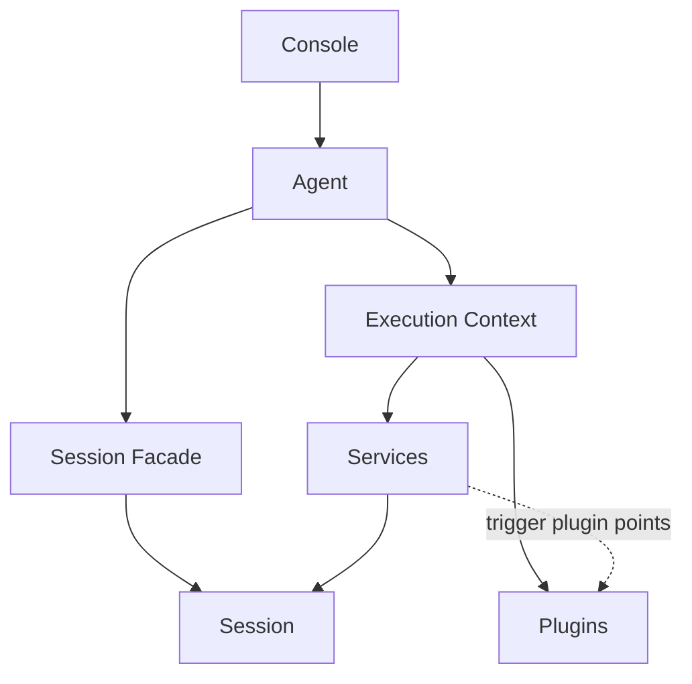

# 架构总览

理解 Downcity，先抓住 6 个概念：

- `console`：全局控制面
- `agent`：单项目宿主进程
- `execution context`：执行期间暴露给 service / plugin 的统一能力面
- `session`：真正执行一轮任务或一段对话的实例
- `service`：主流程模块
- `plugin`：被动扩展模块

## 最重要的理解顺序

从上到下看：

1. `console` 管全局
2. `agent` 管单个项目
3. `execution context` 给执行链路提供统一能力
4. `session` 才是真正跑一轮执行的地方
5. `service` 负责主路径
6. `plugin` 负责固定点增强

也就是说：

- `agent` 不是每一轮对话本身
- `session` 才是一条 chat、一轮 task run 这种执行单元
- `plugin` 不是独立 service，也不是独立 runtime

## 分层结构

1. **Console 层**
- 管 registry、模型池、全局配置、UI gateway
- 负责找到目标 agent，并把命令或请求路由过去

2. **Agent 层**
- 一个项目对应一个 agent 进程
- 负责加载项目配置和 model
- 持有 session facade、service instances 与 plugin registry
- 持续把本项目运行痕迹写进 `.downcity/`

3. **Execution Context 层**
- 暴露 `session`、`invoke`、`plugins`、`logger`、`config`、`env`
- 这是 service 和 plugin 在执行期间看到的统一能力面
- 它不是第二个宿主，只是从 agent 派生出来的执行视图

4. **Session 层**
- 一条 chat 对话就是一个 session
- 一个 task run 也是一个 session
- prompt、history、tools、模型执行都围绕 session 发生

5. **Service 层**
- 例如 `chat`、`task`、`memory`、`shell`
- 拥有主路径编排与领域状态
- 决定什么时候创建、复用或清理 session

6. **Plugin 层**
- 例如 `skill`、`asr`、`tts`、`auth`
- 只通过 service 预定义的扩展点接入
- 不拥有自己的生命周期，也不拥有独立 runtime

## 一张总图

## 一条最重要的边界

- `service` 主动参与主路径
- `plugin` 只在固定点被动参与
- `session` 承载执行状态
- `agent` 承载宿主状态

所以：

- 主路径放在 service
- 执行状态放在 session
- 宿主状态放在 agent
- 扩展逻辑放在 plugin
- plugin 依赖由 plugin 自己管理

## 一个直观例子

在聊天场景里：

- `chat service` 负责消息进入、入队、选择 session、执行、回复
- `execution context` 给它注入统一的 session / plugin 访问能力
- `asr` plugin 在语音相关节点补充转写
- `auth` plugin 在鉴权和角色解析节点接入
- 真正的模型执行仍然发生在目标 `session` 内部
