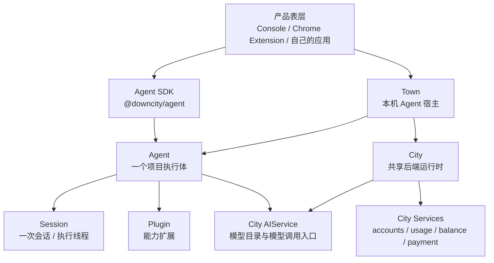

# Downcity 核心概念

如果你第一次接触 Downcity，最容易混乱的不是命令本身，而是这些名字分别代表什么、谁负责什么、它们之间怎么协作。

这页文档的目标很简单：先把最核心的概念讲清楚，再去看 CLI、SDK 或部署细节。

## 一张关系图



## 一句话理解

- `Downcity`：整套产品与运行层的总称
- `Town`：本机 Agent 宿主与管理入口
- `City`：共享后端运行时
- `Agent`：真正执行任务的运行实体
- `Session`：承载具体执行过程的会话对象
- `City AIService`：模型目录和模型调用入口
- `Plugin`：能力扩展边界

## 1. Downcity 是什么

`Downcity` 不是单个包，也不是单个命令。

它更像一整套 Agent 基础设施，包含：

- 本机 Agent 宿主
- 共享后端 runtime
- 模型目录和调用能力
- 插件体系
- 会话、任务、记忆、usage、权限、支付等运行能力
- Console、Extension、SDK 等产品表层

简单说：

- 你可以把它当“做 Agent 产品时复用的一层基础设施”

## 2. Town 是什么

`Town` 是本机侧的 Agent 宿主和 CLI 入口。

它主要负责：

- 启动和管理本机 Agent
- 连接当前使用的 City
- 管理插件、任务、Console 和本地运行状态

它不负责：

- 保存完整模型 provider 配置
- 自己维护模型目录

也就是说，Town 更像：

- “本机的 Agent runtime 管理面”

## 3. City 是什么

`City` 是共享后端运行时。

它主要负责：

- 模型目录
- token / auth
- service / action 路由
- usage / balance / payment 等共享后端能力

如果你的多个 Agent、多个产品表层，或者多个团队成员需要复用同一套模型和服务能力，通常就要接入 City。

## 4. Agent 是什么

`Agent` 是真正执行任务的运行实体。

它可以出现在两种语境里：

### Agent 项目里的运行体

这是 Town 管理的正常项目 Agent。

通常它会绑定：

- `downcity.json`
- `PROFILE.md`
- `SOUL.md`

### SDK 里的本地 Agent

这是 `@downcity/agent` 暴露出来的可编程本地执行壳：

```ts
new Agent({
  id,
  path,
  tools,
  plugins,
  model,
})
```

这两种 `Agent` 底层执行心智是相通的，但使用入口不同。

## 5. Agent 项目是什么

`Agent 项目` 指的是一个已经被 Downcity 初始化、可以被 Town 托管的项目目录。

它通常包含：

- `downcity.json`
- `PROFILE.md`
- `SOUL.md`
- `.downcity/`

这个项目目录最关键的一点是：

- 它只绑定“要用哪个模型”
- 不保存完整 provider 细节

也就是：

```json
{
  "execution": {
    "type": "api",
    "modelId": "quality"
  }
}
```

## 6. City AIService 是什么

`City AIService` 是 City 里专门负责模型目录与模型调用的内建 Service。

它负责：

- 注册模型
- 管理 provider 与 API key
- 暴露模型目录
- 提供 SDK 通路和 OpenAI 兼容通路

它不负责：

- 执行你的 Agent session

所以要分清：

- `AIService` 管理模型
- `Agent / Session` 负责执行

## 7. execution.modelId 是什么

`execution.modelId` 是 Agent 项目绑定模型的字段。

它的含义不是：

- “这里写完整模型配置”

而是：

- “这个项目要使用 City AIService 里哪一个模型 ID”

也就是说：

- 项目里只写 `modelId`
- Town 去 City AIService 解析它

## 8. Session 是什么

`Session` 是真正承载执行过程的对象。

如果你用 SDK，最核心的 API 也几乎都围绕它：

- `createSession()`
- `prompt()`
- `subscribe()`
- `history()`
- `system()`
- `fork()`

可以把它理解成：

- 一条会话线程
- 一份执行历史
- 一个持续可追加输入的执行上下文

## 9. Plugin 是什么

`Plugin` 是能力扩展边界。

它的职责通常包括：

- 暴露 action
- 注入 hook
- 提供 system prompt 片段
- 在需要时挂 lifecycle 或 HTTP 路由

常见例子：

- `skill`
- `web`
- `chat`
- `task`
- `memory`
- `shell`

可以把它理解成：

- “Agent 能力是怎么被模块化接进来的”

## 10. Skill、Task、Memory 分别是什么

### Skill

偏提示词 / 工作流 / 专项能力包。

更像：

- “给 Agent 一组专门的工作方法”

### Task

偏长期存在或定时触发的自动化任务。

更像：

- “让 Agent 在未来某个时间或某个计划里执行事情”

### Memory

偏长期可复用记忆。

更像：

- “让 Agent 不用每次都从零开始知道你是谁、项目是什么、约定是什么”

## 11. Console 是什么

`Console` 是浏览器里的本机控制台。

它不是另一个独立 runtime，而是 Town 的一个产品表层。

它主要负责：

- 查看本机 Agent
- 管理和操作运行状态
- 提供浏览器里的交互界面

## 12. Agent SDK 和 City SDK 的区别

### `@downcity/agent`

适合：

- 在应用里嵌入本地 Agent
- 通过 `RemoteAgent` 调远程 Agent

核心对象是：

- `Agent`
- `RemoteAgent`
- `Session`

### `@downcity/city`

适合：

- 构建 City runtime
- 注册模型和 Service
- 暴露共享后端能力

核心对象是：

- `City`
- `CityBase`
- `AIService`
- `Provider`
- `Service`

## 13. 最容易混淆的几件事

### 1. Town 不是模型目录

Town 连接模型，但不拥有模型目录。

模型目录属于 `City AIService`。

### 2. Agent 项目不保存 provider 细节

Agent 项目只保存：

- `execution.modelId`

不是保存 provider key、baseURL 或完整模型定义。

### 3. AIService 不等于 Agent

`AIService` 管模型。

`Agent / Session` 跑执行。

### 4. RemoteAgent 不直接连模型

`RemoteAgent` 连的是远程 Agent 暴露出的 session 能力。

不是直接去连 City AIService 模型本身。

## 14. 推荐阅读顺序

1. [怎么使用 Downcity](/zh/docs/how-to-use-downcity)
2. [Project Logic Overview](/zh/docs/concepts/project-logic-overview)
3. [快速开始](/zh/docs/quickstart/getting-started)
4. [模型配置](/zh/docs/configuration/model)
5. [City AIService](/zh/city-sdk-docs/service/ai/index)
6. [Agent SDK](/zh/agent-sdk-docs)
