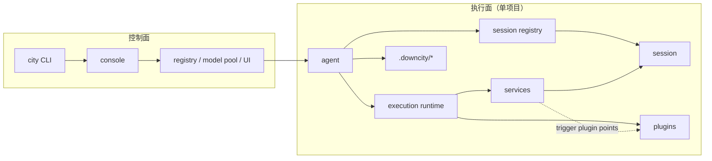
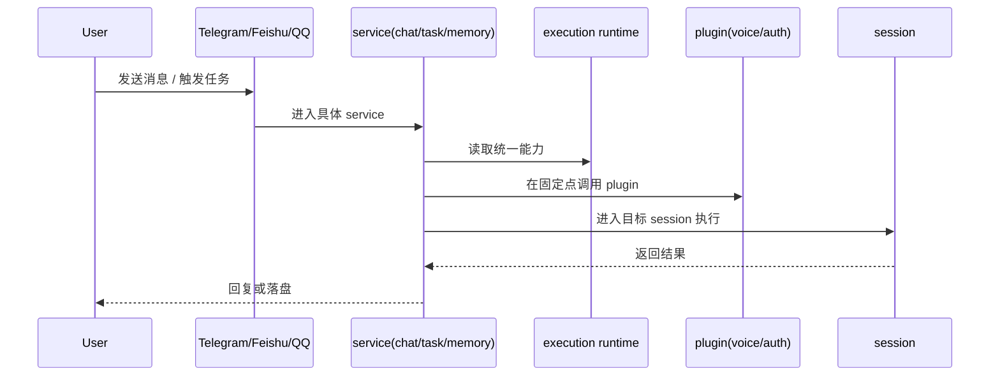

# 架构逻辑图

这页回答一个问题：

一次请求是怎么从 `console` / `agent` 进入真正执行，再回到用户侧的。

## 1. 职责边界

- `console`：全局控制面，管理 daemon、registry、模型池、共享存储
- `agent`：项目宿主，加载项目配置并持有 session registry
- `execution runtime`：统一注入给执行链路的能力视图
- `session`：真正执行 prompt / tools / history 的地方
- `service`：主业务流程与领域编排
- `plugin`：在固定点被动加入的扩展模块

## 2. 系统关系

## 3. 请求流

## 4. 一个贴近真实实现的例子

在 `chat` 里：

- `chat service` 先接住渠道消息
- 它维护渠道目标到 `sessionId` 的映射
- 语音消息可在固定点让 `voice plugin` 补充转写
- 鉴权和角色解析可让 `auth plugin` 参与
- 最后还是由 `chat service` 自己决定是否入队、何时回复、如何写入历史

## 5. 用户视角最值得记住的事

- 你平时操作的是 agent
- 真正执行的是 session
- service 是主流程
- plugin 是扩展层
- execution runtime 只是把这些能力统一接起来
