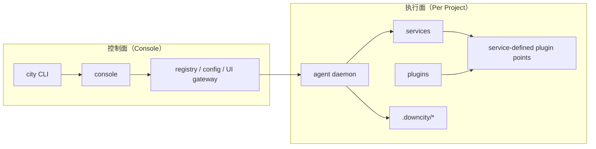
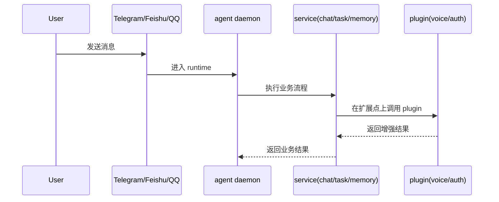

# 架构逻辑图

这页回答一个问题：

`console`、`agent`、`service`、`plugin` 各自负责什么，以及一次请求如何穿过它们。

## 1. 职责边界

- `console`：全局控制面。管理 daemon、registry、模型池、共享存储。
- `agent`：项目执行面。加载项目配置与上下文，持有单个 runtime。
- `service`：核心业务流程，拥有生命周期。
- `plugin`：可选增强模块，被动接入 service 定义的点。
- plugin 自己负责封装依赖与配置细节。

## 2. 系统关系

## 3. 请求流

## 4. 一个贴近真实实现的例子

在 `chat` 里：

- service 先构造入站消息
- 然后在若干固定节点让 plugin 参与
- `voice` 可以补充语音转写
- `auth` 可以做鉴权和角色解析
- 最终仍由 `chat` 自己决定是否入队、何时回复、如何落盘
