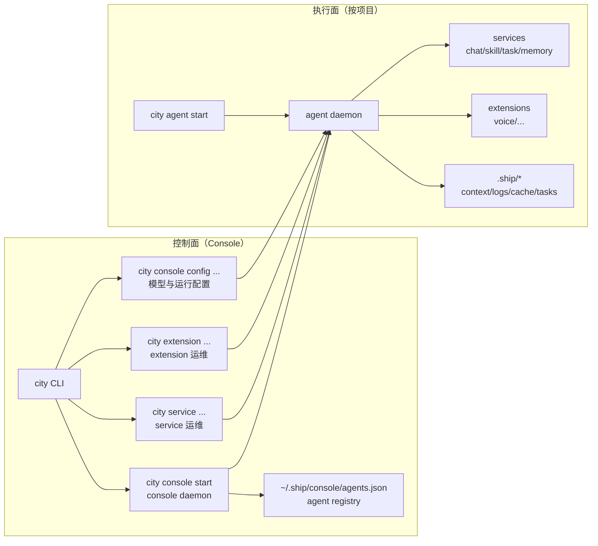
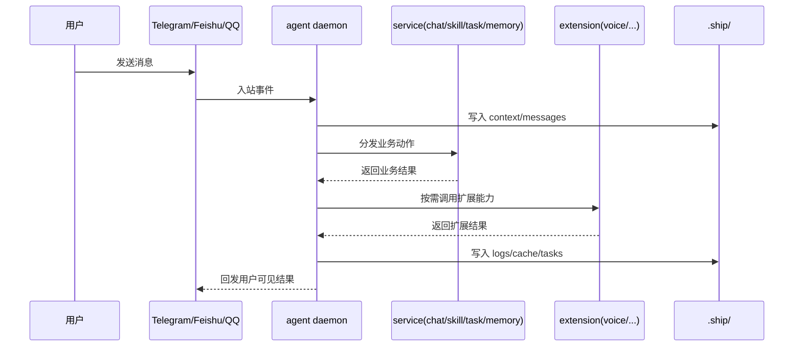

# 架构逻辑图

这页是 Concepts 的第二页，专门回答一件事：

`console`、`agent`、`service`、`extension` 分别负责什么，如何协作，以及一条消息如何穿过这四层。

## 1. 四个角色的职责边界

- `console`：全局控制面。负责启动/停止 console 进程、管理 agent daemon 清单、提供 `service/extension/config` 统一运维入口。
- `agent`：项目级执行面。负责加载当前项目上下文、运行推理与工具调用、把执行轨迹写入 `.ship/`。
- `service`：核心业务能力模块（如 `chat` / `skill` / `task` / `memory`），直接承载业务流程。
- `extension`：共享型扩展能力（如 `voice`），由 console 侧统一管理，供 agent 在运行时按需调用。

## 2. 总体关系图（控制面 vs 执行面）



## 3. 请求执行链路（简化）



## 4. 关键原则

- `console` 管“运维与治理”，`agent` 管“执行与落盘”。
- `service` 是核心域，`extension` 是可选增强域。
- `service` / `extension` 都由 console 统一暴露运维接口，但真正执行发生在 agent runtime 内。
- 模型池通过 `city console model ...` 在 console 全局层管理；项目只通过 `model.primary` 绑定模型 ID。

## 5. 常用命令顺序

```bash
# 1) 启动全局 console（必须）
city console start

# 2) 初始化项目并启动 agent
city agent create .
city agent start

# 3) 运维 service / extension
city service list
city extension list

# 4) 查看整体状态
city console status
city agent status .
```

## 延伸阅读

- [架构总览](/zh/docs/concepts/architecture)
- [关系与进程模型](/zh/docs/concepts/runtime-relationship-and-process)
- [消息处理链路](/zh/docs/concepts/message-processing)
