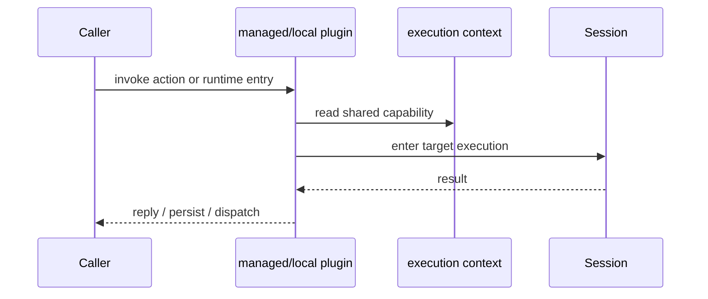

# 逻辑地图

当前逻辑地图可以概括为：

- `console` 管理 runtime 与 registry
- `agent` 承载一个项目 runtime
- `session` 执行一轮真实推理
- `plugins` 暴露并增强能力

## 能力地图

- 本地 plugin：`skill`、`web`、`asr`、`tts`、`auth`
- 托管 plugin：`chat`、`task`、`memory`、`contact`、`shell`、`schedule`

## 请求地图

## 最重要的结论

- plugin 负责能力入口与增强
- session 负责执行
- console 与 agent 负责 runtime 管理
