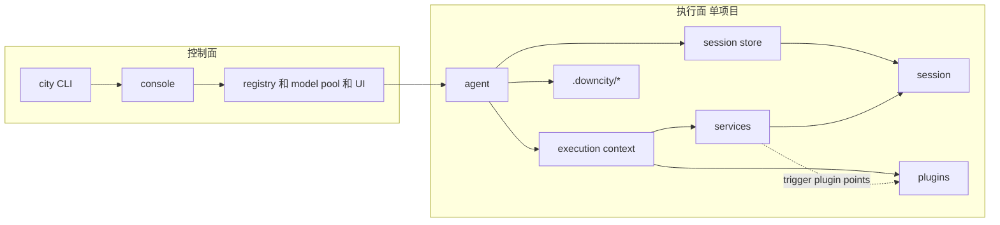
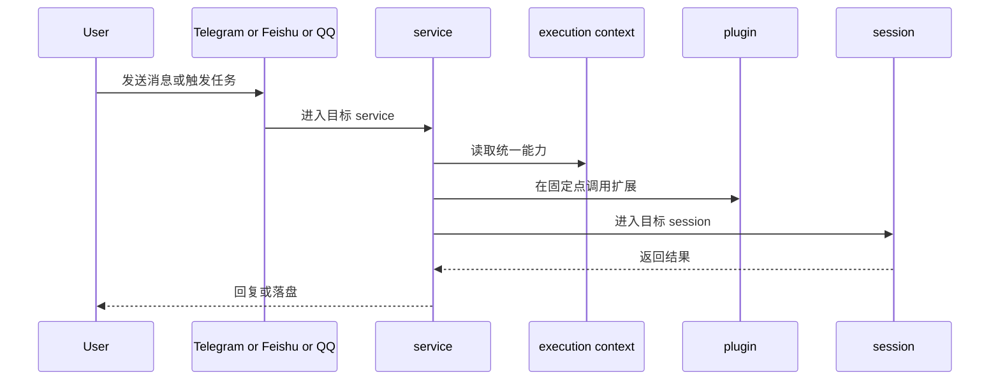

# 架构逻辑图

这页回答一个问题：

一次请求是怎么从 `console` 或 `agent` 进入真正执行，再回到用户侧的。

## 1. 职责边界

- `console`：全局控制面，管理 daemon、registry、模型池、共享 UI 状态
- `agent`：项目宿主，加载项目配置并持有 session store
- `execution context`：统一暴露给执行链路的能力面
- `session`：真正执行 prompt、tools、history 的地方
- `service`：主业务路径与领域编排
- `plugin`：在固定点被动加入的扩展模块

## 2. 系统关系

## 3. 请求流

## 4. 一个贴近真实实现的例子

在 `chat` 里：

- `chat service` 先接住渠道消息
- 它解析目标 `sessionId`
- 语音输入可触发 `asr` plugin
- 鉴权和角色解析可触发 `auth` plugin
- 最终执行仍然发生在目标 `session` 内部
- 由 `chat service` 决定何时以及如何回复

## 5. 用户视角最值得记住的事

- 你平时操作的是 agent
- 真正执行的是 session
- service 是主路径
- plugin 是扩展层
- execution context 只是把这些能力统一接起来
