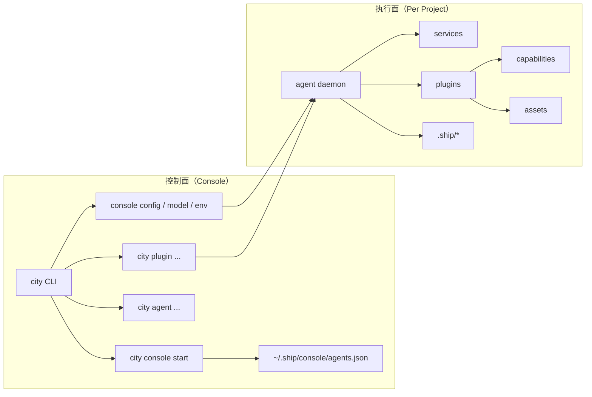
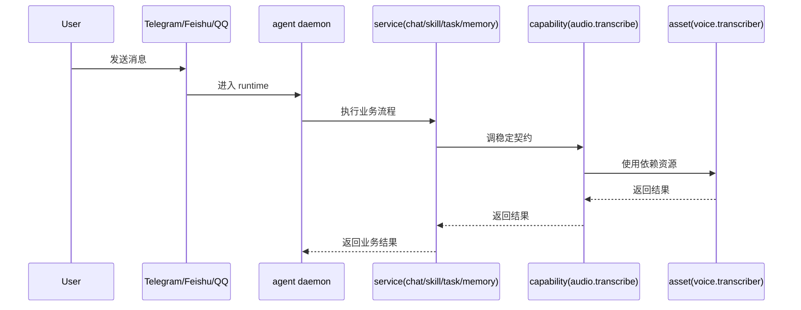

# 架构逻辑图

这页回答一个问题：

`console`、`agent`、`service`、`plugin`、`capability`、`asset` 各自负责什么，以及一次请求如何穿过它们。

## 1. 职责边界

- `console`：全局控制面。管理 daemon、registry、模型池、env、共享存储。
- `agent`：项目执行面。加载项目配置与上下文，持有单个 runtime。
- `service`：核心业务流程。
- `plugin`：可选增强模块。
- `capability`：稳定调用契约。
- `asset`：插件依赖资源。

## 2. 系统关系

## 3. 请求流

