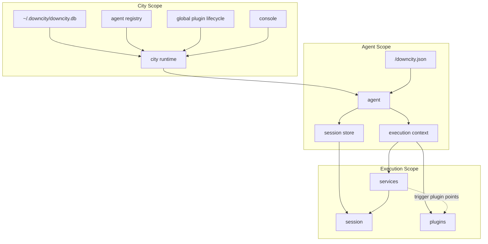
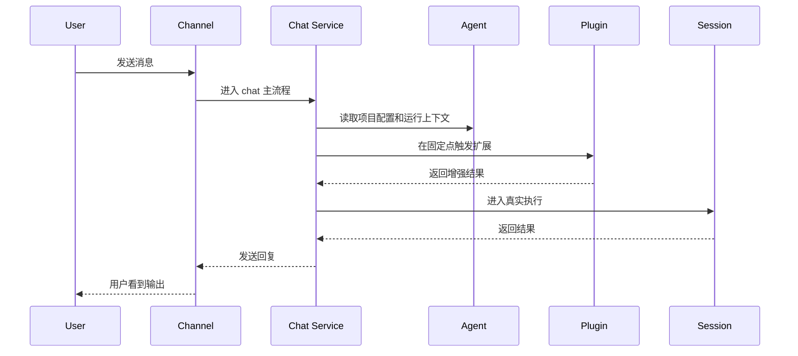

# 项目逻辑结构总览

如果你想快速理解 Downcity，最重要的不是先记命令，而是先记清楚“谁负责什么”。

这套系统可以用 6 个对象来理解：

- `city runtime`：全局宿主
- `console`：全局控制面
- `agent`：单项目宿主
- `session`：一次真实执行
- `service`：主流程模块
- `plugin`：扩展模块

## 一句话先说清

- `city` 管全局资源和全局状态
- `agent` 管单个项目
- `session` 才是真正执行对话或任务的地方
- `service` 负责主路径
- `plugin` 负责在固定点增强
- `console` 只是把这些东西可视化并提供控制入口

## 1. 四层作用域

你可以把整个系统分成 4 个作用域：

| 作用域 | 负责什么 | 典型数据 |
| --- | --- | --- |
| `city` | 全局运行时、模型池、agent registry、全局 plugin 生命周期 | `~/.downcity/downcity.db`、运行中的 agent 清单 |
| `agent project` | 单个项目自己的执行配置 | `<project>/downcity.json` |
| `session` | 一次 chat / task 的执行状态 | message history、prompt、上下文压缩结果 |
| `execution` | 某次执行时临时暴露出来的统一能力面 | `session`、`plugins`、`logger`、`config` |

最关键的一条边界是：

- `plugin 是否启用` 属于 `city`
- `plugin 怎么用` 属于 `agent`

例如：

- `asr` 是否启用，是 city 级状态
- 某个 agent 用哪个 `asr.modelId`，是 agent 参数

## 2. 目录和配置怎么分

用户视角只需要记住两个地方：

### 全局目录

- `~/.downcity/`
- 用来保存 city 级运行数据
- 例如模型池、全局环境、channel account、plugin lifecycle、运行中 agent registry

### 项目目录

- `<project>/downcity.json`
- 用来保存这个 agent 项目的执行配置
- 例如 execution 绑定、channel 绑定、plugin 参数

因此：

- 全局状态去看 Console 或 `~/.downcity`
- 项目参数去看项目自己的 `downcity.json`

## 3. 结构关系图



## 3.1 关键目录树

这不是完整仓库树，只保留理解系统时最有用的目录。

### 仓库根目录

```text
downcity/
├── homepage/                        # 官网与用户文档
│   ├── app/                         # 文档站点应用
│   ├── content/docs/                # 用户文档正文
│   └── public/                      # 站点静态资源
├── packages/
│   ├── downcity/                    # 核心 runtime、CLI、service、plugin 实现
│   └── downcity-ui/                 # 共享 UI 组件库
├── products/
│   ├── console/                     # Console 前端
│   ├── console-ui/                  # 旧 Console UI 相关产物
│   └── chrome-extension/            # 浏览器扩展
├── scripts/                         # 仓库级脚本
└── .agents/                         # 本地 skill / agent 配置辅助目录
```

### 核心运行时代码

```text
packages/downcity/src/
├── main/                            # 平台层入口与宿主编排
│   ├── city/                        # city 全局 runtime、全局 env、模型池、运行路径
│   ├── agent/                       # agent 宿主、项目加载、agent runtime 组装
│   ├── modules/                     # CLI、Console API、HTTP、RPC 对外入口
│   ├── plugin/                      # plugin 注册、catalog、lifecycle、调度
│   └── service/                     # service 注册与公共 service 宿主逻辑
├── services/                        # 主流程 service 实现
│   ├── chat/                        # 聊天主链路、渠道接入、消息编排
│   ├── task/                        # task 主链路
│   ├── memory/                      # memory 主链路
│   └── shell/                       # shell 主链路
├── plugins/                         # 扩展模块实现
│   ├── auth/                        # 鉴权相关 plugin
│   ├── skill/                       # skill catalog 与 lookup/install
│   ├── web/                         # web provider 选择与提示词注入
│   ├── asr/                         # 语音转写
│   ├── tts/                         # 文本转语音
│   └── voice/                       # 旧 voice 兼容实现
├── session/                         # session 执行、prompt、tools、context 处理
├── shared/
│   ├── constants/                   # 共享常量
│   ├── types/                       # 全局共享类型
│   └── utils/                       # 公共工具
└── services/                        # 主流程 service 的具体实现
```

### Console 前端代码

```text
products/console/src/
├── app/                             # 应用入口
├── components/                      # 页面组件与 dashboard 模块
├── hooks/                           # dashboard 状态与行为 hook
├── lib/                             # API、路由、查询、mutation 工具
└── types/                           # Console 前端类型
```

### 看问题时怎么找目录

- 想看全局模型池、全局 env、全局 plugin 开关：先看 `main/city`
- 想看某个项目 agent 怎么启动、怎么读 `downcity.json`：先看 `main/agent`
- 想看 Console 页面的数据从哪来：先看 `main/modules/console` 和 `products/console/src/lib`
- 想看聊天、任务、memory、shell 主流程：看 `services/*`
- 想看 ASR、TTS、Web、Skill 这类增强能力：看 `plugins/*`
- 想看真正 prompt / tools / session 执行逻辑：看 `session/*`

## 4. 每一层分别做什么

## `city runtime`

- 是整个系统的全局宿主
- 管理全局数据库、运行目录、agent registry
- 决定哪些 plugin 在 city 级是启用的
- 给 Console 提供统一控制面

你可以把它理解成“整个 Downcity 的平台层”。

## `console`

- 是 city 的 UI 和 API 控制面
- 负责查看 agent、模型池、channel account、plugin 状态
- `Global > Plugins` 看的是 city 级 plugin 状态
- 不代表某个具体 agent 的局部参数

## `agent`

- 一个项目对应一个 agent
- 它负责加载项目配置
- 它持有 session store
- 它在运行时把 `service` 和 `plugin` 接到统一执行环境里

`agent` 是项目宿主，不是每一轮执行本身。

## `session`

- 才是真正发生模型执行的地方
- 一段 chat 是一个 session
- 一次 task run 也是一个 session
- prompt、messages、上下文压缩、回复生成，都围绕 session 发生

所以：

- 用户在和 agent 交互
- 真正执行是在 session 里完成

## `service`

- `chat`、`task`、`memory`、`shell` 都属于 service
- service 负责主路径
- 它决定什么时候进入 session
- 它决定什么时候触发 plugin 扩展点

一句话：

- 主业务流程放在 service

## `plugin`

- `asr`、`tts`、`web`、`skill`、`auth` 都属于 plugin
- plugin 不拥有独立主流程
- plugin 只能在预定义扩展点接入
- plugin 是否启用由 city 决定
- plugin 参数由 agent 项目决定

一句话：

- plugin 是扩展层，不是主流程层

## 5. 一次请求是怎么跑的

最典型的是聊天消息。



如果是语音消息：

- `chat service` 先接住消息
- 在入站增强点触发 `asr`
- `asr` 把语音转成文本
- 再进入 session 做真正推理

如果是网页任务：

- 主路径仍然是 `chat` 或 `task`
- `web` plugin 只是在 system / provider 侧增强执行能力
- 它不是一个独立 service

## 6. Plugin 为什么不是 agent 的

这点最容易混。

正确理解应该是：

- plugin 定义属于 city
- plugin 生命周期属于 city
- agent 只是消费这些 plugin
- agent 只保存自己的 plugin 参数

所以现在在 Console 里：

- `Global > Plugins`：看 city 级 plugin 开关
- `Agent > Plugins`：看当前 agent 的参数和运行时视图

这两个页面不是同一个概念。

## 7. 你最该记住的配置规则

### city 级配置

放全局：

- 模型池
- channel accounts
- 全局环境
- plugin enable / disable

### agent 级配置

放项目：

- execution 绑定
- 项目自己的 channels 绑定
- plugin 参数
- 例如 `plugins.asr.modelId`
- 例如 `plugins.tts.voice`

### session 级状态

不手写配置：

- 消息历史
- 压缩归档
- 执行过程中的上下文状态

## 8. 一个实用心智模型

如果你不想记那么多，实现上可以只记这 5 句话：

1. `city` 是全局平台层。
2. `agent` 是单项目宿主。
3. `session` 是真正执行的地方。
4. `service` 负责主流程。
5. `plugin` 只负责扩展，不负责主流程。

## 9. 对应到 Console 怎么看

- 看系统全局状态：去 `Global`
- 看某个项目运行态：去 `Agent`
- 看 plugin 是否启用：去 `Global > Plugins`
- 看某个 agent 的 plugin 参数：去 `Agent > Plugins`
- 看某次对话或任务是怎么执行的：去 `Session` / `Task`

## 相关文档

- [架构总览](/zh/docs/concepts/architecture)
- [架构逻辑图](/zh/docs/concepts/logic-map)
- [Runtime 关系与进程模型](/zh/docs/concepts/runtime-relationship-and-process)
- [Service Runtime](/zh/docs/concepts/service-runtime)
- [消息处理流程](/zh/docs/concepts/message-processing)
