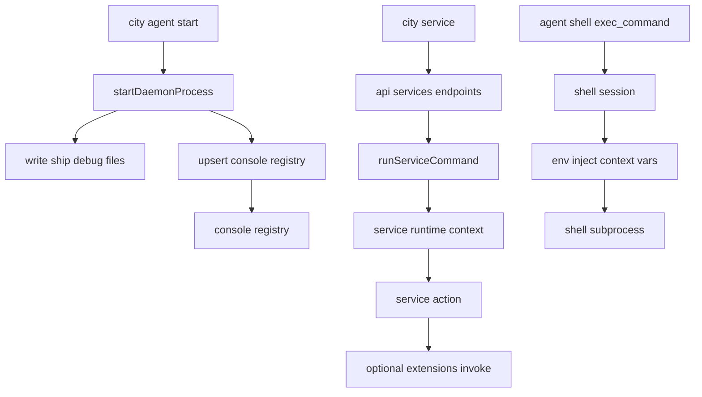

# Console 注册、Service 执行与 Shell 机制

这页只讲三件事：

1. console 的 agent 注册逻辑是什么
2. agent runtime 如何执行 service
3. agent 的 shell 是怎么工作的

## 1) Console 注册逻辑

## 核心结论

- console registry 是 `~/.ship/console/agents.json`
- registry 记录的是“console 已登记的 agent 项目 + 最近 pid”，不是实时健康探针
- agent daemon 启动后必须成功 upsert 到 registry，否则启动会回滚

## 触发时机

当执行 `city agent start`（后台 daemon）时：

1. 先校验 console 是否运行
2. 再校验 agent 项目目录（`PROFILE.md` / `ship.json`）
3. daemon manager 拉起 detached 子进程
4. 写 `.ship/debug/*`（pid/meta/log）
5. 调用 `upsertConsoleAgentEntry` 写入 registry

若第 5 步失败，会立即 kill 子进程并清理 pid/meta（避免“半成功”状态）。

## 数据语义

每条 registry 记录包含：

- `projectRoot`
- `pid`
- `startedAt`
- `updatedAt`

`city console agents` / `city console status` 在展示时会再次读每个项目的 daemon pid 并判活；判定为 stale 的记录会被清理。

## 2) Agent runtime 执行 service 逻辑

## 核心结论

- 一个 agent 进程只绑定一个 `rootPath`
- `service` 调用使用当前 runtime 注入的 `context/config/model/logger`
- `service -> extension` 也是同 runtime 内分发，不是跨进程默认行为

## 启动装配（RuntimeState）

`initRuntimeState(cwd)` 关键步骤：

1. 解析 `rootPath` 并校验项目结构
2. 读取配置并写入 runtime base state
3. 创建模型（`createModel`）
4. 创建 `ContextManager`（会话、persistor、dispatcher）
5. 组装 `ServiceRuntime`（含 `invoke` 与 `extensions.invoke`）

这决定了 service 执行时天然携带当前 agent 上下文。

## 执行路径

`city service ...` -> daemon API -> service manager：

- `/api/services/list` -> `listServiceRuntimes`
- `/api/services/control` -> `controlServiceRuntime`
- `/api/services/command` -> `runServiceCommand`

`runServiceCommand` 会按 service 名解析、按 action 分发，并基于 service runtime state 返回 snapshot。

## 3) Agent shell 机制

## 核心结论

- shell 是会话式工具，不是一次性 `exec`
- 默认工作目录是当前 runtime 的 `rootPath`
- shell 子进程会注入上下文 env，确保回路仍指向当前 agent server

## 工作方式

agent shell 提供三个工具动作：

- `exec_command`
- `write_stdin`
- `close_shell`

`exec_command` 创建会话上下文，后续通过 `write_stdin` 持续写入并轮询输出；输出按预算分页并缓存，直到会话关闭。

## 环境变量注入

shell 子进程会注入：

- `DC_CTX_CONTEXT_ID`
- `DC_CTX_REQUEST_ID`
- `DC_CTX_SERVER_HOST`
- `DC_CTX_SERVER_PORT`

因此 shell 中再执行 `city ...` 命令时，默认会优先命中当前 runtime 对应 server。

## 命令桥接

shell 对 `city|downcity` 命令支持桥接协议：

- 累积输出
- 尝试解析协议块（`__ship`）
- 可注入 user message 回主对话
- 可抑制原始工具输出并返回桥接摘要

这是 agent 内“shell 命令 -> 对话上下文”的统一回路。

## 关系图（简版）

## 相关文档

- [调用路由与环境隔离](/zh/docs/concepts/invocation-routing-and-isolation)
- [Service Runtime](/zh/docs/concepts/service-runtime)
- [Extension Runtime](/zh/docs/concepts/extension-runtime)
