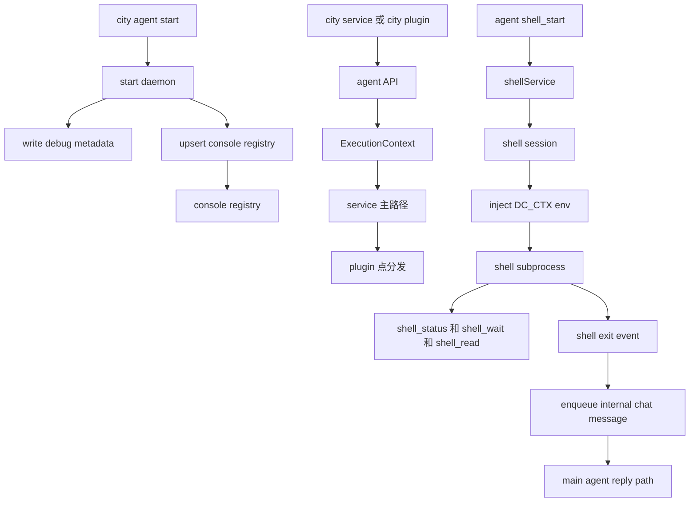

# Console 注册、Execution Context 与 Shell 流程

## 1. Console 注册

- registry 文件：`~/.downcity/console/agents.json`
- 保存已知 agent 与最近一次 daemon 元数据
- daemon 启动后必须成功写 registry，否则回滚

## 2. Execution Context 流程

- 一个 agent 进程绑定一个 `rootPath`
- agent 组装一个 `ExecutionContext`
- `ExecutionContext` 暴露 `session`、`invoke`、`plugins`
- plugin 向固定扩展点注册 `pipeline`、`guard`、`effect`、`resolve`
- service 在自己的主路径节点触发这些扩展点

## 3. Shell 流程

- shell 现在由 `shellService` 持有状态，而不是 tool 本地临时维护进程表
- `shell_start` 会返回 `shell_id`，它和 chat `contextId` 不是同一个东西
- 长任务期间应优先使用 `shell_status` 和 `shell_wait`，而不是高频空轮询
- 默认工作目录是当前项目根目录
- 子进程会注入 `DC_CTX_*` 环境变量
- shell 结束后，如果该会话属于真实 chat context，service 可以回投一条内部消息，再进入主回复链

## 关系图

