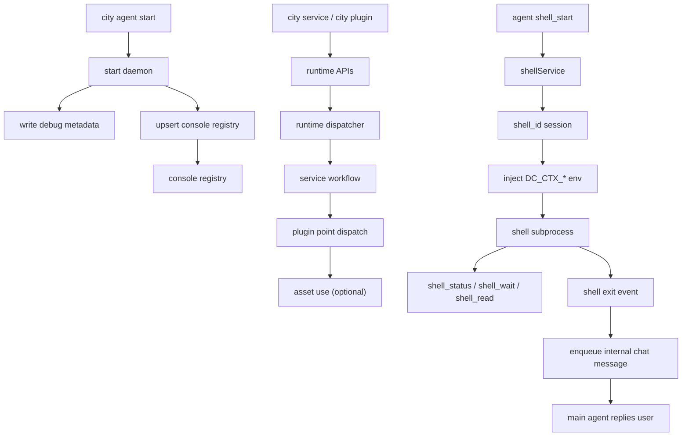

# Console 注册、Runtime 执行与 Shell 流程

## 1. Console 注册

- registry 文件：`~/.downcity/console/agents.json`
- 保存已知 agent 与最近一次 daemon 元数据
- daemon 启动后必须成功写 registry，否则回滚

## 2. Runtime 执行

- 一个 agent 进程绑定一个 `rootPath`
- runtime 组装 `ServiceRuntime`、`PluginRuntime` 与 asset 基础设施
- plugin 向 service 已定义的扩展点注册 `pipeline / guard / effect / resolve`
- service 在自己的工作流节点触发这些扩展点

## 3. Shell 流程

- shell 现在由独立的 `shellService` 维护状态，而不是由 agent tool 自己直接持有进程表
- 启动命令会返回 `shell_id`；它和 chat `contextId` 不是同一个东西
- 长任务期间，agent 应优先使用 `shell_status` / `shell_wait` 查询状态，而不是高频空轮询
- 默认工作目录是当前项目根目录
- 子进程会注入 `DC_CTX_*` 环境变量
- shell 结束后，如果该会话属于真实 chat context，service 会回投一条内部消息到原 chat，再由主 agent 自己回复用户

## 关系图

