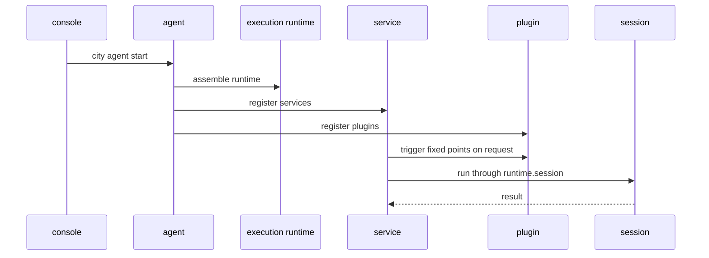

# Runtime 关系与进程顺序

## 1. 角色关系

- `console`：管理 registry、模型池、共享存储、UI
- `agent`：单个项目的宿主进程
- `execution runtime`：执行期间统一注入的能力视图
- `session`：具体执行实例
- `service`：主工作流模块
- `plugin`：通过固定点参与的扩展模块

一句话总结：

`console` 负责管，`agent` 负责承载，`execution runtime` 负责统一注入，`session` 负责执行，`service` 负责编排，`plugin` 负责增强。

## 2. 启动时发生什么

当你执行：

```bash
city agent start
```

通常顺序是：

1. agent 读取项目配置与环境变量
2. agent 初始化 logger、model、session registry
3. agent 组装统一的 `execution runtime`
4. agent 注册 service / plugin 基础设施
5. services 进入可用状态
6. plugins 注册自己的 hook / resolve / effect 能力
7. 运行痕迹持续写入 `.downcity/*`

关键点：

- service 和 plugin 在启动后就“可用”了
- 但这时还没有真正开始某个具体 session 执行

## 3. 真正执行是什么时候开始的

真正执行发生在外部请求进入之后，比如：

- Telegram 收到一条消息
- dashboard 对某个 session 发起 execute
- task scheduler 触发一次 task run

此时顺序通常变成：

1. 请求先进入某个 service
2. service 解析目标 `sessionId`
3. service 决定创建或复用 session
4. service 在固定节点触发 plugin
5. service 通过 `runtime.session` 进入 session 执行
6. session 返回结果
7. service 决定如何回写平台或落盘

## 4. 一张时序图



## 5. 最容易混淆的一点

不要把下面两件事混在一起：

1. `agent` 已经启动
2. 某个 `session` 正在执行

`agent` 是长期宿主。
`session` 是按需产生、按需复用的执行实例。

所以：

- 一个 agent 可以承载多个 session
- 一个 service 会把不同请求路由到不同 session
- plugin 不会自己创建独立执行主轴
