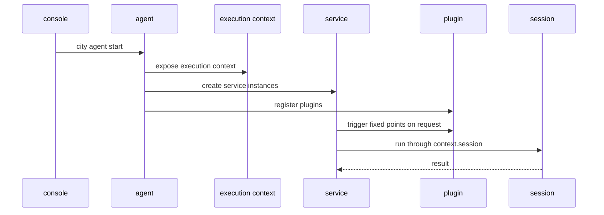

# 关系与进程模型

## 1. 角色总结

- `console`：管理 registry、模型池、共享存储和 UI
- `agent`：单个项目的宿主进程
- `execution context`：执行期间统一暴露的能力面
- `session`：具体的一次执行实例
- `service`：主路径模块
- `plugin`：只在固定点接入的扩展模块

一句话总结：

`console` 负责管，`agent` 负责承载，`execution context` 负责统一暴露能力，`session` 负责执行，`service` 负责编排，`plugin` 负责增强。

## 2. 启动时发生什么

当你运行：

```bash
city agent start
```

通常顺序是：

1. agent 读取项目配置和 env
2. agent 初始化 logger、model、session store、plugin registry 和 service instances
3. agent 对外暴露共享的 `execution context`
4. services 进入可用状态
5. plugin 固定扩展点进入可用状态
6. 项目本地运行痕迹继续写入 `.downcity/*`

关键点：

- service 和 plugin 会在启动后就绪
- 但此时还没有具体 session 开始执行

## 3. 真正执行何时开始

真正执行只会在外部请求进入后发生，例如：

- Telegram 投递一条消息
- dashboard 执行一个目标 session
- task scheduler 触发一次 task run

这时通常顺序是：

1. 请求先进入某个 service
2. service 解析目标 `sessionId`
3. service 创建或复用一个 session
4. service 在固定点触发 plugin
5. service 通过 `context.session` 进入执行
6. session 返回结果
7. service 决定如何回复或如何落盘

## 4. 一张时序图



## 5. 最常见的混淆

不要混淆这两个状态：

1. `agent` 已经启动
2. 一个 `session` 正在执行

`agent` 是长期宿主。
`session` 是按需创建或复用的执行实例。

所以：

- 一个 agent 可以承载很多 session
- 一个 service 会把不同请求路由到不同 session
- plugin 不会创造第二条执行主轴
