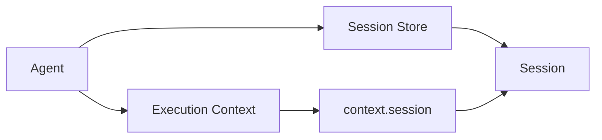
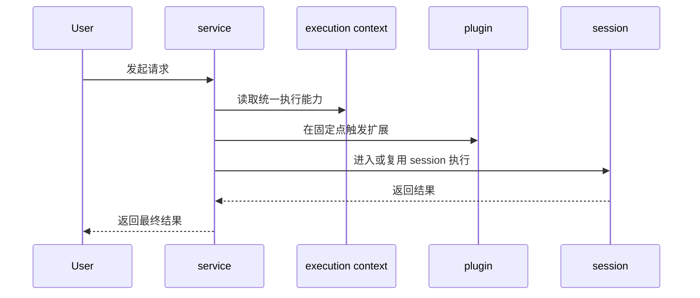

# Execution Context 与 Session

这页只回答 3 个问题：

1. `execution context` 是什么
2. `session` 是什么
3. `service` 和 `plugin` 怎么接进来

## 1. Execution Context 是什么

`execution context` 不是一个新进程，也不是一个独立系统。

它更准确的意思是：

**agent 在执行期间，对 service / plugin 暴露的一套统一能力视图。**

通常包括：

- `config`
- `env`
- `logger`
- `session`
- `invoke`
- `plugins`

所以它解决的是“执行时大家怎么拿到同一套能力”的问题，而不是“谁是宿主”的问题。

## 2. Session 是什么

`session` 才是真正的一次执行实例。

你可以把它理解成：

- 一条 chat 对话 = 一个 session
- 一次 task run = 一个 session
- 后续的 history、prompt、tool、assistant output 都围绕这个 session 发生

这也是为什么现在很多用户侧概念都统一收敛到 `sessionId`：

- 语义更稳定
- chat 和 task 可以共用同一套执行主轴
- 不再需要把各种执行实例拆成很多平级概念

## 3. Execution Context 和 Session 的关系

要点是：

- `agent` 持有 session store
- `execution context` 暴露 `context.session`
- `service` 和 `plugin` 不直接拥有 session，它们是通过 `context.session` 使用 session 能力

## 4. Service 应该负责什么

service 是主流程模块。

典型内置 service：

- `chat`
- `task`
- `memory`
- `shell`

service 应该负责：

- 主路径
- 编排
- 领域状态
- 稳定 action
- 定义允许 plugin 接入的扩展点

service 不应该负责：

- plugin 私有实现细节
- plugin 的依赖安装与内部切换
- 把主路径拆碎到 plugin 里

## 5. Plugin 应该负责什么

plugin 是被动扩展层。

它的职责是：

- 在固定扩展点增强主路径
- 做 guard、pipeline、effect、resolve
- 管理自己的依赖、配置和内部实现

plugin 不应该：

- 拥有独立生命周期
- 变成第二套 service
- 再维护一套独立 runtime

## 6. 它们如何协作

## 7. 一个聊天例子

在 chat 场景里：

- `chat service` 接收 Telegram、Feishu 或 QQ 消息
- 它通过映射找到目标 `sessionId`
- 然后通过 `context.session` 进入该 session 执行
- 如果有语音附件，就触发 `asr plugin`
- 如果需要鉴权，就触发 `auth plugin`
- 最后由 `chat service` 决定如何回复渠道

## 8. 最终记忆法

一句话记：

- `agent` 是宿主
- `execution context` 是统一执行视图
- `session` 是真正执行单元
- `service` 负责主路径
- `plugin` 负责被动增强
