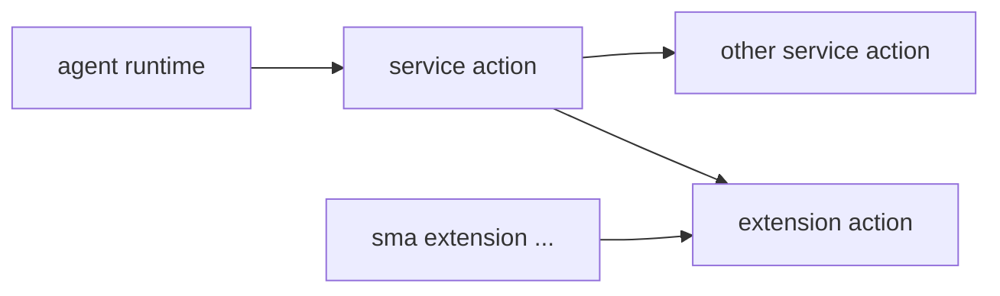

# Service 与 Extension 区别

这页专门回答：`service` 和 `extension` 到底怎么分。

## 一句话结论（本质）

- `service`：**agent 层的能力机制**，必须结合具体 `context`（会话、模型、持久化）运行。
- `extension`：**console/platform 层的扩展机制**，核心不依赖会话 `context`，由 service 或 CLI 调用。

## 对照表

| 维度 | service | extension |
| --- | --- | --- |
| 核心定位 | agent 执行面的机制（面向 context） | console/platform 扩展机制（面向通用平台能力） |
| command/action | 有，注册后由 agent 调度 | 有，注册后由 service/CLI 调用 |
| 典型调用方向 | `agent -> service` | `service -> extension`、`CLI -> extension` |
| 配置作用域 | `ship.json.services.*`（每个 agent 项目独立） | `ship.json.extensions.*`（每个 agent 是否启用独立） |
| 对 context 依赖 | 强依赖（ContextManager/model/persistor） | 弱依赖或无依赖（不以会话上下文为核心） |
| 资源共享 | 主要是项目内状态（`.ship/*`） | 常见为全局共享资源（如 voice 默认 `~/.ship/models/voice`） |

## 关键判断（直接确认）

1. `service` 是 agent 层机制，必须和具体 context 结合。
- 结论：**是**。

2. `extension` 与会话 context 无关，属于 console/platform 级扩展机制。
- 结论：**方向正确**。
- 补充：extension 运行时仍会拿到 runtime 对象，但核心设计不是“围绕会话上下文编排”。

3. `service` 与 `extension` 是两类机制，不应合并成同一类“能力”。
- 结论：**是**，文档按两类机制分别说明更准确。

4. voice 这类 extension 的模型资产默认全局共享。
- 结论：**是（默认）**。
- 补充：
  - 默认情况下，voice 模型目录是 `~/.ship/models/voice`，可被多个 agent 复用。
  - 但每个 agent 仍有自己的 extension 开关与配置（`ship.json.extensions.*`）。
  - 若显式配置 `modelsDir` 到项目内路径，也可以不共享。

## 调用关系图

## 使用建议

- 涉及会话编排、模型推理、消息持久化的逻辑，放 `service`。
- 跨 agent 复用、与会话上下文弱耦合的逻辑，放 `extension`。

## 相关文档

- [Service Runtime](/zh/docs/concepts/service-runtime)
- [Extension Runtime](/zh/docs/concepts/extension-runtime)
- [关系与进程模型](/zh/docs/concepts/runtime-relationship-and-process)
