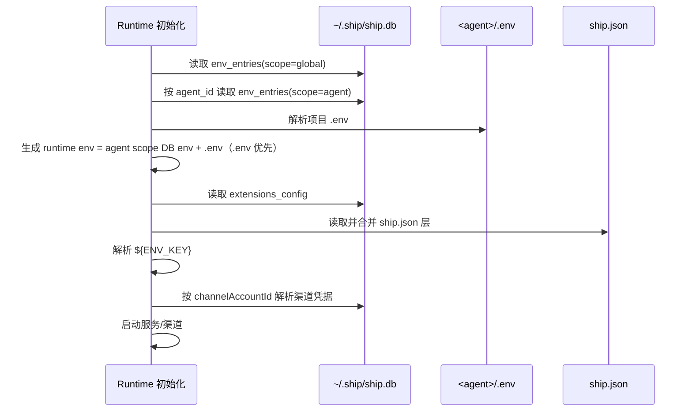

# Env 与 ship.db 数据库设计

本文是 `env + ~/.ship/ship.db` 设计的唯一说明文档，覆盖表结构、加密、绑定关系、读写流程。

## 1. 设计目标

1. 所有“持久化 env”统一加密存储到 `~/.ship/ship.db`。
2. agent 之间的 env 完全隔离，不串用。
3. `ship.json` 只做绑定，不存明文凭据。
4. Console UI 与 CLI 共用同一套数据模型。

## 2. 总览图

```mermaid
flowchart LR
  subgraph ConsoleGlobal[~/.ship/ship.db]
    G[env_entries(global)]
    A[env_entries(agent)]
    B[channel_accounts]
    M1[model_providers]
    M2[models]
    S[console_secure_settings]
  end

  J[<agent>/ship.json] -->|model.primary + channel.channelAccountId| R[Agent Runtime]
  E[<agent>/.env] -->|仅 runtime 叠加| R
  A -->|agentId=projectRoot| R
  G -->|console 共享 env| R
  B -->|按 channelAccountId 解析渠道凭据| R
  M1 --> R
  M2 --> R
  S -->|extensions_config| R
```

## 3. 表结构（逐表说明）

## 3.1 `env_entries`

用途：统一承载 console 共享 env 与 agent 私有 env。

| 字段 | 类型 | 说明 |
|---|---|---|
| `scope` | TEXT | `global` 或 `agent` |
| `agent_id` | TEXT | 全局行固定为空字符串；agent 行为 projectRoot 绝对路径 |
| `key` | TEXT | env key |
| `value_encrypted` | TEXT | AES-GCM 密文 |
| `created_at` | TEXT | ISO 时间 |
| `updated_at` | TEXT | ISO 时间 |

约束：

1. 复合主键：`(scope, agent_id, key)`
2. 索引：`scope`
3. 索引：`agent_id`

## 3.2 `channel_accounts`

用途：chat 渠道凭据统一管理。

| 字段 | 类型 | 说明 |
|---|---|---|
| `id` | TEXT PK | channel account id（`ship.json` 绑定值） |
| `channel` | TEXT | `telegram` / `feishu` / `qq` |
| `name` | TEXT | 展示名 |
| `identity` | TEXT | 可选身份文案 |
| `owner` | TEXT | 可选所有者信息（平台可取到时自动同步） |
| `creator` | TEXT | 可选创建者信息（平台可取到时自动同步） |
| `bot_token_encrypted` | TEXT | Telegram token（密文） |
| `app_id_encrypted` | TEXT | appId（密文） |
| `app_secret_encrypted` | TEXT | appSecret（密文） |
| `domain` | TEXT | 可选 domain（主要用于 Feishu/Lark） |
| `sandbox` | INTEGER | QQ 沙箱开关（`0/1`） |
| `auth_id` | TEXT | 可选 master 鉴权 id |
| `created_at` | TEXT | ISO 时间 |
| `updated_at` | TEXT | ISO 时间 |

## 3.3 仍在使用的表

1. `model_providers` / `models`：全局模型池。
2. `console_secure_settings`：非 env 的加密 JSON（当前用于 `extensions_config`）。

## 4. 加密边界

以下字段必须加密：

1. `env_entries.value_encrypted`
3. `channel_accounts.*_encrypted`
4. `console_secure_settings.value_encrypted`
5. `model_providers.api_key_encrypted`

说明：

1. 解密只发生在进程内存。
2. `ship.json` 不保存 chat 明文密钥。

## 5. ship.json 绑定模型

`ship.json` 只保留绑定字段：

```json
{
  "model": {
    "primary": "default"
  },
  "services": {
    "chat": {
      "channels": {
        "qq": {
          "enabled": true,
          "channelAccountId": "qq-main"
        }
      }
    }
  }
}
```

规则：

1. `model.primary` 绑定 `models.id`。
2. `services.chat.channels.<channel>.channelAccountId` 绑定 `channel_accounts.id`。
3. 渠道启动需要同时满足：
- `enabled=true`
- `channelAccountId` 可解析
- 绑定账户具备该渠道必填凭据

## 6. 运行时加载顺序



## 7. 写入路径

1. Console UI 的 Channel Accounts 页面：写 `channel_accounts`。
2. Console UI / CLI 的模型管理：写 `model_providers`、`models`。
3. Console 扩展配置与 extension 命令：写 `console_secure_settings.extensions_config`。
4. 渠道配置动作：只写 `ship.json` 的 `enabled/channelAccountId`。

## 8. `.env` 与 DB 的关系

1. `<agent>/.env` 由用户手动维护，仅注入当前 agent runtime。
2. `env_entries(scope=agent)` 也是 agent 私有层；最终 runtime env = `agent scope DB env + .env`（`.env` 覆盖）。
3. console 共享层 env 只来自 `env_entries(scope=global)`。

## 9. 自检清单

1. `channel_accounts` 中存在目标 account。
2. agent 的 `ship.json` 渠道已绑定 `channelAccountId`。
3. `chat status` 显示：
- `enabled=true`
- `configured=true`
- 非 `config_missing`

4. 新建 agent 未绑定账户时，不应自动继承旧项目密钥。
