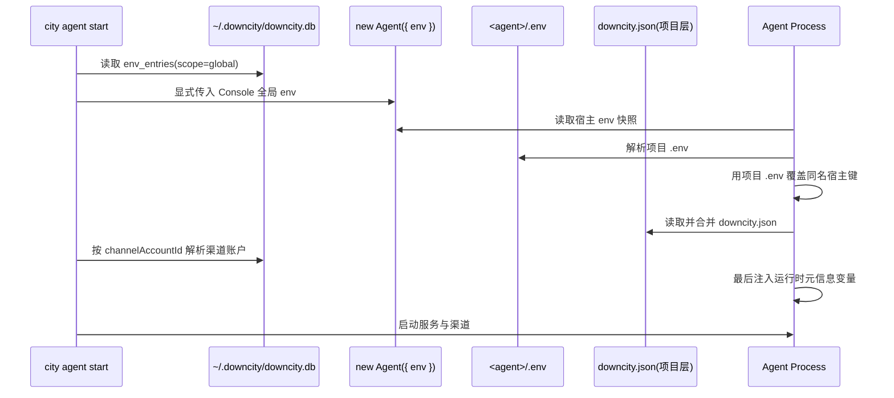
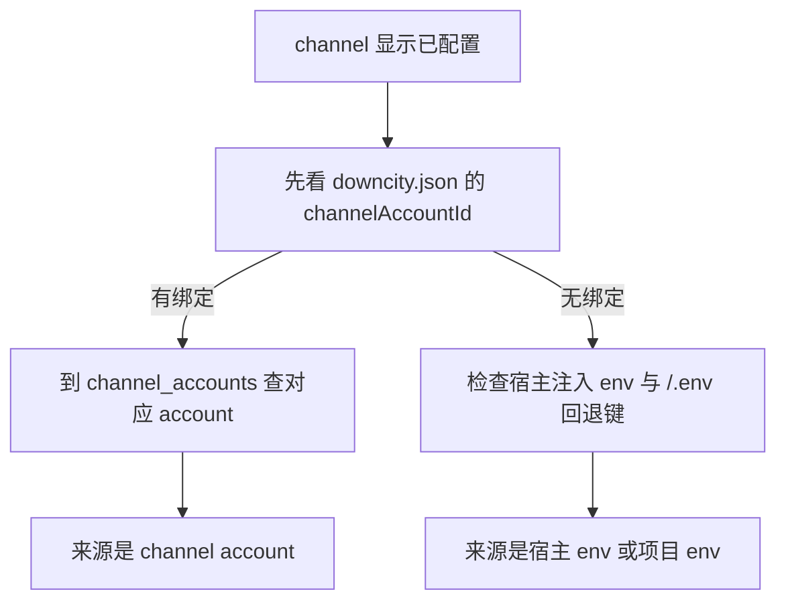

> 标准设计文档： [Env 与 downcity.db 数据库设计](/zh/docs/configuration/env-downcitydb-design)


# 环境变量配置逻辑（宿主 Env、项目 `.env`、运行时元信息）

这篇文档专门回答 4 个问题：

1. 环境变量到底分几类？
2. 每一类保存到哪里？
3. 启动时怎么加载、怎么覆盖？
4. 哪些地方会读取，哪些地方不会？

## 1. 作用域矩阵

| 层 | 数据源 | 是否持久化 | 作用范围 | 典型内容 |
|---|---|---|---|---|
| 宿主注入 env | `new Agent({ env })` | 否 | 单个 agent 实例 | 共享 API Key、嵌入宿主参数、city 全局 env |
| 项目 env 文件 | `<agent>/.env` | 用户文件 | 单个 agent | 项目本地运行时叠加值 |
| 运行时元信息 | 进程内存（`DC_CITY_*`、`DC_AGENT_*`、`DC_SESSION_ID`） | 否 | 单次请求 / 单个进程 | runtime 地址、agent 身份与 session 元信息 |
| Bot 凭据池 | `~/.downcity/downcity.db` `channel_accounts` | 是（敏感字段加密） | 被多个 agent 绑定复用 | Telegram/Feishu/QQ 密钥 |
| Console Env 记录 | `~/.downcity/downcity.db` `env_entries` | 是（加密） | Console 侧管理存储 | 全局共享 env 注册表 |

关键点：

1. `@downcity/agent` 不会自动读取宿主 `process.env`。
2. `new Agent({ env })` 是宿主注入 env 的唯一入口。
3. 当宿主是 `city` 时，会先从 `downcity.db` 读取 Console 全局 env，再显式传给 `Agent`。
4. `downcity.json` 只做绑定（如 `channelAccountId`），不保存明文凭据。

## 2. 运行时数据流（图示）



## 3. 优先级规则

### 3.1 Agent 级 env 合并优先级

1. 先读取宿主注入的 `new Agent({ env })`。
2. 再叠加 `<agent>/.env`。

因此，Agent 级同名键覆盖顺序是：项目 `.env` > 宿主注入 `env`。

### 3.2 运行时元信息注入优先级

1. 运行时 helper 先从已经解析好的 agent env 快照出发。
2. `DC_SESSION_ID`、`DC_CITY_*`、`DC_AGENT_*` 等请求级元信息最后注入。

因此，带运行时元信息时的优先级是：`DC_CITY_*` / `DC_AGENT_*` / `DC_SESSION_ID` > 项目 `.env` > 宿主注入 `env`。

### 3.3 渠道凭据优先级

1. `downcity.json` 渠道只配置 `channelAccountId`。
2. 真实密钥优先从 `channel_accounts` 解析。
3. 如果绑定缺失或凭据不完整，则 `config_missing`。

## 4. 哪些会读 `.env`，哪些不会

### 4.1 会读取项目 `.env`

1. Agent 运行时 env 组装（`new Agent({ env })` + `.env`）。
2. 本地 plugin 命令上下文组装。
3. 在已解析 env 之上继续叠加请求元信息的运行时 helper。

### 4.2 不会读取项目 `.env`

1. 模型池（`model_providers`、`models`）只来自 `downcity.db`。
2. plugin 配置来自项目 `downcity.json`（`plugins.*`，包含插件自己的依赖配置）。
3. bot 凭据源只来自 `channel_accounts`。
4. `DC_CTX_*` 是请求时生成，不属于配置持久层。

## 5. 写入路径

1. Console UI `Global / Env`：写 `env_entries`，作为 Console 侧 env 管理存储。
2. Channel Accounts 页面：写 `channel_accounts`。
3. 模型管理（CLI/UI）：写 `model_providers`、`models`。
4. `plugins.*` 配置：写项目 `downcity.json`。
5. 渠道配置：仅写 `downcity.json` 的 `enabled` 与 `channelAccountId`。
6. 用户手工改 `<agent>/.env`：仅影响当前 agent。

补充说明：

1. `env_entries` 属于 Console 侧管理存储。
2. 如果宿主希望这些值参与 Agent 运行时 env，应该通过 `new Agent({ env })` 显式传入。

## 6. 常见问题与排查

### 6.1 “为什么新 agent 也显示已有渠道凭据？”

常见原因：

1. 新 agent 绑定到了已有 `channelAccountId`。
2. 宿主显式传给了 Agent 共享凭据键。
3. 新项目 `.env` 中已有回退凭据键。



## 7. 推荐操作流程

1. 初始化 console 全局层：

```bash
city init
city model create
city plugin action asr configure --payload '{"modelId": "SenseVoiceSmall"}'
```

2. 在 Console UI `Global / Env` 维护共享 env，或由宿主在 `new Agent({ env })` 时显式传入。
3. 在 Console UI `Global / Channel Accounts` 创建账号。
4. 在 agent `downcity.json` 里绑定 `channelAccountId`。
5. 仅在需要时使用 `<agent>/.env` 做项目级运行时覆盖。

## 8. 最佳实践

1. 持久化密钥全部放进 `downcity.db` 加密表。
2. `downcity.json` 只写绑定，不写明文密钥。
3. `<agent>/.env` 仅作项目本地运行时叠加。
4. `new Agent({ env })` 只用于明确的宿主侧覆盖。
5. 渠道配置变更后执行 `chat status` 进行验收。
6. 出现“像复用旧值”的情况时，优先检查 `channelAccountId`、宿主注入 env 与项目 `.env`。

## 9. Homepage Agent 社区资源

Homepage 里的 Agent 社区资源现在可以接 PostgreSQL 兼容数据库，推荐直接使用 Supabase。

需要的运行时变量：

1. `DATABASE_URL`：指向你的 Supabase Postgres 连接串，用来统一保存仓库提交与审核状态。

行为说明：

1. 所有公开提交都会先以 `review_status = pending` 写入数据库。
2. 管理员直接在 Supabase 后台手动执行通过或拒绝。
3. 只有 `approved` 状态的记录才会显示在公开 marketplace 页面上。

## 10. Console 公网地址

当你使用 `city start -p` 或 `city console start -p` 时，CLI 会尝试在启动结果里打印 `Public URL`。
如果你使用 `city public on`，后续普通 `city start` 和 `city console start` 也会沿用这份已保存的公网绑定模式。

这些值通常由 `city start` 或部署环境注入，不是 `contact link` 要求用户手动填写的参数：

1. `DOWNCITY_PUBLIC_URL`：完整公网 URL，例如 `https://console.example.com`
2. `DOWNCITY_PUBLIC_HOST`：公网 host，CLI 会自动补成 `http://<host>:5315`

`city start` 会自动探测公网 IP，并把结果写入全局 Console Env 的 `DOWNCITY_PUBLIC_HOST`。这个值也会被 agent 的 `contact link` 用来生成可转交的联系码。

优先级：

1. `DOWNCITY_PUBLIC_URL`
2. `DOWNCITY_PUBLIC_HOST`
3. 当前绑定 host（如果它本身就是可直连地址）
4. 本机网卡里探测到的公网 IPv4
