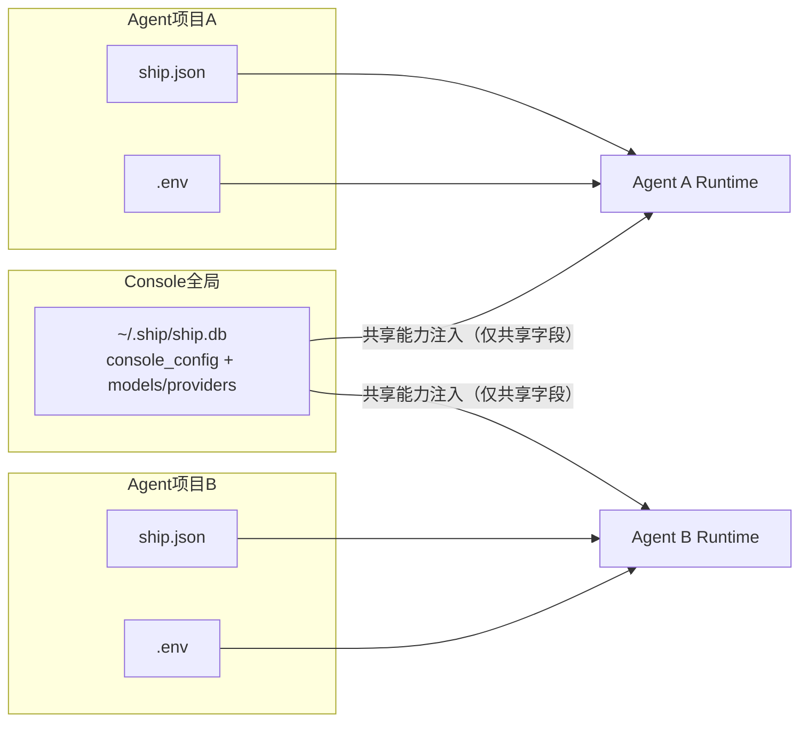
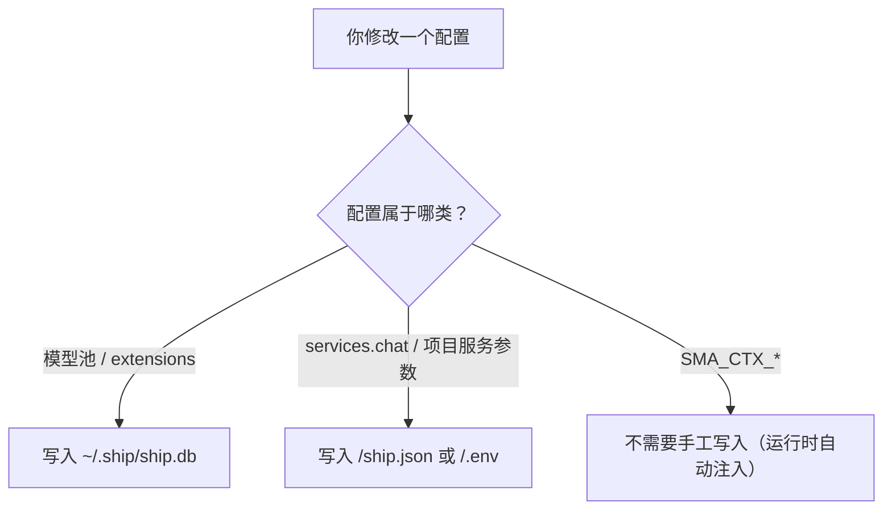
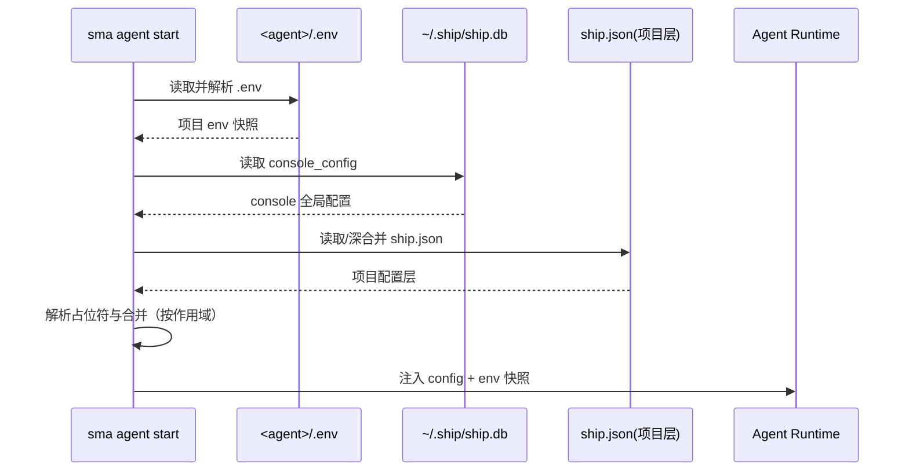
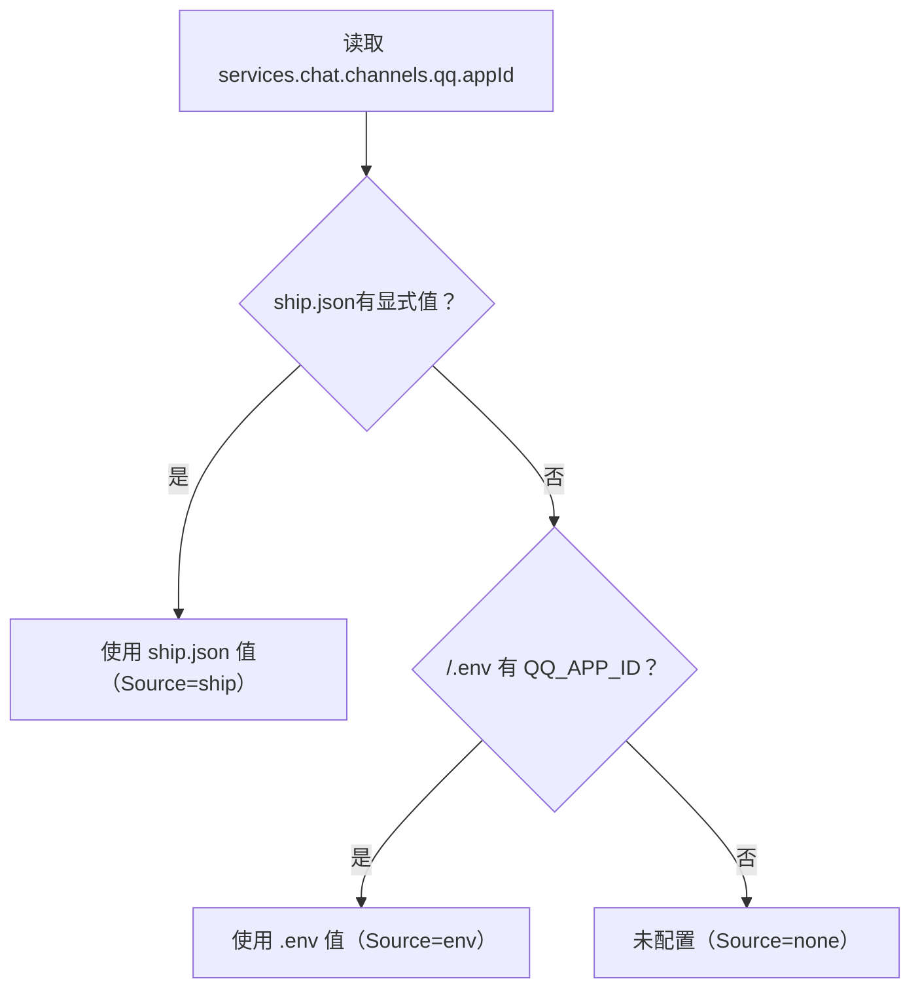
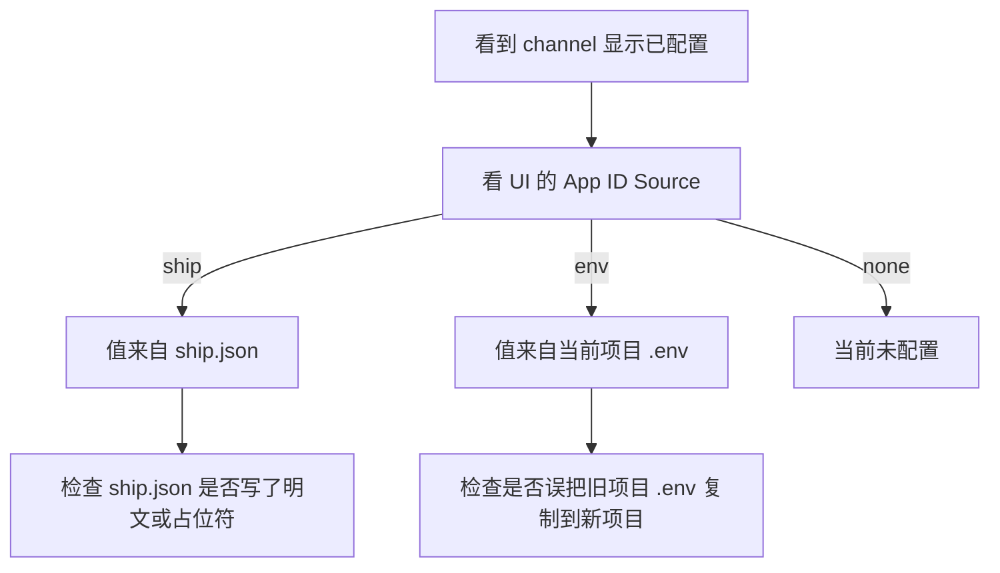

# 环境变量配置逻辑（Console 共享 vs Agent 私有）

这篇文档专门回答 4 个问题：

1. 环境变量到底分几类？
2. 每一类保存到哪里？
3. 启动时怎么加载、怎么覆盖？
4. 哪些地方会读取，哪些地方不会？

## 1. 一页总览

### 1.1 三类变量（先分清概念）

| 类型 | 典型键 | 保存位置 | 作用范围 | 你是否需要手工配置 |
|---|---|---|---|---|
| Console 共享配置变量 | provider API Key、`extensions.*` | `~/.ship/ship.db` | 所有 Agent | 是（通过 `sma console ...`） |
| Agent 私有配置变量 | `QQ_APP_ID`、`TELEGRAM_BOT_TOKEN` | `<agent>/.env` | 当前 Agent | 是（在项目目录配置） |
| 运行时上下文变量 | `SMA_CTX_CHANNEL`、`SMA_CTX_CHAT_ID` | 进程环境（不落盘） | 单次请求 | 否（系统自动注入） |

### 1.2 架构图（保存边界）



关键点：

1. `ship.db` 是 Console 全局事实源。
2. 每个 Agent 只读取自己的 `.env`。
3. 不存在 “A 项目的 `.env` 自动给 B 项目用” 的路径。

## 2. 保存逻辑（你改配置时写到哪里）

### 2.1 Console 共享能力写入

你通过以下命令修改的内容，会写到 `~/.ship/ship.db`：

1. `sma console model ...`
2. `sma console config set extensions...`
3. `sma voice ...`（本质也是改 `extensions.voice`）

### 2.2 Agent 私有能力写入

你在项目目录里修改：

1. `<agent>/ship.json`
2. `<agent>/.env`

这些只影响当前 Agent，不影响其它项目。

### 2.3 保存路径流程图



## 3. 启动加载逻辑（从磁盘到生效）

Agent 启动（`sma agent start` 或 console daemon 拉起）时，大致顺序：

1. 读取 `<agent>/.env`，得到**项目私有快照**（不污染全局 `process.env`）。
2. 读取 `~/.ship/ship.db` 的 `console_config`。
3. 从 console 配置中只提取共享字段并注入（当前重点是 `extensions`）。
4. 读取项目层 `ship.json`（含继承链）并深合并。
5. 解析 `${ENV_KEY}` 占位符：
   1. 项目层占位符：只读项目 `.env` 快照。
   2. console 层占位符：只读系统环境。
6. service 运行时按合并后的配置 + 项目 `.env` 快照执行。

### 3.1 加载时序图



## 4. 优先级逻辑（同一个字段谁赢）

### 4.1 Chat 渠道凭据优先级

以 QQ 为例（Feishu/Telegram 同理）：

1. 先看 `ship.json` 显式值（如 `services.chat.channels.qq.appId`）。
2. 如果没填，再看项目 `.env`（如 `QQ_APP_ID`）。
3. 两者都没有，视为未配置。

### 4.2 优先级图（以 `appId` 为例）



## 5. 会读取 `.env` 的位置 vs 不会读取的位置

### 5.1 会读取项目 `.env`（当前 Agent）

1. 项目 `ship.json` 的 `${ENV_KEY}` 解析（项目层）。
2. Chat 渠道凭据解析（Telegram/Feishu/QQ）。
3. 某些 extension 的本地兜底执行（daemon 不可达时）使用同一份项目 env 快照。

### 5.2 不会读取项目 `.env`

1. Console 模型池事实源（providers/models）本身：来源是 `ship.db`。
2. `extensions.*` 全局开关与参数：来源是 `ship.db` 的 `console_config.extensions`。
3. `SMA_CTX_*`：它们是请求上下文，不是配置项。

## 6. 常见误解与排查图

### 6.1 “新 Agent 为什么自动有 QQ appId？”

最常见原因：该项目 `.env` 里已经有 `QQ_APP_ID`。  
这表示 env 回退生效，不代表写回了 `ship.json`。

### 6.2 排查流程图



## 7. 推荐配置模板

### 7.1 Console 共享能力

```bash
sma console init
sma console model create
sma console config set extensions.voice.enabled true
```

### 7.2 Agent 私有能力

`ship.json`：

```json
{
  "services": {
    "chat": {
      "channels": {
        "qq": {
          "enabled": true,
          "appId": "${QQ_APP_ID}",
          "appSecret": "${QQ_APP_SECRET}",
          "auth_id": ""
        }
      }
    }
  }
}
```

`.env`：

```bash
QQ_APP_ID=your_qq_app_id
QQ_APP_SECRET=your_qq_app_secret
```

## 8. 最佳实践清单

1. 把模型池和 extensions 统一放在 `ship.db`。
2. 把服务密钥放在项目 `.env`，在 `ship.json` 里只写 `${ENV_KEY}`。
3. 把 `SMA_CTX_*` 当成运行时上下文，不要手工落盘。
4. 多 Agent 并行时，务必保证每个项目 `.env` 独立。
5. 变更后重启目标 Agent，再看 Console UI 的 `Source` 字段验收。
