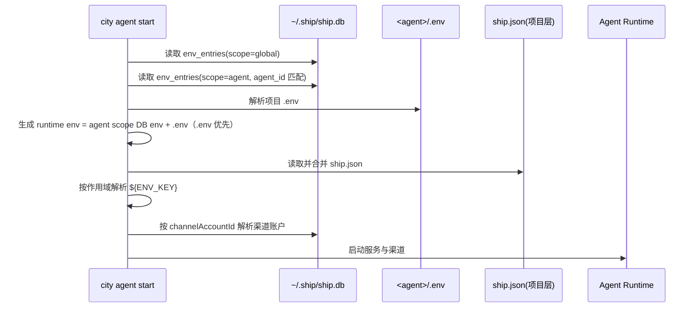
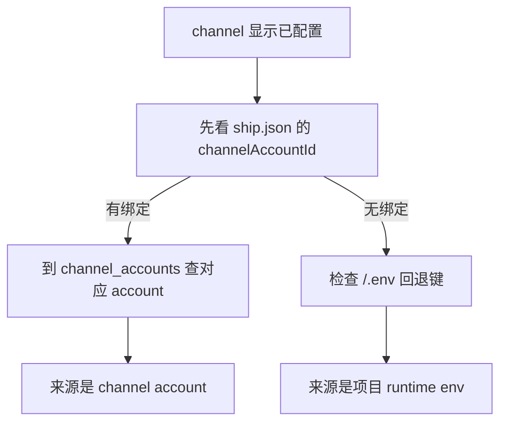

> 标准设计文档： [Env 与 ship.db 数据库设计](/zh/docs/configuration/env-shipdb-design)


# 环境变量配置逻辑（Console 共享 vs Agent 私有）

这篇文档专门回答 4 个问题：

1. 环境变量到底分几类？
2. 每一类保存到哪里？
3. 启动时怎么加载、怎么覆盖？
4. 哪些地方会读取，哪些地方不会？

## 1. 作用域矩阵

| 层 | 数据源 | 是否持久化 | 作用范围 | 典型内容 |
|---|---|---|---|---|
| Console 全局 env | `~/.ship/ship.db` `env_entries`（`scope=global`） | 是（加密） | 所有 agent | 全局共享 key、共享占位符 |
| Agent 私有 env（DB） | `~/.ship/ship.db` `env_entries`（`scope=agent` + `agent_id`） | 是（加密） | 单个 agent（`agent_id`） | 项目私有密钥 |
| Agent 私有 env（文件） | `<agent>/.env` | 用户文件 | 单个 agent | 运行时叠加值 |
| Bot 凭据池 | `~/.ship/ship.db` `channel_accounts` | 是（敏感字段加密） | 被多个 agent 绑定复用 | Telegram/Feishu/QQ 密钥 |
| 运行时上下文 | 进程内存（`DC_CTX_*`） | 否 | 单次请求 | channel/chat/user 上下文 |

关键点：

1. 持久化的 env 类数据统一在 `ship.db` 加密存储。
2. `<agent>/.env` 是该 agent 的运行时叠加层。
3. `ship.json` 只做绑定（如 `channelAccountId`），不保存明文凭据。

## 2. 运行时数据流（图示）



## 3. 优先级规则

### 3.1 运行时 env 合并优先级

1. 先加载 agent scope 的 DB env。
2. 再叠加 `<agent>/.env`。
3. 同名键冲突时 `.env` 覆盖 DB 值。

### 3.2 `shell` 会话注入优先级

1. shell 子进程先继承宿主进程的基础 `process.env`。
2. 再叠加 Console 全局 env（`scope=global`）。
3. 再叠加当前 agent runtime env（`agent scope env + <agent>/.env`）。
4. 最后注入 `DC_CTX_*` 等请求上下文变量。

因此，同名键冲突时优先级是：`DC_CTX_*` > agent runtime env > global env > 宿主进程基础 env。

### 3.3 渠道凭据优先级

1. `ship.json` 渠道只配置 `channelAccountId`。
2. 真实密钥优先从 `channel_accounts` 解析。
3. 如果绑定缺失或凭据不完整，则 `config_missing`。

## 4. 哪些会读 `.env`，哪些不会

### 4.1 会读取项目 `.env`

1. 项目层 `ship.json` 的 `${ENV_KEY}` 解析。
2. agent runtime 进程 env 注入（`env_entries` 中的 agent scope env + `.env`）。
3. `shell` 子进程注入（global env + 当前 agent runtime env + `DC_CTX_*`）。
4. 少数 service auth 的本地兜底读取。

### 4.2 不会读取项目 `.env`

1. 模型池（`model_providers`、`models`）只来自 `ship.db`。
2. plugin 配置来自项目 `ship.json`（`plugins.*`、`assets.*`）。
3. bot 凭据源只来自 `channel_accounts`。
4. `DC_CTX_*` 是请求时生成，不属于配置持久层。

## 5. 写入路径

1. Console UI `Global / Env`：写 `env_entries`（`scope=global/agent`）。
2. Channel Accounts 页面：写 `channel_accounts`。
3. 模型管理（CLI/UI）：写 `model_providers`、`models`。
4. `plugins.*` / `assets.*` 配置：写项目 `ship.json`。
5. 渠道配置：仅写 `ship.json` 的 `enabled` 与 `channelAccountId`。
6. 用户手工改 `<agent>/.env`：仅影响当前 agent runtime。

## 6. 常见问题与排查

### 6.1 “为什么新 agent 也显示已有渠道凭据？”

常见原因：

1. 新 agent 绑定到了已有 `channelAccountId`。
2. 新项目 `.env` 中已有回退凭据键。



## 7. 推荐操作流程

1. 初始化 console 全局层：

```bash
city console init
city console model create
city plugin action voice configure --payload '{"enabled": true}'
```

2. 在 Console UI `Global / Env` 维护共享 env（写 `env_entries`）。
3. 在 Console UI `Global / Channel Accounts` 创建账号。
4. 在 agent `ship.json` 里绑定 `channelAccountId`。
5. 仅在需要时使用 `<agent>/.env` 做项目级运行时覆盖。

## 8. 最佳实践

1. 持久化密钥全部放进 `ship.db` 加密表。
2. `ship.json` 只写绑定，不写明文密钥。
3. `<agent>/.env` 仅作 agent 私有运行时叠加。
4. 渠道配置变更后执行 `chat status` 进行验收。
5. 出现“像复用旧值”的情况时，优先检查 `channelAccountId` 与 `.env`。
