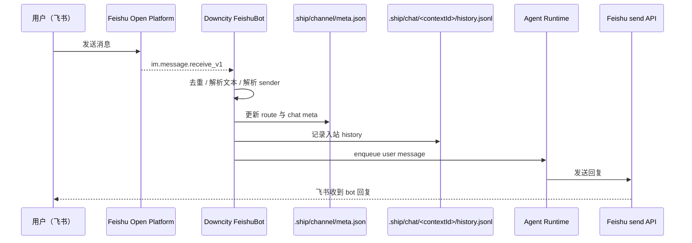

# 飞书：从收到消息到发送回复的全链路

这篇文档解释当前 `downcity` 包里的飞书 channel 是如何工作的。

> 用户配置入口见：[/zh/docs/services/chat/feishu](/zh/docs/services/chat/feishu)

## 1）总体流程



## 2）启动阶段

当 `chat` service 启动飞书 channel 时，会：

1. 从 channel account 读取：
   - `appId`
   - `appSecret`
   - `domain`
2. 创建：
   - `Lark.Client`
   - `Lark.WSClient`
3. 注册事件：
   - `im.message.receive_v1`
4. 启动长连接

当前实现位于：

- [Index.ts](/Users/wangenius/Documents/github/shipmyagent/package/src/services/chat/Index.ts:298)
- [Feishu.ts](/Users/wangenius/Documents/github/shipmyagent/package/src/services/chat/channels/feishu/Feishu.ts:733)

## 3）入站消息解析

飞书消息进来后，当前实现会读取这些核心字段：

- `message.chat_id`
- `message.chat_type`
- `message.message_id`
- `message.message_type`
- `sender.sender_id.open_id / user_id / union_id`

### 3.1 去重

飞书存在重复投递的可能。

当前实现同时做了两层去重：

- 进程内内存去重
- 本地文件去重（`.cache/feishu/dedupe`）

这样重连或重复事件不会把同一条消息执行多次。

### 3.2 当前会把文本和常见附件送入执行

当前 `downcity` 包里的飞书 channel 会按消息类型做归一化：

- `message_type === text`：直接把正文送入执行
- `message_type === image | file | audio | media`：先下载到本地缓存，再注入 `@attach ...`
- 其他类型：直接回错误提示

所以当前版本里，飞书图片、视频、文件、音频已经会像 Telegram 一样先落地到本地，再作为执行输入注入。

对应实现见：

- [Feishu.ts](/Users/wangenius/Documents/github/shipmyagent/package/src/services/chat/channels/feishu/Feishu.ts:816)

## 4）发送者姓名与 chat 标题解析

这是飞书接入最关键、也最容易误解的部分。

### 4.1 当前使用 `tenant_access_token`

当前实现会用：

- `appId + appSecret`
- 换取 `tenant_access_token`

然后去调用：

- `contact/v3/users/...`
- `im/v1/chats/...`
- `im/v1/chats/:chat_id/members`

这意味着：

- 运行时是否拿得到名字，不看你手动调试时的 `user_access_token`
- 而是看 **tenant 权限** 是否真的生效

### 4.2 解析顺序

当前实现的顺序是：

1. 从事件里抽取 sender identity
   - 优先 `open_id`
   - 再 `user_id`
   - 再 `union_id`
2. 调 `contact/v3/users/:id`
3. 如果返回里没有姓名字段，再尝试：
   - `im/v1/chats/:chat_id/members`
4. 如果还是没有，就退回 ID

对应实现见：

- [Feishu.ts](/Users/wangenius/Documents/github/shipmyagent/package/src/services/chat/channels/feishu/Feishu.ts:195)
- [Feishu.ts](/Users/wangenius/Documents/github/shipmyagent/package/src/services/chat/channels/feishu/Feishu.ts:245)
- [Feishu.ts](/Users/wangenius/Documents/github/shipmyagent/package/src/services/chat/channels/feishu/Feishu.ts:349)

### 4.3 为什么 UI 里可能还是 `chat_id / open_id`

因为当前逻辑是 **best-effort**：

- 能查到就写 `actorName / chatTitle`
- 查不到也照常处理消息

所以功能可能“能用”，但展示信息不完整。

## 5）上下文路由与持久化

当一条消息被接受后，运行时会建立或更新：

- `contextId`
- `channel`
- `chatId`
- `targetType`
- `messageId`
- `actorId`
- `actorName`
- `chatTitle`

这些信息会落到：

- `.ship/channel/meta.json`

目标键的结构大致是：

```text
feishu|<chatId>|<chatType>|<threadId>
```

对应实现见：

- [ChannelContextStore.ts](/Users/wangenius/Documents/github/shipmyagent/package/src/services/chat/runtime/ChannelContextStore.ts:118)
- [BaseChatChannel.ts](/Users/wangenius/Documents/github/shipmyagent/package/src/services/chat/channels/BaseChatChannel.ts:365)

## 6）入站消息如何进入 Agent

飞书消息不会直接把原始平台 JSON 丢给模型，而是会被封装成统一的 user message：

```text
<info>
channel: feishu
context_id: ...
chat_id: ...
chat_type: p2p
message_id: ...
user_id: ...
username: ...
</info>

用户正文
```

这样模型能理解：

- 这是哪个 channel
- 当前 contextId 是什么
- 发消息的人是谁
- 当前是私聊还是群聊

对应实现见：

- [QueuedUserMessage.ts](/Users/wangenius/Documents/github/shipmyagent/package/src/services/chat/runtime/QueuedUserMessage.ts:32)

同时审计历史会写入：

- `.ship/chat/<contextId>/history.jsonl`

## 7）回复是怎么发出去的

当前飞书出站分两种情况：

### 7.1 私聊 `p2p`

使用：

- `client.im.v1.message.create`

并按 `chat_id` 直接发送。

### 7.2 群聊

优先使用：

- `client.im.v1.message.reply`

直接回复到原消息 `message_id`。

对应实现见：

- [Feishu.ts](/Users/wangenius/Documents/github/shipmyagent/package/src/services/chat/channels/feishu/Feishu.ts:885)

另外，当前版本支持在回复文本里写附件指令并自动转换为飞书文件消息：

```text
@attach document reports/downcity-office-hours.md
```

发送顺序是：

1. 先发送正文文本（去掉 `@attach` 行）
2. 再上传并发送附件文件消息
3. 如果 `@attach` 包含 `| 说明`，会追加发送说明文本

## 8）为什么 `user_access_token` 测试通过，但运行时不行

因为这是两条不同链路。

### 你本地调试时可能是：

- `user_access_token`
- 代表“某个授权用户本人”

### 运行中的 channel 是：

- `tenant_access_token`
- 代表“应用身份”

所以可能出现：

1. 你本地调试能查到 `name`
2. 运行中的 bot 还是只能拿到 `open_id`

这并不冲突。

## 9）当前版本的限制

当前 `downcity` 包里的飞书 channel 仍有这些限制：

- 入站执行只支持文本消息
- 名称解析依赖 tenant 权限与通讯录可见范围
- `user_access_token` 不参与当前消息元数据补全逻辑

## 10）排障建议

如果你看到：

- `chatTitle = null`
- `chatDisplayNameSource = chat_id`
- `username = unknown`

优先按这个顺序排查：

1. `tenant` 权限是否已经发布并重新授权
2. `im.message.receive_v1` 是否真的生效
3. `im:chat.members:read` 是否对当前 app 生效
4. `contact:user.employee_id:readonly` 是否对当前 app 生效
5. 通讯录可见范围是否覆盖当前用户
6. 发一条新的飞书消息，让 route/meta 刷新
