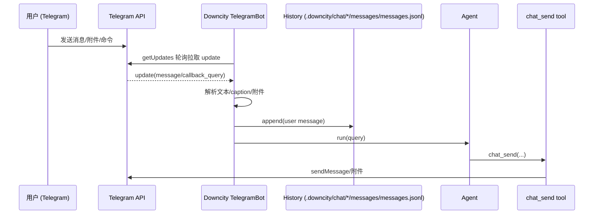

# Telegram：从发消息到收到回复的全链路

> ⚠️ **简化模式（2026-02-03）**：当前发布的 `downcity` 包已暂时移除审批（默认全权限执行）。本文档中与审批相关的部分已过期。

这篇文档以 Telegram 为例，说明 **一条用户消息如何进入 Downcity**，以及 **Agent 如何执行、以及消息如何通过 `chat_send` tool 发送回 Telegram**。

> 代码参考：`packages/downcity/src/services/chat/channels/telegram/Bot.ts`、`packages/downcity/src/services/chat/channels/BaseChatChannel.ts`、`packages/downcity/src/services/chat/runtime/*`、`packages/downcity/src/sessions/SessionCore.ts`

## 1）总体流程（概览）



## 2）输入：Telegram update → “可执行指令”

### 2.1 拉取与分发

- Downcity 以 **轮询** 模式工作：定时调用 `getUpdates` 拉取 `TelegramUpdate[]`，并更新 `lastUpdateId`（持久化在 `.downcity/.cache/telegram/lastUpdateId.json`）。
- 每个 update 会按并发上限处理；同时对**同一个 chatKey**做串行化（避免并发把上下文打乱）。

### 2.2 ChatKey（唯一隔离 key）

Downcity 会把 Telegram 的聊天抽象为一个 **chatKey**，用来隔离上下文与日志：

- 私聊 / 普通群聊：`telegram-chat-<chatId>`
- Topics（话题）的群：`telegram-chat-<chatId>-topic-<messageThreadId>`

### 2.3 群聊触发策略（trigger）

在群聊/超级群中，**非空消息默认都可进入执行判定**。

- 不再要求 `@bot` 或 reply 才能触发
- 不再区分发起人/管理员权限，群成员消息统一接入

### 2.3.1 自动确认 reaction

当前版本里，Telegram 入站消息在：

- 通过授权校验之后
- 进入命令处理 / Agent 执行之前

会先对用户那条消息自动贴一个 `👀` reaction，表示“已经收到，开始处理”。

这个 reaction 是 **best-effort**：

- 贴成功：用户会立刻看到轻量确认
- 贴失败：不会阻塞后续命令或 Agent 执行

### 2.4 附件处理：保存到本地缓存 + 注入 `<file>`

当 message 含附件（document/photo/voice/audio/video）时，Downcity 会：

1. 调用 `getFile` 获得 `file_path`，再下载文件内容
2. 写入本地缓存目录：`.downcity/.cache/telegram/`
3. 在最终指令文本前拼一段 `<file ...>` 标签（相对 `projectRoot` 的路径）
4. 如果附件是图片或 PDF，会额外 best-effort 注入为模型 `file parts`

示例（最终送入 Agent 的 query）：

```text
<file type="document" caption="xxx.pdf">.downcity/.cache/telegram/1738...-xxx.pdf</file>

帮我总结这个 PDF，并列出待办事项。
```

> 说明：如果用户在发送文件时写了 caption，caption 会作为“文本指令”的来源（与纯 text 同等对待）。
>
> 说明：`<file>` 文本协议仍然会保留，所以即使当前模型不支持多模态，依然能看到稳定的附件描述。

## 3）持久化：history 如何记录上下文

每次收到用户消息，TelegramBot 都会先把它写入对话 history（JSONL，append-only）：

- 路径：`.downcity/chat/<encode(chatKey)>/messages/messages.jsonl`
- 格式：`UIMessage`（包含 `role/parts/metadata` 等）

在真正执行之前，runtime 会直接使用该 `chatKey` 的 history 作为模型的 `messages` 输入；当 history 接近上下文窗口时会自动 compact。

## 4）执行：Agent 如何跑起来（sync / async）

### 4.1 tool-strict：由 Agent 主动发消息

Downcity 的聊天集成采用 tool-strict：

- Agent 通过 `chat_send` 工具把回复发送回 Telegram（可以分多条、按阶段发送）
- 集成本身不再“自动转发 Agent 的输出”为消息（避免把发送逻辑写死在集成层）

### 4.2 执行与回复（run + delivery）

如果不是审批回复，TelegramBot 会调用 Agent 执行（概念示意）：

- `agent.run({ chatKey, query })`

回复发送遵循 tool-strict：

- **主要路径**：Agent 使用 `chat_send` 工具把消息发送回 Telegram（可以分多条/分阶段）
- **兜底路径**：如果 Agent 忘记调用 `chat_send`，集成会把最终的 plain text `output` 回发（避免“用户收不到回复”）

发送消息时会：

- 按 3900 字符分片（避开 Telegram 4096 限制）
- 优先用 `parse_mode=Markdown`，失败则回退纯文本
- 解析输出中的 `<file ...>` 并以真正的 Telegram 附件形式发送（支持本地路径或 URL）
- 正文和附件会先解析成有序片段，再按它们在原消息中的实际顺序逐段发送

### 4.3 `reply_to_message` 与 `chat react` 的执行细节

#### 出站回复关联（`reply_to_message_id`）

当 `chat send` 触发发送时，默认是普通消息。
只有显式启用 reply（例如 `city chat send --reply`）时，runtime 才会尝试解析目标 `messageId` 并映射到 Telegram `reply_to_message_id`。

优先级：
1. 调用时显式传入的 `messageId`
2. 当前 `chatKey` 的 chat meta 中记录的最近入站 `messageId`

结果分支：
- 有合法数字 `messageId`：按“回复某条消息”发送
- 无合法 `messageId`：降级为普通发送（不阻塞 `chat send`）

#### 贴表情（`city chat react`）

`chat react` 走 Telegram `setMessageReaction`，规则如下：
- 默认 emoji：`👍`
- 可通过 `--emoji` 覆盖
- 可通过 `--big` 打开 `is_big`
- 必须能拿到合法 `messageId`（显式或回填），否则返回错误

这意味着：
- `chat send` 在无 `messageId` 时可继续工作（只是没有 reply 关联）
- `chat react` 在无 `messageId` 时不能执行（因为必须贴到某条现有消息）

## 5）用户可能收到的“各种消息”

以一次完整交互为例，用户可能看到：

- **普通回复**：最终答案（可能分片多条；主要来自 `chat_send`，兜底来自 `output` 回发）
- **进度消息**：仅当 Agent 主动用 `chat_send` 发送阶段性进度时才会出现（集成层不做自动“流式转发”）
- （可选）**进度消息**：仅当 Agent 主动用 `chat_send` 发送阶段性进度时才会出现
