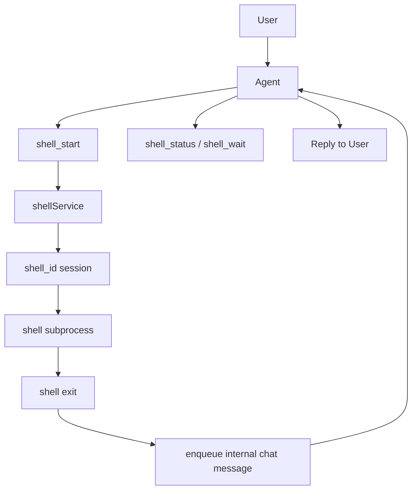

# Shell Service

`shellService` 是 runtime 内专门负责命令执行会话的 service。

它解决的不是“能不能执行命令”，而是：

- 命令执行状态由谁持有
- 长任务期间用户怎样继续和 agent 对话
- shell 会话如何与 chat `contextId` 区分
- 输出如何落盘与审计

## 它现在负责什么

- 启动 shell 会话
- 维护 shell 状态
- 缓存并落盘 stdout/stderr
- 支持按 `shell_id` 查询状态与读取增量输出
- 在 shell 结束后，把事件送回原 chat，再由主 agent 自己回复用户

## 它不负责什么

- 不直接对用户发消息
- 不取代 agent 做业务判断
- 不理解第三方业务语义本身

例如视频生成里的外部 `thread_id`，只是 shell 输出里识别到的一个外部引用，不是 runtime 主键。

## 三种 ID 要区分

### 1. `contextId`

这是 chat / agent 对话上下文 ID。

它表示：

- 这是谁的会话
- 这个 chat lane 的串行队列归属
- agent 的消息历史挂在哪里

### 2. `shell_id`

这是一个 shell 会话 ID。

它表示：

- 一次命令执行实例
- 一个可查询状态、可读取输出、可关闭的 shell session

### 3. 外部 `thread_id`

这是第三方系统自己的任务 ID。

例如：

- 剪映生成任务 ID
- 某个外部网页工作流 ID

它可以附着在 shell 会话上，但不是 runtime 的主键。

## agent 和 shell 的关系

现在的关系非常明确：

- agent 是编排者
- shell 是执行资源
- shell 不直接和用户对话
- shell 结束后仍然回到主 agent

也就是说，用户始终是在和 agent 交互，不是在和一个“后台 shell”直接交互。

## 当前可用的 shell tools

### `shell_exec`

一次性执行并等待完成。

适合：

- 很短的命令
- 不需要中途查询状态
- 不需要 stdin 交互

它不会要求 agent 后续继续维护 `shell_id`。

如果命令可能持续较久，就不应该用它，而应改用 `shell_start`。

### `shell_start`

启动一个 shell 会话，并返回：

- `shell_id`
- 当前状态
- 首批输出

如果命令很短，它可能在这一步就执行完成。

如果命令较长，它会返回 `running`，之后由 agent 按需继续查询。

### `shell_status`

读取当前 shell 会话状态。

适合用户在长任务中途问：

- 现在怎么样了？
- 还在跑吗？
- 最近输出是什么？

### `shell_read`

从指定 `from_cursor` 开始读取增量输出。

只有在 agent 真的需要原始输出时才应使用。

### `shell_write`

向 shell 的 stdin 写入内容。

### `shell_wait`

等待 shell 状态变化或新输出。

重点是：

- agent 不需要自己写高频空轮询循环
- shell service 会在内部维护状态变化

### `shell_close`

关闭 shell 会话并释放资源。

## 当前 shell 逻辑是什么

### 短命令

短命令优先使用 `shell_exec`。

它的特征是：

- 一次性执行
- 等待完成
- 直接返回最终输出
- 不需要后续 `shell_id` 查询

实现上它仍复用同一套 shell session 引擎，但不会把状态化交互暴露给模型。

### 长任务

长任务流程是：

1. agent 调用 `shell_start`
2. runtime 创建 `shell_id`
3. `shellService` 持有进程、状态、输出、waiter
4. agent 先向用户汇报“任务已开始”
5. 用户中途询问时，agent 用 `shell_status` 或 `shell_wait`
6. shell 结束时，service 往原 chat 注入内部消息
7. 主 agent 自己回复最终结果

## 为什么不再使用“模型空轮询 shell”

旧模式的问题是：

- shell 会话和 chat 上下文的命名容易混淆
- agent 会被迫承担 shell 轮询者角色
- 长任务期间用户中途发问时，体验很差

现在的改动是：

- shell 状态由 `shellService` 自己维护
- agent 只查询 shell，不维护 shell
- shell 结束后回投原 chat，让 agent 接着说

## shell 会话的落盘结构

每个 shell 会话会写到：

```text
.downcity/shell/<shell_id>/
├─ snapshot.json
└─ output.log
```

其中：

- `snapshot.json` 保存当前 shell 状态快照
- `output.log` 保存完整输出

这让 shell 有独立的审计面，而不是只存在于一次 tool 调用的瞬时内存里。

## 与 chat 的关系图



## 什么时候应该使用 shell 会话

适合用 shell session 的场景：

- 命令可能较长
- 需要中途查状态
- 需要读取增量输出
- 需要 stdin 交互

如果命令非常短，仍然可以直接用 `shell_start`，它通常会在 inline wait 内完成并返回结果。

## 当前不提供什么

当前仍然推荐把一次性命令保持在“短、快、可直接收口”的范围内。

如果命令可能会：

- 跑很久
- 需要用户中途问进展
- 需要 stdin 交互

那就不应该使用 `shell_exec`，而应该使用状态化的 `shell_start`。
