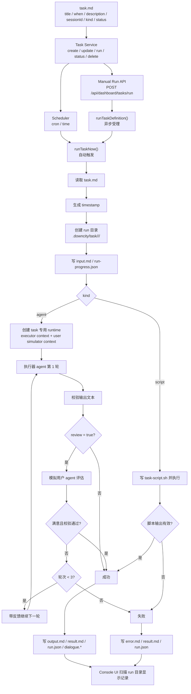

# Agent 模式任务

`kind=agent` 会把 `task.md` 正文交给 agent 执行。默认单轮完成；只有显式设置 `review: true` 时，才会启用“执行器 + 模拟用户”的多轮复核。

## 它适合什么

- 需要推理和迭代的任务
- 研究 / 分析 / 总结
- 生成可阅读、可复用的文字产物

## 它不是什么

- 不是普通聊天回合
- 不是数据库驱动的任务队列
- 默认不要求把结果发送到外部 channel

## 适用场景

- 需要推理和迭代的任务
- 研究/分析/总结
- 需要结构化文字产出的任务

## 执行特点

- 默认单轮执行
- `review: true` 时自动多轮（默认最多 3 轮）
- 每轮都有进度事件（Console UI 可实时查看）
- 最终输出正文写入 `output.md`，并在 `result.md` 写摘要
- 同时把执行器的 query / reply 落到 run 目录下的 `messages.jsonl`，便于 debug

## 当前执行逻辑

1. 读取 `task.md`，解析 frontmatter 与正文。
2. 为本次执行创建新的 run 目录：`./.downcity/task/<taskId>/<timestamp>/`。
3. 写入 `input.md` 与 `run-progress.json`，把输入快照和实时进度落盘。
4. 创建 task 专用 runtime，不复用普通聊天上下文。
5. 执行器 agent 先生成结果。
6. 若 `review: true`，模拟用户 agent 会根据任务目标评估结果是否满意。
7. 若 `review: true` 且结果未达标，则把“上一轮输出 + 模拟用户反馈”继续喂给执行器修订，最多 3 轮。
8. 若未开启 `review`，则在单轮输出通过基础校验后直接结束。
9. 最终写入 `output.md`、`result.md`、`dialogue.*`、`run.json`，失败时额外写 `error.md`。

## 成功判定

- `agent` 任务当前默认只要求单轮产生有效输出文本
- 不再默认要求 `chat_send` 成功送达
- 若设置 `review: true`，还会经过模拟用户复核与最多 3 轮修订
- 若任务正文明确要求外发，再由任务本身决定是否调用外部发送动作

## 相关上下文

- `sessionId` 记录在任务定义中，用来决定任务结果回发到哪个会话
- 真正执行时会创建独立的 task run context
- 因此 task 执行不会直接复用普通 chat 的消息历史

## 流程图



## 最佳实践

- 正文写清目标、边界和验收标准
- 默认不要开 `review`；只有确实需要“生成后再复核”时才设置 `review: true`
- 尽量要求“可审计输出”，方便排障
- 不要把 shell 脚本直接放在 agent 任务正文里

## 示例

```yaml
---
title: daily-market-research
description: 每日市场研究摘要
sessionId: research
when: 0 8 * * *
status: enabled
kind: agent
review: true
---

请生成今天的市场研究摘要，包含：
1. 主要事件
2. 关键风险
3. 下一步建议
```
