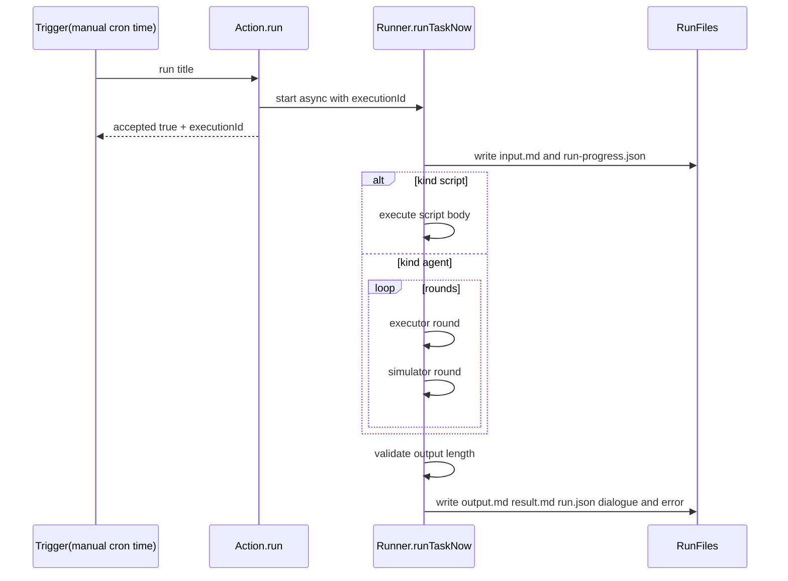

# 执行与校验链路

## 总体流程

1. 读取任务定义并创建 run 目录。
2. 写入 `input.md` 与 `run-progress.json`（running）。
3. 按 `kind` 执行：
   - `script`：直接执行脚本
   - `agent`：执行器 + 模拟用户多轮
4. 做结果校验（当前规则：输出至少 1 字符；`agent` 任务要求 `chat_send` 成功送达）。
5. 写入 `output.md` / `result.md` / `run.json` / `dialogue.*` / `error.md`。

## 结果字段

- `status`：最终状态（success/failure）
- `executionStatus`：执行阶段状态
- `resultStatus`：结果校验状态（valid/invalid/not_checked）
- `executionId`：本次执行唯一 ID

## Mermaid

