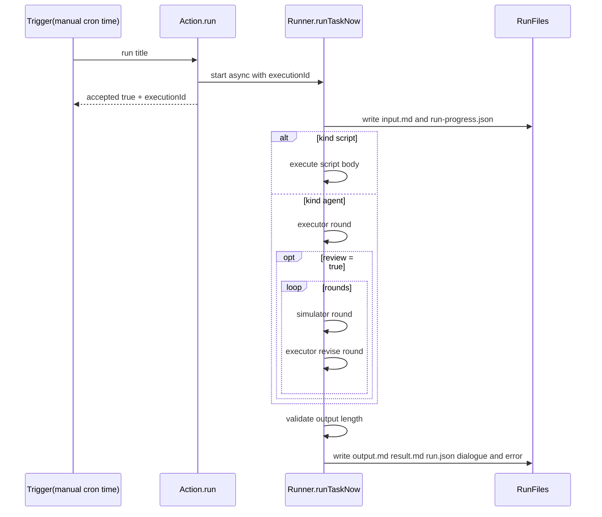

# 执行与校验链路

## 总体流程

1. 读取任务定义并创建 run 目录。
2. 写入 `input.md` 与 `run-progress.json`（running）。
3. 按 `kind` 执行：
   - `script`：直接执行脚本
   - `agent`：默认单轮；`review: true` 时执行器 + 模拟用户多轮
4. 做结果校验（当前规则：输出至少 1 字符）。
5. 写入 `output.md` / `result.md` / `run.json` / `dialogue.*` / `error.md`。

## 手动触发与调度触发

- 手动触发：Console UI 调用 `/api/dashboard/tasks/run`
- 手动触发当前是“异步受理”，接口先返回 `accepted=true`，后台继续执行
- 调度触发：由 task scheduler 根据 cron 或 one-shot time 自动触发
- 调度器对同一 `taskId` 有串行保护；手动触发目前没有同级别防重入

## 为什么会看到多条 run 记录

- 每次执行都会生成一个新的时间戳目录
- UI 展示 run 列表时，直接扫描这些时间戳目录
- 因此一次请求对应一条 run 记录；如果触发两次，就会出现两条记录

## 产物与职责

- `input.md`：记录本次执行输入快照
- `run-progress.json`：记录执行中阶段与进度
- `output.md`：记录任务最终输出正文
- `result.md`：记录面向人的摘要
- `dialogue.md` / `dialogue.json`：记录 agent 多轮修订过程
- `run.json`：记录最终状态与元数据
- `error.md`：失败时记录错误摘要

## 结果字段

- `status`：最终状态（success/failure）
- `executionStatus`：执行阶段状态
- `resultStatus`：结果校验状态（valid/invalid/not_checked）
- `executionId`：本次执行唯一 ID

## Mermaid

