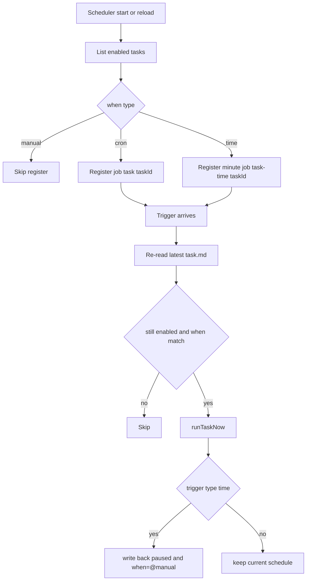

# 调度注册与触发链路

## 注册规则

启动或重载 task scheduler 时，针对每个 `enabled` 任务：

1. `when=@manual`：不注册 job。
2. `when=cron`：注册 `task:<taskId>`。
3. `when=time:...`：注册 `task-time:<taskId>`（分钟轮询）。

## 触发前复检

真正触发时会重新读取最新 `task.md` 并复检：

- `status` 仍为 `enabled`
- `when` 仍匹配当前触发方式

这样可避免“定义已更新但旧调度还在跑”的问题。

## one-shot 行为

`when=time:...` 执行成功后自动：

- `status -> paused`
- `when -> @manual`

## 串行保护

同一 `taskId` 同时只允许 1 次执行：

- 若上次还在执行，新触发会被跳过
- 日志记录：`Task skipped (already running)`

## Mermaid

