# @downcity/agent

`@downcity/agent` 是 Downcity 的单 Agent 运行时包。

它负责把一个 agent 项目目录装配成可执行运行时，包括 session、service、plugin、HTTP/RPC、sandbox、SDK 与项目级宿主能力。`@downcity/city` 负责多 Agent 管理、控制面网关、console daemon 与平台级存储；单 Agent 执行内核放在这个包里。

## 包定位

- 面向单个 Agent 项目的执行面。
- 对外通过 `@downcity/agent` 根入口暴露公共 API。
- 负责 session、service、plugin、sandbox、HTTP/RPC server、SDK 本地 Agent。
- 不负责多 Agent registry、control plane daemon、console UI 聚合和平台级编排。

## 与其他包的边界

- `@downcity/agent`
  - 单 Agent runtime。
  - 单 Agent HTTP/RPC server。
  - session 执行、service 框架、plugin 框架、sandbox。
  - 本地 SDK facade。
- `@downcity/city`
  - 多 Agent registry。
  - control plane / gateway。
  - 平台 CLI、模型池、全局 env、channel account store。
  - agent daemon 进程管理。
- `@downcity/ui`
  - React UI 组件与展示层。

## 根目录结构

```text
packages/agent
├── bin/                # 构建输出目录
├── scripts/            # 构建辅助脚本
├── src/                # 源码目录
├── package.json        # 包信息、导出面、脚本
├── README.md           # 包结构说明
└── tsconfig.json       # TypeScript 配置
```

## 当前源码结构

```text
src/                       # 单 Agent 执行内核源码根目录，承载 runtime、session、service、plugin、server、SDK 等模块
├── index.ts               # 包公开入口，集中导出外部可依赖的 API 与协议类型
├── config/                # 项目配置模块，负责 downcity.json、默认配置、环境变量与项目路径解析
├── host/                  # Agent 与宿主环境的端口模块，负责 daemon 协议与 runtime 注入边界
│   ├── daemon/            # Agent 侧 daemon 协议模块，负责 daemon API、client、项目准备与本地路径约定
│   └── runtime/           # 宿主 runtime 端口模块，负责 platform gateway、store、plugin runtime resolver 等注入能力
├── model/                 # 模型运行模块，负责模型实例创建、模型管理与 provider 运行辅助
├── plugin/                # 插件系统模块，负责 plugin 注册、启用态、hook、action 与内建插件
│   ├── builtins/          # 内建插件模块，提供 auth、skill、web、asr、tts、voice、workboard 等默认能力
│   ├── core/              # 插件核心模块，负责注册表、hook 调度、本地 action、项目插件配置与 HTTP routes
│   └── types/             # 插件公共类型模块，定义 plugin、action、API、hook 等插件协议
├── project/               # Agent 项目模块，负责项目初始化、execution binding 与项目骨架准备
│   └── types/             # 项目私有类型模块，定义 agent project 初始化相关结构
├── runtime/               # 单 Agent runtime 模块，负责装配 AgentRuntime、AgentContext、状态与热重载
├── sandbox/               # 命令沙箱模块，负责 shell/task/tool 执行前的沙箱配置解析与受限运行
│   └── types/             # 沙箱私有类型模块，定义 sandbox 配置与执行相关协议
├── sdk/                   # 本地 SDK 模块，提供 Agent、RemoteAgent、Session facade 与 HTTP/RPC wrapper
├── server/                # 单 Agent server 模块，负责 HTTP/RPC 服务端、路由与静态资源承载
│   ├── http/              # HTTP 服务模块，提供 control、execute、plugins、services、health、static 等路由
│   └── rpc/               # 本机 RPC 服务模块，提供 local RPC server 与 session/service 调用入口
├── service/               # Service 系统模块，负责内建服务、service 生命周期、action 调度与 schedule
│   ├── builtins/          # 内建 service 模块，提供 chat、contact、task、memory、shell 等用户可用服务
│   ├── core/              # Service 核心模块，负责 service 注册、实例管理、状态控制、action runner 与系统提示
│   ├── schedule/          # Service 调度模块，负责持久化 service action 的计划执行与 runtime store
│   └── types/             # Service 公共类型模块，定义 service、action、state、schedule 等协议
├── session/               # 会话执行模块，负责 Session 实例、模型输入组合、tool loop、history 与消息持久化
│   ├── composer/          # Session 组合模块，负责 history、system、execution、compaction 等上下文组合面
│   ├── executors/         # Session 执行器模块，负责 local executor、core runner、tool loop 与执行错误归一化
│   ├── ids/               # Session 标识模块，负责 session id / message id 等标识生成与解析
│   ├── messages/          # Session 消息模块，负责 UI/model/session 消息转换、附件映射与 step event 映射
│   ├── tools/             # Session 工具模块，负责 shell 等内置 tool 的定义、桥接与输出格式化
│   └── types/             # Session 公共类型模块，定义消息、执行输入、step event 等会话协议
├── transport/             # 调用端传输模块，负责 agent client 侧 transport 协议与连接选择
│   └── rpc/               # RPC transport 模块，提供 local RPC client、endpoint path 与 transport 实现
├── types/                 # 跨模块共享类型模块，集中放置跨包、跨领域复用的稳定协议类型
│   ├── auth/              # 鉴权协议类型模块，定义 token、permission、route 与 auth control 共享结构
│   ├── common/            # 基础公共类型模块，定义 Json、Template 等无领域依赖的基础类型
│   ├── config/            # 配置协议类型模块，定义 DowncityConfig、LLM、model binding、start options 等结构
│   ├── daemon/            # Daemon 协议类型模块，定义 agent daemon API 与状态交换结构
│   ├── host/              # Host 协议类型模块，定义 AgentHost、store、plugin config runtime 等宿主能力
│   ├── http/              # HTTP 协议类型模块，定义 inline execute 等 HTTP API payload
│   ├── platform/          # 平台端口类型模块，定义 Platform、PlatformGateway 等 city/agent 注入协议
│   └── rpc/               # RPC 协议类型模块，定义 local RPC request/response 与 transport 载荷
└── utils/                 # 包内通用工具模块，提供 CLI、日志、存储与模板等低层辅助能力
    ├── cli/               # CLI 辅助模块，负责命令行输出、交互与格式化工具
    ├── logger/            # 日志模块，负责结构化日志、请求/响应格式化与 fetch 日志封装
    └── storage/           # 存储工具模块，负责本地 JSON/文件存储等通用落盘辅助
```

## 目录职责

- `src/index.ts`
  - 包的唯一公开入口。
  - `city` 和外部调用方应从这里导入公共能力，避免依赖内部子路径。

- `src/runtime/`
  - 单 Agent runtime 装配层。
  - `AgentRuntime.ts` 负责初始化 config、model、session factory、services、plugins、hot reload。
  - `AgentContext.ts` 负责从 `AgentRuntime` 派生统一能力面。

- `src/project/`
  - 项目初始化与 execution binding。
  - 负责 agent 项目骨架、默认文件、模型绑定与初始化结果类型。

- `src/config/`
  - 项目配置与项目级路径解析。
  - 负责 `downcity.json`、项目 env、`.downcity/*` 路径规则。

- `src/host/`
  - Agent 运行时与宿主环境之间的端口层。
  - `runtime/` 只保留注入到 `AgentRuntime` 的宿主端口、plugin 配置能力与 plugin runtime resolver。
  - `daemon/` 只保留 agent 侧 daemon 协议、项目准备、HTTP client 与项目级 daemon meta 路径。
  - daemon 进程启停、pid 清理、registry 同步等平台级管理职责属于 `@downcity/city`。

- `src/types/`
  - 跨模块、跨包共享协议类型。
  - `common/` 放 JSON、模板等基础类型。
  - `config/` 放 `downcity.json`、execution binding、LLM、start options 等配置类型。
  - `host/`、`platform/`、`daemon/`、`rpc/`、`auth/`、`http/` 放 city/agent 共享控制面协议。
  - 领域内部类型仍保留在对应领域目录，例如 `service/types/`、`plugin/types/`、`session/types/`。

- `src/sdk/`
  - 本地 SDK facade。
  - 包括 `Agent`、`RemoteAgent`、`SdkSession`、SDK HTTP/RPC wrapper 与 session metadata。
  - `Agent.ts` 负责本地 SDK agent facade，装配 service/plugin/runtime/session 集合。
  - `RemoteAgent.ts` 负责远程 SDK facade，通过 transport 连接已有 agent server。
  - `Session.ts` 负责单个 SDK session 的高层 API，例如 `set/run/stream/fork/history`。
  - `SessionPersistence.ts` 负责 SDK session meta 刷新与 assistant 消息落盘。
  - `SessionServicePort.ts` 负责把 SDK session 适配成 chat service 可消费的 `SessionPort`。
  - `StreamEvents.ts` 负责把 AI SDK UI stream chunk 归一成 SDK 对外 stream event。
  - `SessionMetadata.ts` 与 `Paths.ts` 负责 SDK session metadata 与 `.downcity` 路径约定。

- `src/server/`
  - 单 Agent server 层。
  - `http/` 是 HTTP server 与路由，包含 `control / execute / services / plugins / health / static`。
  - `rpc/` 是本机 local RPC server。

- `src/transport/`
  - agent 调用端 transport 协议。
  - `rpc/` 放 local RPC client、endpoint path、transport 选择器与协议类型。

- `src/model/`
  - 模型创建与模型运行辅助。

- `src/plugin/`
  - 插件框架与内建插件。
  - `core/` 负责注册、启用态、hook 调度、本地 action。
  - `builtins/` 放 `auth`、`skill`、`web`、`asr`、`tts`、`voice`、`workboard` 等内建插件。
  - `types/` 放插件公共协议类型。

- `src/service/`
  - 单 Agent service 域。
  - `core/` 负责 service class 注册、状态控制、action 调度、HTTP route 注册。
  - `builtins/` 放 `chat`、`contact`、`task`、`memory`、`shell` 等内建 service。
  - `schedule/` 负责持久化 service action 调度。
  - `types/` 放 service 公共协议类型。

- `src/session/`
  - 会话执行内核。
  - `Session.ts` 是单 session 实例外壳。
  - `executors/local/LocalSessionExecutor.ts` 装配执行器。
  - `executors/local/LocalSessionCore.ts` 执行模型/tool loop。
  - `executors/local/SessionToolLoopRunner.ts` 承担 tool loop 的逐轮调度。
  - `executors/local/SessionModelMessageState.ts` 维护 session/model 双消息基线。
  - `executors/local/SessionUiStreamCollector.ts` 收敛 UI stream 最终 assistant 消息。
  - `executors/local/SessionExecutionError.ts` 归一化 stream/provider 错误。
  - `composer/` 负责 history、system、execution、compaction 的组合。
  - `messages/` 负责消息编码、附件映射与 step event 映射。
  - `tools/` 放 session 可用工具定义。

- `src/sandbox/`
  - 命令执行沙箱。
  - shell/task 等执行最终通过这里进入受限环境。

- `src/utils/`
  - 包内通用工具、日志、CLI 输出、基础 JSON/Template 类型。

## 模块核心与调用逻辑

### 核心分层

`@downcity/agent` 的核心不是某一个服务，而是一条单 Agent 执行链：

```text
入口协议 -> AgentRuntime -> AgentContext -> Session / Service / Plugin -> Model / Tool / Sandbox -> History / Reply
```

各模块的核心定位如下：

| 模块 | 核心 | 主要输入 | 主要输出 |
| --- | --- | --- | --- |
| `index.ts` | 公共 API 边界 | 包内稳定能力 | `@downcity/agent` 根入口导出 |
| `runtime/` | 单 Agent 装配中枢 | 项目路径、host 端口、config | `AgentRuntime`、`AgentContext`、session/service/plugin runtime |
| `project/` | 项目准备 | rootPath、execution binding | 项目骨架、默认配置、初始化结果 |
| `config/` | 项目配置解析 | `downcity.json`、env、默认值 | 标准化 config、项目路径能力 |
| `host/` | 宿主端口 | city/platform 注入能力 | platform gateway、store、plugin config runtime、daemon client |
| `server/` | 服务端入口 | HTTP/RPC 请求 | session/service/plugin/control 调用 |
| `transport/` | 调用端连接 | endpoint path、RPC 配置 | local RPC client / transport |
| `sdk/` | 用户侧 facade | 本地/远程 agent 目标 | `Agent`、`RemoteAgent`、`Session` API |
| `session/` | 对话执行内核 | 用户输入、system、history、tools | 模型响应、tool events、assistant history |
| `service/` | 长生命周期能力 | service action、schedule、外部事件 | chat/task/memory/contact/shell 等能力结果 |
| `plugin/` | 横切扩展点 | hooks、actions、project plugin config | system prompt、入站增强、工具/action 能力 |
| `model/` | 模型实例层 | model binding、provider config | AI SDK model / provider runtime |
| `sandbox/` | 命令执行隔离 | shell command、sandbox policy | 受限执行结果 |
| `types/` | 共享协议层 | 跨模块/跨包结构 | 稳定类型契约 |
| `utils/` | 基础工具层 | 日志、文件、CLI、模板输入 | 通用辅助能力 |

### 依赖方向图

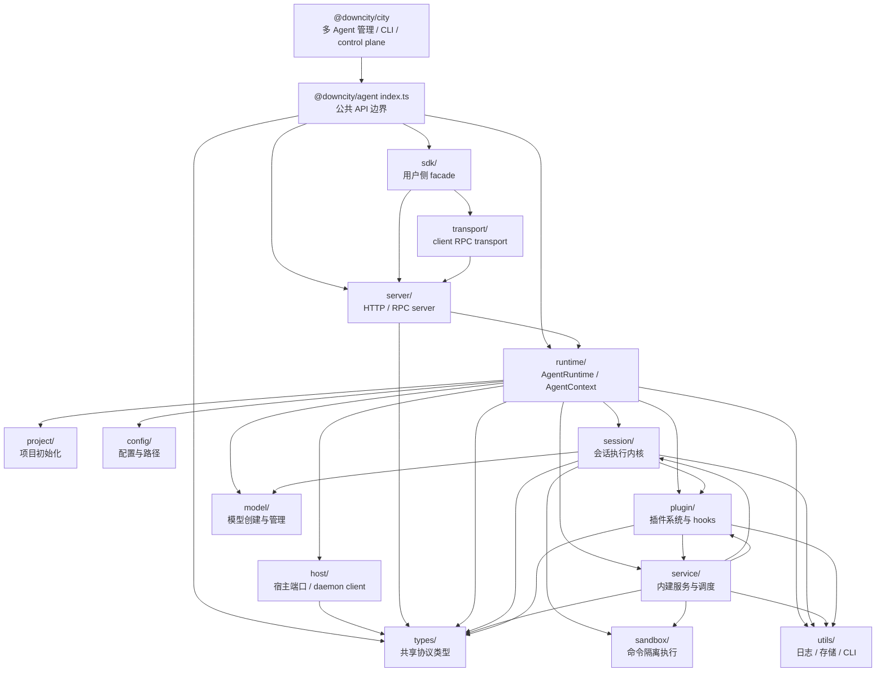

方向约定：

- `city` 只能依赖 `@downcity/agent` 根入口，不直接导入 `src/*` 内部模块。
- `runtime` 是单 Agent 的装配中心，`server`、`sdk`、`service` 都通过它取得执行能力。
- `service` 是长生命周期业务能力，`plugin` 是横切扩展点，两者通过 `AgentContext` 协作。
- `session` 只关心一次会话执行，不直接承担 HTTP、daemon、registry、平台管理职责。
- `types` 只放跨模块共享协议；模块私有类型留在本模块 `types/` 下。

### Runtime 装配图

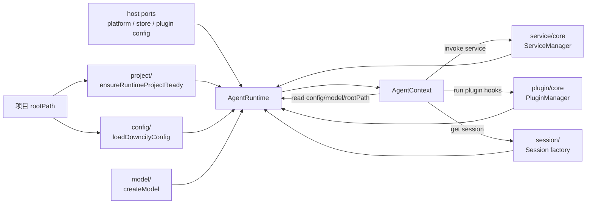

`AgentRuntime` 的核心是“装配与持有状态”，`AgentContext` 的核心是“给 session/service/plugin 提供统一能力面”。多数模块不直接互相 new 对方，而是通过 `AgentContext` 调用，避免形成隐式耦合。

### Agent 启动时序

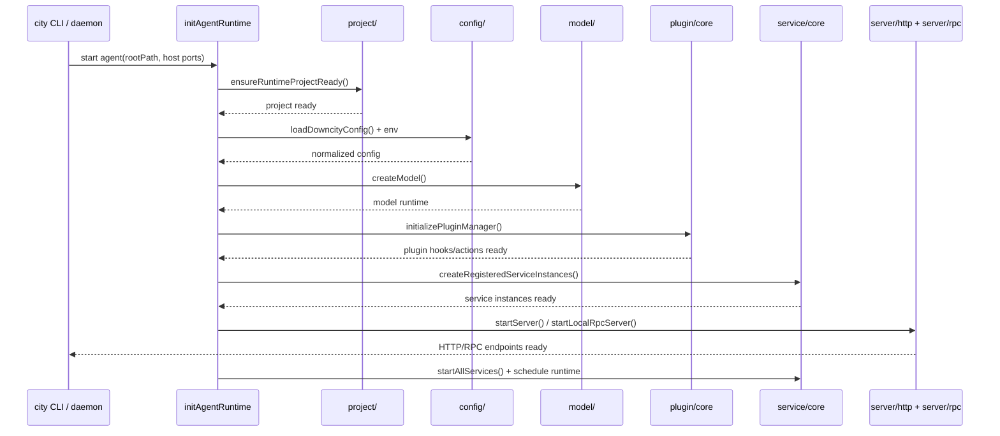

### Session 执行时序

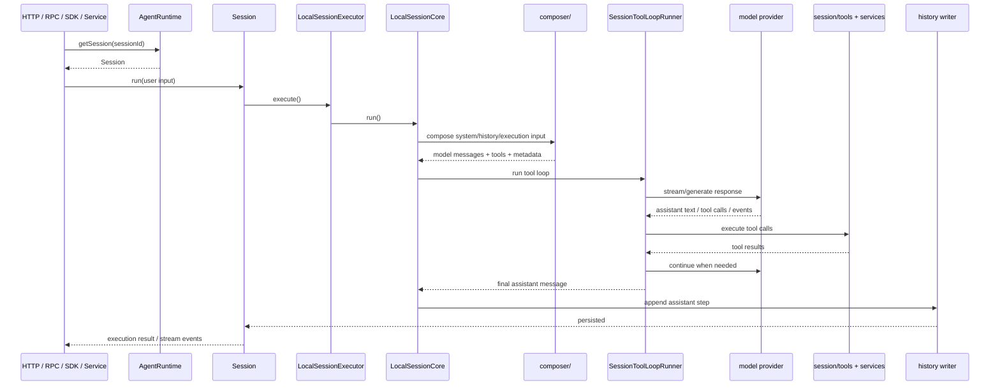

Session 这一层的核心拆分：

- `Session.ts`：单 session 外壳，负责并发保护、append assistant、executor 缓存。
- `LocalSessionExecutor.ts`：执行器装配，把 model/history/system/execution/compaction composer 接起来。
- `LocalSessionCore.ts`：一次 run 的协调层，负责准备输入、错误恢复、最终 assistant 收敛。
- `SessionToolLoopRunner.ts`：模型响应与 tool call 的循环执行。
- `SessionModelMessageState.ts`：维护 session 消息与 model 消息两份基线。
- `SessionUiStreamCollector.ts`：把 UI stream 中的 assistant 内容收敛为最终消息。

### Service 调用图

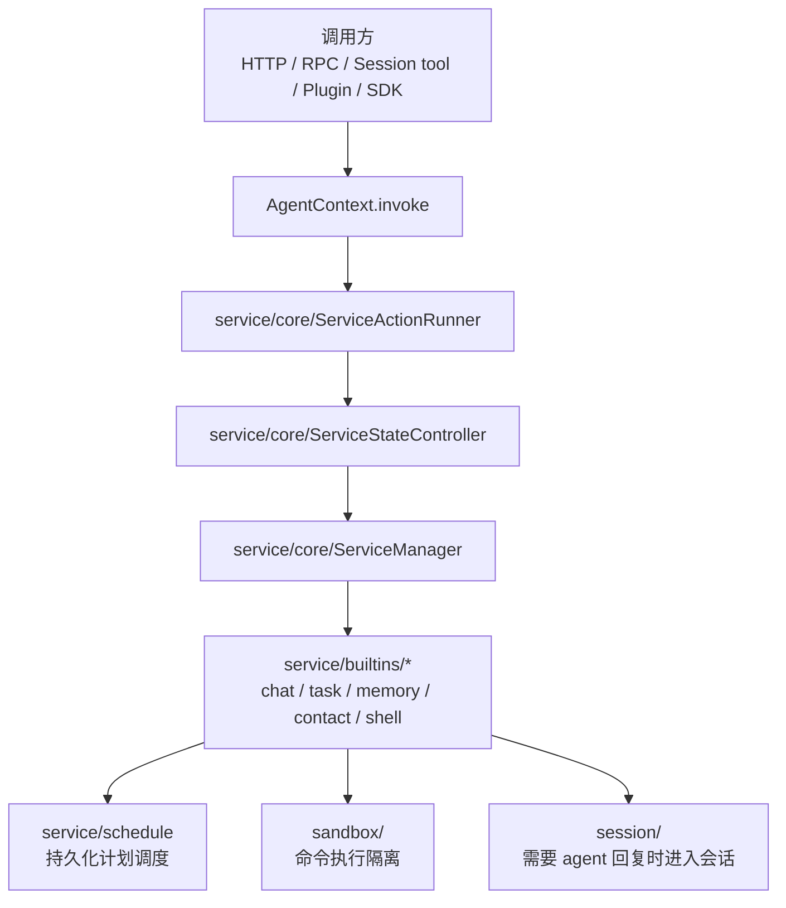

Service 的核心是“长期存在的业务能力”。例如：

- `chat` 接 IM 渠道、入站队列、上下文映射与回复分发。
- `task` 接 cron / manual run，把任务执行转成 session 或 service action。
- `memory` 提供长期记忆读写。
- `shell` 提供命令执行 action，最终落到 `sandbox`。
- `contact` 提供联系人、分享与远程协作相关能力。

### Chat 入站执行图

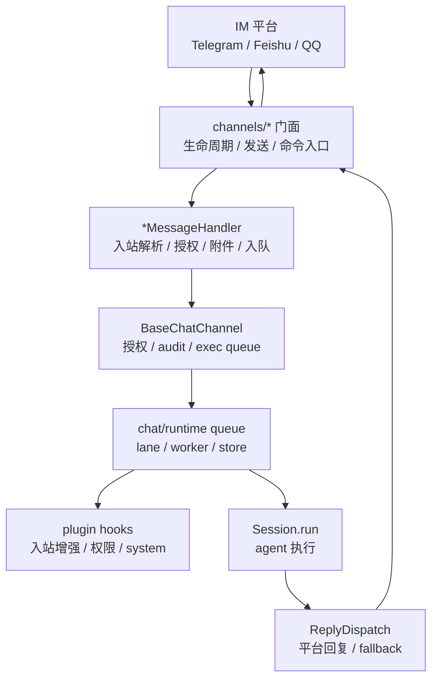

Chat 渠道的拆分原则：

- `Bot.ts` / `QQ.ts` / `Feishu.ts` 只做渠道门面：启动、停止、发送、命令入口、平台 client 装配。
- `*MessageHandler.ts` 做入站主流程：去重、授权、附件、reply context、执行入队。
- `*PlatformClient.ts` 做平台连接和 API：polling、WebSocket、token、上传下载、发送。
- `*Inbound.ts` / `*Support.ts` 做纯解析和归一化辅助。

### Plugin 调用图

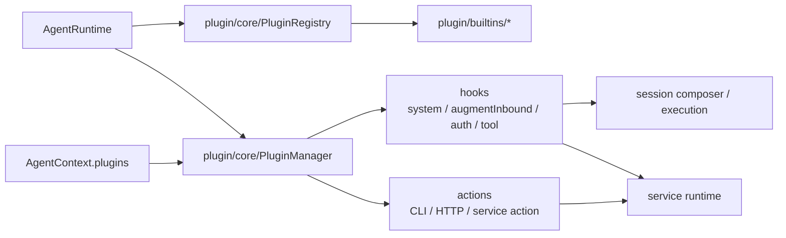

Plugin 的核心是“横切扩展”。它不应该接管主流程，而是在稳定点位上增强：

- `system` hook：给 session system prompt 增加能力说明。
- `augmentInbound` hook：增强 chat 入站消息，例如 ASR 把音频转写成文本。
- auth / policy hook：参与权限判断。
- action：暴露给 CLI、HTTP 或 service 的可调用能力。

### Server / SDK / Transport 图

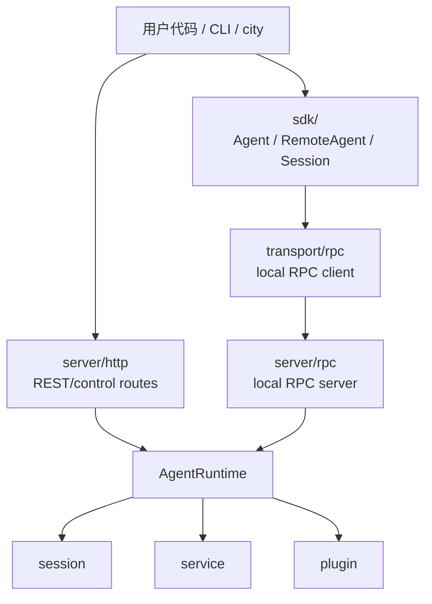

这条链的边界是：

- SDK 是调用方友好的 facade，不承担 runtime 状态。
- transport 是 client 侧连接协议，不承担业务执行。
- server 是 agent 内部入口适配层，不直接放业务规则。
- 真正业务执行都回到 `AgentRuntime`、`Session`、`Service`、`Plugin`。

### SDK 本地 Session 图

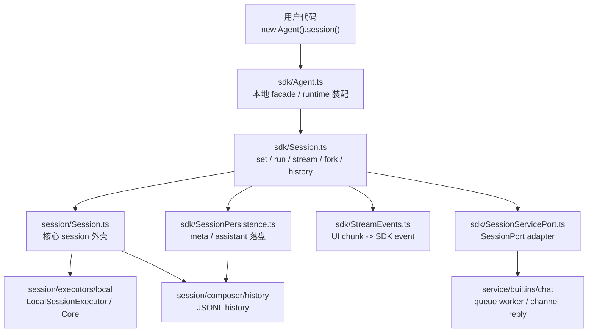

本地 SDK 的核心是“对用户友好的 facade + 对内部 runtime 的轻量适配”：

- `Session.ts` 保持门面职责，负责参数校验、调用底层 session、产出 SDK 结果。
- `SessionPersistence.ts` 统一处理 meta 更新时间、模型标签与 assistant 最终消息持久化。
- `StreamEvents.ts` 统一处理 stream chunk 事件映射和 toolCallId 到 toolName 的短生命周期状态。
- `SessionServicePort.ts` 只做端口适配，让 chat service 复用底层 session 协议，不重复走 SDK `run()` 包装层。

### Sandbox 调用图

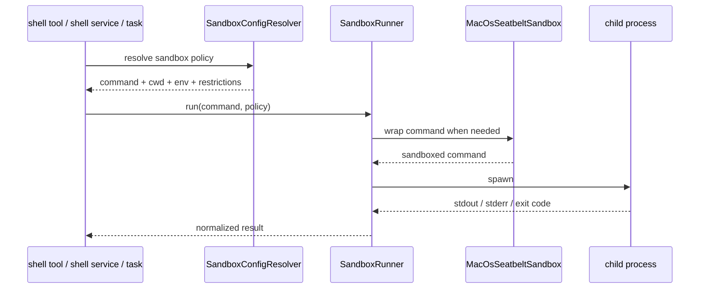

Sandbox 的核心是“把执行策略和具体命令隔离”。上游模块只表达要执行什么，`sandbox` 负责决定如何执行、如何限制、如何收敛结果。

### 生命周期状态图

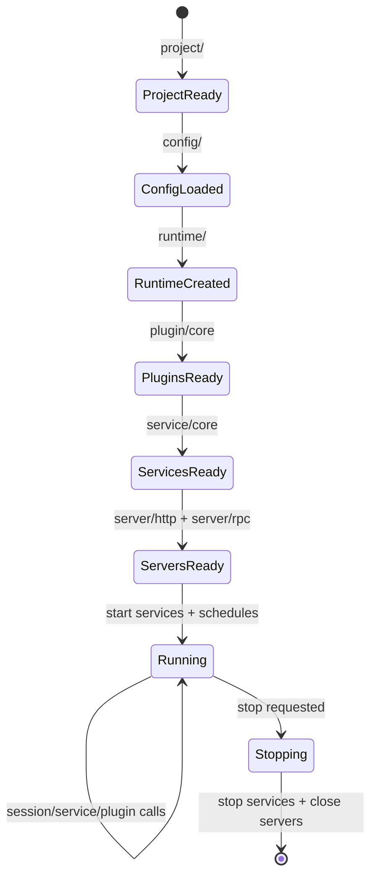

## 当前运行主链

### Agent 启动

```text
city agent start
  -> @downcity/city cli/agent/Run.ts
  -> initAgentRuntime()
  -> ensureRuntimeProjectReady()
  -> loadDowncityConfig() / load env / load static prompts
  -> createModel()
  -> create session factory
  -> createRegisteredServiceInstances()
  -> initializePluginManager()
  -> startServer() / startLocalRpcServer()
  -> startAllServices() / startServiceScheduleRuntime()
```

关键入口：

- `src/runtime/AgentRuntime.ts`
- `src/runtime/AgentContext.ts`
- `src/server/http/Server.ts`
- `src/server/rpc/Server.ts`

### Session 执行

```text
外部输入
  -> HTTP / RPC / service / SDK
  -> AgentRuntime.getSession(sessionId)
  -> Session.run()
  -> LocalSessionExecutor
  -> LocalSessionCore
  -> model / tools / system / history / compaction
  -> assistant message 持久化与回调
```

关键入口：

- `src/session/Session.ts`
- `src/session/executors/local/LocalSessionExecutor.ts`
- `src/session/executors/local/LocalSessionCore.ts`
- `src/session/executors/local/SessionToolLoopRunner.ts`

### Service 调用

```text
AgentContext.invoke
  -> service/core/ServiceActionRunner.ts
  -> service/core/ServiceStateController.ts
  -> service/builtins/* 具体 action
```

### Plugin 调用

```text
AgentContext.plugins
  -> plugin/core/PluginManager.ts
  -> plugin/core/PluginRegistry.ts
  -> plugin/builtins/* 具体 plugin
```

### 沙箱执行

```text
shell tool / shell service / task service
  -> sandbox/SandboxConfigResolver.ts
  -> sandbox/SandboxRunner.ts
  -> sandbox/MacOsSeatbeltSandbox.ts
```

## 公开导出约定

- 包外只从 `@downcity/agent` 根入口导入。
- `@downcity/agent/*` 子路径不是公共 API。
- `src/index.ts` 必须使用显式导出清单，不使用 `export *` 扩大公共面。
- 根入口只暴露 SDK、插件/服务作者 API、city 运行集成 API 与跨包协议类型。
- HTTP router、sandbox runner、内部 service runner 等实现细节不从根入口导出。
- 如果 `city` 需要新的 agent 能力，先补到 `src/index.ts`，再由 `city` 消费。
- `packages/city/scripts/lint-import-boundaries.mjs` 会检查 city 不直接依赖 agent 内部子路径。

## 后续整理方向

当前 `packages/agent/src` 已按单 Agent 执行内核拆分，根入口也已改成显式公共 API 清单。后续推荐继续把跨包共享的基础类型集中到 `types/`：

```text
src
├── runtime/          # AgentRuntime / AgentContext / runtime state
├── project/          # 初始化、execution binding、项目准备
├── server/           # http / rpc / auth / routes
├── transport/        # agent client transport 协议
├── sdk/              # SDK facade
├── session/
├── service/
├── plugin/
├── sandbox/
├── model/
├── config/
├── types/            # 跨模块共享类型
└── utils/
```

迁移优先级：

1. 将跨模块共享类型继续集中到 `src/types/`，模块私有类型保留在本模块 `types/` 下。
2. 大模块超过 800-1000 行时继续按职责拆分。

## 维护约定

- 不要把多 Agent 管理逻辑写进这个包。
- 不要在 `city` 中复制 agent 的 session/service/plugin/sandbox 执行内核。
- `service/core` 和 `service/builtins` 必须保持边界清晰。
- `plugin/core` 和 `plugin/builtins` 必须保持边界清晰。
- `bin/` 是构建产物，不直接修改。
