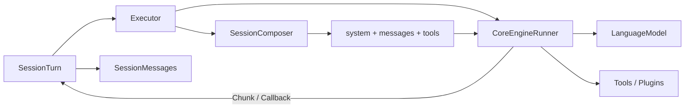

# Executor Module

`executor/` 是 Session 内部的模型与 Tool Loop 执行内核。普通 SDK 用户只通过 `Session` 调用它。

完整 Session Runtime 设计见 [`docs/session-runtime-architecture.md`](../../../../docs/session-runtime-architecture.md)。

## 边界

- `SessionTurn` 拥有输入队列、Turn Handle、取消信号与 Assistant Message 收口。
- `SessionComposer` 根据只读 Session 快照组装 system、messages 和 tools。
- `Executor` 管理单次模型执行、上下文超限重试和 Step Plugin Lease。
- `CoreEngineRunner` 执行 `streamText()`、Tool Loop、续写和内存上下文折叠。
- `SessionMessages` 是 Message 唯一事实源；Executor 不写文件、不持有 Store。

## 执行关系



每个模型 Step 前，`SessionTurn` 先消费排队的 Steer 和状态 Command。Executor 随后捕获最新 effective state，并调用 Composer 生成完整 Step 输入。

```text
Session.prompt()
  -> SessionTurn 持久化 User Message
  -> Executor 捕获只读 Session 快照
  -> SessionComposer.compose()
  -> CoreEngineRunner.run()
  -> SessionTurn 接收 Stream Chunk
  -> SessionMessages 完成 Assistant Message
```

## 旧 Composer 去向

过去的四个独立 Composer 不再构成执行管线：

| 旧能力 | 当前归属 |
| --- | --- |
| `SystemComposer` | `DefaultSessionComposer.compose()` + `SessionSystem` |
| `HistoryComposer` | `SessionMessages.context_snapshot()` + `SessionMessageCodec` |
| `ContextComposer` 的 tools | `Session.create_compose_input()` + `SessionComposer.compose()` |
| `ContextComposer` 的 Step Callback | `SessionTurn` + `CoreEngineRunner` |
| `ContextComposer` 的 fallback Assistant | `CoreEngineRunner` + `ExecutorRecoveryPolicy` |
| `CompactionComposer` | `SessionComposer.compact()` + `should_compact()` |

统一 Composer 只回答两个策略问题：

1. 当前 Step 的 system、messages 和 tools 是什么？
2. 当前只读 Message 快照应生成什么压缩计划？

Queue 消费、Turn 控制、Message 写入、Mutation 发布和 Segment 提交都不是 Composer 职责。

## Compaction

```text
SessionComposer.compact(readonly snapshot)
  -> SessionCompactionPlan
  -> Session.commit_compaction_plan()
  -> SessionMessages.compact_active()
```

Composer 可以调用模型生成 Summary，但不能修改 Message、Metadata 或发布事件。持久化提交始终由 Session 领域完成。

## 目录

```text
executor/
  Executor.ts
  core-engine/       模型与 Tool Loop
  composer/system/   可复用的默认 system prompt 领域实现
  messages/          AI SDK 消息转换
  services/          执行恢复策略
  tools/             Tool 运行辅助
  types/             Executor 内部类型
```
