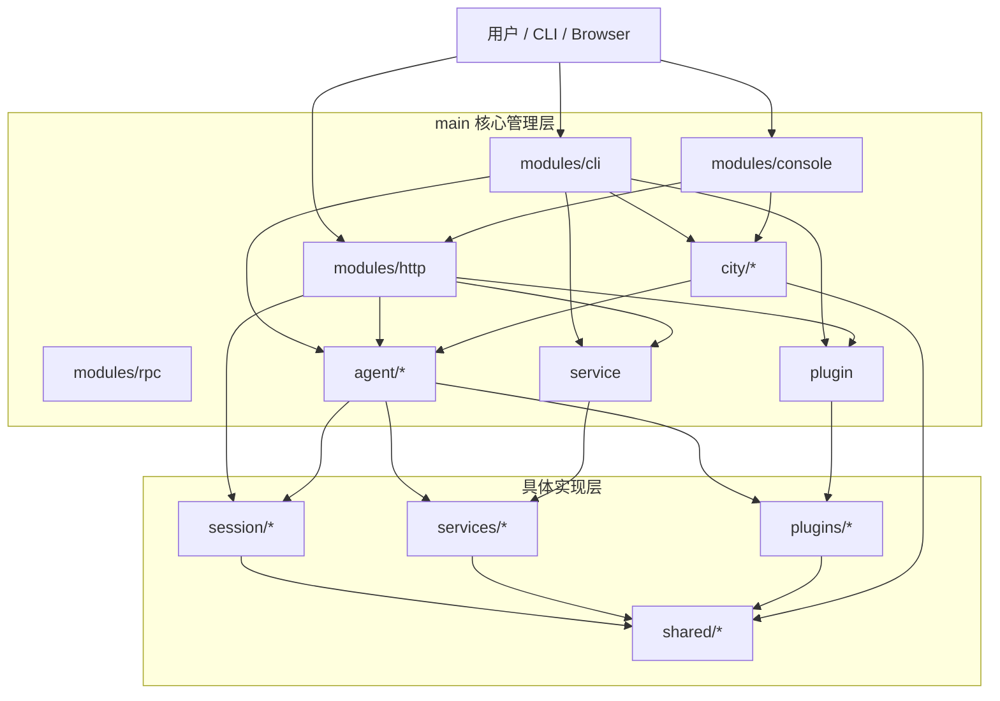
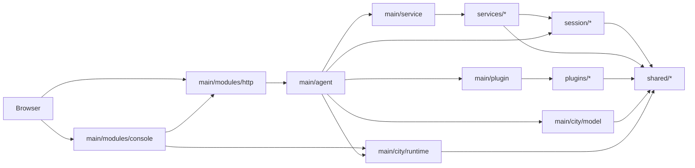
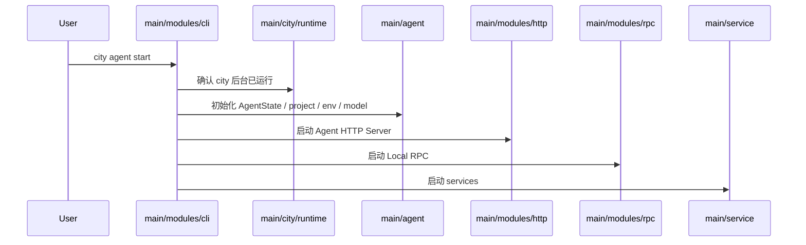
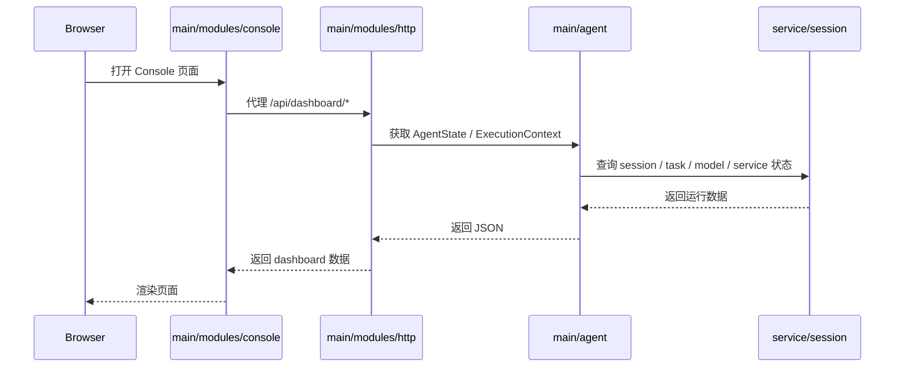

# downcity package 结构说明

## 1. package 是什么

`packages/downcity` 是一个完整的 Agent Runtime package。

它不是只有一个 CLI，也不是只有一个 HTTP 服务，而是同时包含：

- `main/` 核心管理层
- `services/` 具体 service 实现
- `plugins/` 具体 plugin 实现
- `session/` 会话执行框架
- `shared/` 公共类型与工具
- `public/` Console 前端静态资源
- `test/` 测试

一句话理解：

- `main/` 负责把系统装起来并对外暴露模块
- `services/` 和 `plugins/` 负责提供具体能力
- `session/` 负责执行一轮会话 loop
- `shared/` 提供跨层复用基础设施

---

## 2. package 根目录树

```text
packages/downcity/
├── bin/                                  # TypeScript 编译产物
├── docs/                                 # 开发文档
├── public/                               # Console 前端静态资源
├── scripts/                              # 构建与发布辅助脚本
├── src/                                  # 核心源码
├── test/                                 # 测试
├── package.json                          # 包定义与脚本入口
├── README.md                             # 用户向说明
└── tsconfig.json                         # TypeScript 配置
```

### 根目录职责

- `bin/`
  TypeScript 编译产物。CLI 实际执行入口和运行时代码都从这里输出。

- `docs/`
  开发文档。用于记录结构与模块职责，不面向最终用户。

- `public/`
  Console 模块的前端静态资源。

- `scripts/`
  构建脚本和打包辅助脚本。

- `src/`
  核心源码。

- `test/`
  测试目录。命名还有历史遗留，但不影响当前源码结构。

---

## 3. 开发环境与生产环境实现

### 3.1 开发环境如何实现

`packages/downcity` 的开发环境不是“构建完后自动生成系统全局命令”，而是拆成两个独立链路：

- `console-ui`
  使用 Vite 开发服务器启动，默认端口 `5173`。

- `packages/downcity`
  使用 `tsc --watch` 维护 TypeScript 编译产物。

开发时的前后端协作关系是：

1. 浏览器访问 Vite dev server
2. Vite 将 `/api` 和 `/health` 代理到 Console 网关默认端口 `5315`
3. Console 网关再读取 city 全局状态、agent 状态和 dashboard 数据

也就是说，开发态主要依赖：

- `console-ui` 的 Vite dev server
- `packages/downcity` 的 TypeScript watch 编译
- Console 网关进程本身

而不是依赖一次 `build` 后直接把 `city` 注入当前 shell。

### 3.2 生产环境如何实现

生产环境是“先构建前端静态资源，再由 downcity package 自己提供这些静态资源”。

关键链路如下：

1. `console-ui` build
   输出到 `packages/downcity/public`
2. `packages/downcity` build
   编译 TypeScript 到 `packages/downcity/bin`
3. 运行时由 `main/modules/console` 从 `public/` 目录读取 `index.html`、`styles.css`、`app.js`
4. CLI 命令入口由 `package.json` 的 `bin` 字段暴露为 `city` 和 `downcity`

因此 `packages/downcity` 本身是一个“自带静态资源的 CLI/runtime package”：

- `public/`
  存放 Console 前端构建产物
- `bin/`
  存放 CLI 与运行时编译产物

### 3.3 `build:downcity` 和 `build:all` 的区别

仓库根脚本里，这两个命令职责不同：

- `npm run build:downcity`
  只执行 downcity 交付链路：
  1. 构建 `console-ui`
  2. 构建 `packages/downcity`

- `npm run build` / `npm run build:all`
  执行完整仓库构建：
  1. 构建 `packages/downcity-ui`
  2. 构建 `homepage`
  3. 构建 `console-ui`
  4. 构建 `packages/downcity`
  5. 执行 `npm install -g packages/downcity`

最关键的差异是：

- `build:downcity` 只“产出文件”
- `build:all` 除了产出文件，还会“刷新全局 CLI 安装”

### 3.4 为什么 `npm run build:downcity` 之后终端里 `city` 还是不存在

因为 `build:downcity` 只会把以下内容构建出来：

- `packages/downcity/public/*`
- `packages/downcity/bin/*`

它不会执行全局安装，也不会自动修改当前 shell 的 `PATH`。

而 `city` 这个命令要能在终端里直接输入，前提是下面两件事至少满足一件：

1. 包已经通过 `npm install -g` 安装到 npm global prefix
2. 本地源码目录已经通过 `npm link` 暴露到全局 bin

如果这一步没做，shell 只能看到仓库中的文件，看不到名为 `city` 的全局可执行命令，所以会报：

```bash
zsh: command not found: city
```

### 3.5 package 开发时的正确理解

对这个 package 来说，要区分三个动作：

1. 构建产物
   把源码编译成 `bin/`，把前端打包到 `public/`
2. 提供运行时
   由 downcity package 自己读取 `public/` 和 `bin/` 提供能力
3. 暴露 shell 命令
   通过 `npm install -g` 或 `npm link` 把 `city` / `downcity` 放进 PATH

很多混淆都来自把第 1 步误认为第 3 步。

### 3.6 本地开发推荐方式

如果目的是本地联调 package 逻辑，推荐使用以下方式：

```bash
# 终端 1：启动 console-ui 开发服务
pnpm -C products/console dev

# 终端 2：维护 downcity TypeScript 编译
pnpm -C packages/downcity dev
```

如果目的是让当前机器直接可用 `city` 命令，应该额外执行下面任一方式：

```bash
# 方式 1：完整构建并刷新全局 CLI
npm run build
```

```bash
# 方式 2：本地源码 link 到全局
cd packages/downcity
npm run build
npm link
rehash
```

如果已经安装或 link 过，但仍然报 `command not found`，再检查 npm global prefix 对应的 `bin` 是否在 `PATH` 中。

---

## 4. src 目录树

```text
packages/downcity/src/
├── main/                                 # 核心管理层
│   ├── modules/                          # 完整的对外模块层
│   │   ├── cli/                          # CLI 命令系统
│   │   ├── console/                      # Console 控制台模块
│   │   │   └── gateway/                  # Console 网关与 agent 代理逻辑
│   │   ├── http/                         # Agent 远程访问模块
│   │   │   ├── auth/                     # 远程访问认证与权限
│   │   │   ├── dashboard/                # dashboard / 管理接口
│   │   │   ├── execute/                  # 执行入口
│   │   │   ├── health/                   # 健康检查
│   │   │   ├── plugins/                  # plugin 远程接口
│   │   │   ├── services/                 # service 远程接口
│   │   │   ├── static/                   # 静态资源
│   │   │   └── Server.ts                 # agent server 装配
│   │   └── rpc/                          # 本地 RPC
│   ├── plugin/                           # plugin 注册与管理层
│   ├── agent/                            # 单 agent 运行态
│   │   └── project/                      # agent 项目初始化与 execution binding
│   ├── city/                             # city 全局运行态 / 后台进程管理
│   │   ├── daemon/                       # daemon / pid / log / meta
│   │   ├── env/                          # 路径、配置、环境变量
│   │   ├── model/                        # 模型管理
│   │   └── runtime/                      # city 全局 registry / runtime
│   └── service/                          # service 注册与管理层
│       └── schedule/                     # service 调度运行时
├── plugins/                              # 具体 plugin 实现
├── services/                             # 具体 service 实现
├── session/                              # 会话执行框架
└── shared/                               # 公共基础设施
```

---

## 5. 核心逻辑框架

### 5.1 `main/` 是什么

`main/` 不是具体能力实现层，而是系统的核心管理层。

它主要做四件事：

1. 对外暴露完整模块
2. 装配单 agent 运行态
3. 维护 city 全局运行态
4. 管理 service 与 plugin

更具体地说：

- `main/modules/`
  是完整的对外模块层
- `main/agent/`
  是单 agent 运行态
- `main/city/`
  是 city 全局运行态
- `main/service/`
  是 service 管理层
- `main/plugin/`
  是 plugin 管理层

### 5.2 `services/` 和 `main/service/` 的区别

- `main/service/`
  负责注册、生命周期、命令转发、调度

- `services/`
  负责具体实现

例如：

- `main/service/Manager.ts`
  负责服务管理入口
- `services/chat/ChatService.ts`
  才是真正的 chat service 实现

### 5.3 `plugins/` 和 `main/plugin/` 的区别

- `main/plugin/`
  负责 plugin 注册、catalog、hook、action 调度

- `plugins/`
  负责具体 plugin 实现

例如：

- `main/plugin/PluginManager.ts`
  负责 plugin 管理入口
- `plugins/skill/Plugin.ts`
  才是 skill plugin 的具体实现

### 5.4 `session/` 为什么单独存在

`session/` 不是某个 service 的内部细节，而是一个独立的会话执行框架。

它负责：

- session runtime 缓存
- 单轮 loop 执行
- prompt 装配
- tool 调用
- ACP runtime 兼容

因此它被单独放在顶层，而不是挂到 `main/agent/` 或某个 service 下。

### 5.5 `shared/` 的职责

`shared/` 只放跨层复用的公共能力：

- `shared/types/`
  统一类型
- `shared/utils/`
  工具方法
- `shared/constants/`
  常量

这层不承载运行时装配，也不承载具体业务域。

---

## 6. 关键模块解释

### 6.1 `main/modules/cli`

CLI 命令层。

负责：

- 注册 `city start|stop|restart|status|agents`
- 注册 `city config *`
- 注册 `city model *`
- 注册 `city console *`
- 注册 `city agent *`

它只负责入口与编排，不应该承载重业务状态。

### 6.2 `main/modules/http`

Agent 远程访问模块。

负责：

- 创建 agent server
- 挂载 `/health`
- 挂载 `/api/execute`
- 挂载 `/api/services/*`
- 挂载 `/api/plugins/*`
- 挂载 `/api/dashboard/*`
- 挂载远程访问认证能力

其中 `dashboard/` 本质上是 agent 内部管理 API，不是独立前端壳。

### 6.3 `main/modules/console`

独立控制台模块。

负责：

- 多 agent 选择
- 网关代理
- 控制台后端逻辑
- 聚合 city 全局状态

它是一个完整模块，不是 `http/dashboard` 的一部分。

### 6.4 `main/agent`

单 agent 运行态。

负责：

- `AgentState`
- `ExecutionContext`
- `RuntimeState`
- agent 宿主能力注入
- `project/` 初始化与 execution binding

这里描述的是“某一个 agent 如何运行”，不是 city 全局后台。

### 6.5 `main/city/runtime`

city 全局运行态。

负责：

- city 后台 pid / log / 判活
- city 维护的 agent registry
- city 与 Console 模块共享的全局路径约定
- city 级孤儿进程清扫

它不是 Console 模块本身，而是 Console 背后的全局后台运行态。

### 6.6 `main/city/env`

city 配置与路径基础设施。

负责：

- 读取 `downcity.json`
- 解析项目 `.env`
- 读取全局 env store
- 统一项目级 `.downcity/` 路径规则

这层是配置基础设施，不直接承载业务逻辑。

### 6.7 `main/city/model`

模型管理中心。

负责：

- provider 解析
- model 构造
- 读取全局 store 中的模型配置
- 结合项目 execution binding 选择当前 model

`model` 作为一个集中模块整体存在，不再拆成多个散落层级。

### 6.8 `main/service` 与 `main/plugin`

这两层都是“管理层”，不是实现层。

- `main/service/*`
  负责 service 注册、生命周期管理、命令转发、调度
- `main/plugin/*`
  负责 plugin 注册、catalog、hook、action 调度

对应的具体实现分别位于：

- `src/services/*`
- `src/plugins/*`

---

## 7. 当前 package 的分层关系



---

## 8. 运行关系图



---

## 9. 请求路径示意

### 9.1 CLI 启动 agent



### 9.2 Browser 访问 Console 与 dashboard



---

## 10. 当前结构的核心判断

当前 package 结构可以概括成：

- `main/`
  系统管理层

- `services/`
  service 实现层

- `plugins/`
  plugin 实现层

- `session/`
  会话框架层

- `shared/`
  公共基础设施层

这个结构最重要的边界是：

1. 管理层和实现层分开
2. `modules/` 按完整模块组织，不按技术碎片组织
3. `agent/` 和 `city/` 明确分开
4. `session/` 独立存在
5. `model` 作为集中模块保留在 `main/city/model`

---

## 11. 补充说明

- 当前 `test/` 目录命名还保留部分旧分类，但这不影响 `src/` 的新结构。
- `bin/` 会跟随 `src/` 编译产出新的目录骨架。
- 后续如果继续规范化，优先级最高的方向是：
  - 完善 `shared/types/*` 的字段注释
  - 检查每个模块文件头注释是否满足规范
